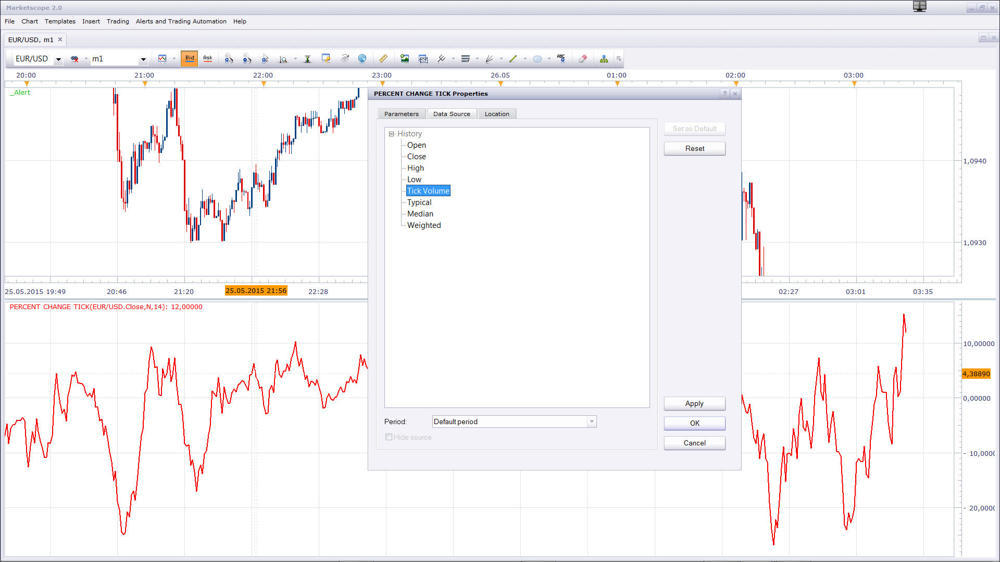

# PERCENT CHANGE

> Source: https://fxcodebase.com/code/viewtopic.php?f=17&t=6522  
> Forum: 17 · Topic 6522 · 9 post(s)

---

## PERCENT CHANGE

**Apprentice** · Tue Sep 13, 2011 1:36 pm

The indicator shows the net change in pips or the the change in percents of the close bar against the open price N period ago.

 [PERCENT CHANGE.lua](files/14903/PERCENT%20CHANGE.lua)

 [PERCENT CHANGE TICK.lua](files/14903/PERCENT%20CHANGE%20TICK.lua)

Net and Percent Change against the day open you can find here.
[viewtopic.php?f=17&t=883&p=1615&hilit=percents#p1615](https://fxcodebase.com/code/viewtopic.php?f=17&t=883&p=1615&hilit=percents#p1615)

The indicator was revised and updated

---

## Re: PERCENT CHANGE

**fskliris** · Wed Sep 14, 2011 7:55 am

Thanks Apprentice but is it possible to have this indicator with red and green bars going around the Zero line . Much better to watch the move. Thanks again.

---

## Re: PERCENT CHANGE

**Apprentice** · Thu Sep 15, 2011 4:30 am

Version with bars.

 [PERCENT CHANGE.lua](files/14974/PERCENT%20CHANGE.lua)

---

## Re: PERCENT CHANGE

**fskliris** · Thu Sep 15, 2011 8:34 am

Aprentice thanks so much . Is it possible to have the bars colored this way . When the previous bar is green and the next one is lower than the previous to be red etc. Thanks This way you can see the deference between the candle much easier.

---

## Re: PERCENT CHANGE

**nookie** · Mon May 25, 2015 1:03 pm

Can we add the function of choice of source as tick volume, high, low, open and close ?

---

## Re: PERCENT CHANGE

**Apprentice** · Tue May 26, 2015 3:03 am

Try PERCENT CHANGE TICK.lua

 

---

## Re: PERCENT CHANGE

**speakinmymind** · Thu Sep 24, 2015 11:21 am

Could you please create another indicator based off of this one.

First line:

1.) The highest point in the Percent Change indicator identifies a bar. The Open/close (whichever is higher) or the high of this bar is the starting price for calculation.

2.) The current bar's Percent Change output is applied to the starting price of the first step.

3.) Display historical output as a line.

Second line:

1.) The lowest point in the Percent Change indicator identifies a bar. The Open/close (whichever is lower) or the low of this bar is the starting price for calculation.

2.) The current bar's Percent Change output is applied to the starting price of the first step.

3.) Display historical output as a line.

Suggested features:
Allow each line to be turned on or off.
Apply additional MVA options to the lines to smooth them.

Thanks!

---

## Re: PERCENT CHANGE

**Apprentice** · Tue Jul 25, 2017 11:29 am

The indicator was revised and updated.

---

## Re: PERCENT CHANGE

**Apprentice** · Wed Jul 26, 2017 5:33 am

Based on the above request.

 [Second Generation of PERCENT CHANGE.lua](files/113748/Second%20Generation%20of%20PERCENT%20CHANGE.lua)
