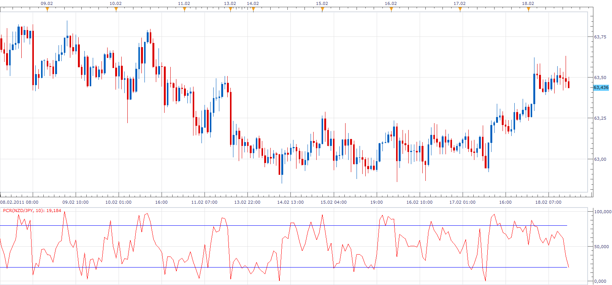

# Percent Retracement (PCR)

> Source: https://fxcodebase.com/code/viewtopic.php?f=17&t=3448  
> Forum: 17 · Topic 3448 · 3 post(s)

---

## Percent Retracement (PCR)

**Apprentice** · Fri Feb 18, 2011 2:25 pm

The Percent Retracement (PCR) measures the proximity of the current close to the maximum high over the observation period.
 PCR[period] =100*(1- (max-close[period])/(max-min));

 [PCR.lua](files/8245/PCR.lua)

The indicator was revised and updated

---

## Re: Percent Retracement (PCR)

**Alexander.Gettinger** · Fri Dec 19, 2014 12:27 pm

MQL4 version of PCR oscillator: [viewtopic.php?f=38&t=61610](https://fxcodebase.com/code/viewtopic.php?f=38&t=61610).

---

## Re: Percent Retracement (PCR)

**Apprentice** · Mon Jun 26, 2017 10:02 am

The indicator was revised and updated.
