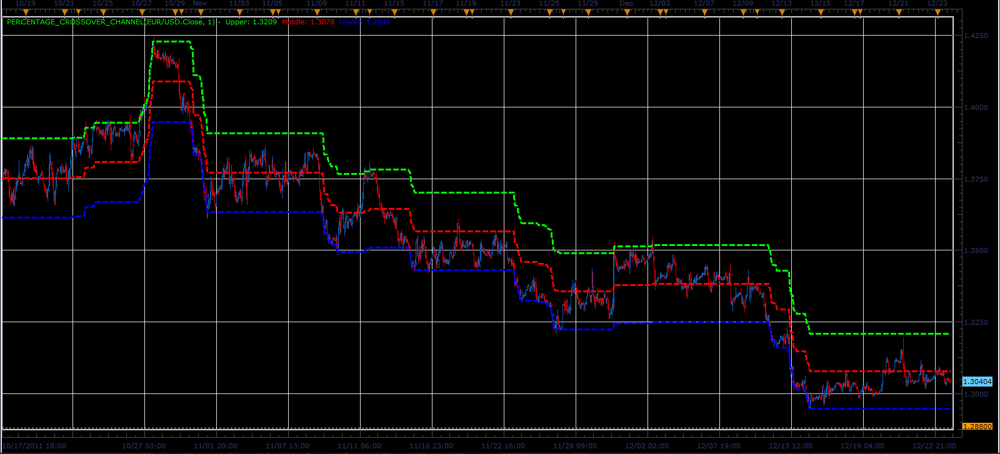

# Percentage Crossover Channel indicator

> Source: https://fxcodebase.com/code/viewtopic.php?f=17&t=10402  
> Forum: 17 · Topic 10402 · 9 post(s)

---

## Percentage Crossover Channel indicator

**Alexander.Gettinger** · Sun Dec 25, 2011 3:02 pm

This indicator is a ported MQL5 indicator from [http://www.mql5.com/en/code/689](http://www.mql5.com/en/code/689).

 

Download:

 [Percentage_Crossover_Channel.lua](files/21611/Percentage_Crossover_Channel.lua)

The indicator was revised and updated

---

## Re: Percentage Crossover Channel indicator

**Alexander.Gettinger** · Mon Dec 26, 2011 7:17 am

Strategy based on Percentage Crossover Channel indicator: [viewtopic.php?f=31&t=10452](https://fxcodebase.com/code/viewtopic.php?f=31&t=10452)

---

## Re: Percentage Crossover Channel indicator

**massarde** · Tue May 29, 2012 2:54 am

Would be possible some alert with email and sound if the candle touches or crosses the middle line?
I think this indicator is the best that i got so far. simple and efficient.
Thanks.

---

## Re: Percentage Crossover Channel indicator

**Apprentice** · Wed May 30, 2012 2:42 am

we can write the signal or strategy.
As for, indicator with alerts.
I have received instructions from my boss not to implement this.
However i can do this in a private arrangement, if you are up for it.

---

## Re: Percentage Crossover Channel indicator

**massarde** · Wed May 30, 2012 2:51 am

not sure how this work but u can contact me through email.
[[email protected]](https://fxcodebase.com/cdn-cgi/l/email-protection#c9b9a8bca5a6a4a8babaa8bbadac89a1a6bda4a8a0a5e7aaa6a4), and we can see how good "$$$$$$" i think this indicator is....lol..

---

## Re: Percentage Crossover Channel indicator

**massarde** · Thu May 31, 2012 5:46 pm

Very, very happy with what he did for me. worth every penny.
very patient, went through each detail with me. changed some stuff to how I wanted.
100% happy with the result.

Many Thanks Apprentice, you are the best.

---

## Re: Percentage Crossover Channel indicator

**Alexander.Gettinger** · Fri Jun 01, 2012 2:16 pm

> **massarde wrote:**
> Would be possible some alert with email and sound if the candle touches or crosses the middle line?
> I think this indicator is the best that i got so far. simple and efficient.
> Thanks.

See update of strategy: [viewtopic.php?f=31&t=10452&p=34749#p34749](https://fxcodebase.com/code/viewtopic.php?f=31&t=10452&p=34749#p34749)

---

## Re: Percentage Crossover Channel indicator

**TakisGen** · Sat Apr 06, 2013 9:50 am

Great concept, wrong calculations.
But not easy to see the error looking at the chart.
Unless you scale the data to feed your neural network and everything starts going bad.
You will rewrite the network, double check the transfer function and start having sigmoid dreams for a couple of months.
Finally, since everything else is ok, you realize that if your income is decreased by 10% and then the result is increased by 10% you dont earn the same money. Only politicians say so
Data is not centered around zero and overflow the upper limit.
So, use this approach and remember to check other indicators too:

 if (period>first) then
 local half=source[period]*percent/200
 if source[period]-half>M[period-1] then
 M[period]=source[period]-half
 elseif source[period]+half<M[period-1] then
 M[period]=source[period]+half
 else
 M[period]=M[period-1];
 end
 U[period]=M[period]+half
 L[period]=M[period]-half
 else ......

Best regards,
Takis

---

## Re: Percentage Crossover Channel indicator

**Apprentice** · Tue May 09, 2017 6:08 am

Indicator was revised and updated.
