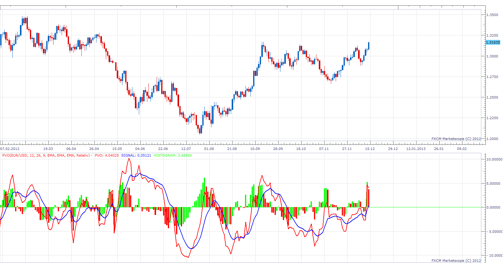

# Percentage Volume Oscillator (PVO)

> Source: https://fxcodebase.com/code/viewtopic.php?f=17&t=27744  
> Forum: 17 · Topic 27744 · 3 post(s)

---

## Percentage Volume Oscillator (PVO)

**Apprentice** · Sun Dec 16, 2012 7:06 am

The Percentage Volume Oscillator (PVO) is a momentum oscillator for volume. PVO measures the difference between two volume-based moving averages as a percentage of the larger moving average.

Percentage Volume Oscillator (PVO):
((12-day EMA of Volume - 26-day EMA of Volume)/26-day EMA of Volume) x 100

Signal Line: 9-day EMA of PVO

PVO Histogram: PVO - Signal Line

 [PVO.lua](files/48593/PVO.lua)

As you have noticed, it is identical to the MACD.
Instead of price, PVO uses Volume.

MT4 version.
[viewtopic.php?f=38&t=61248](https://fxcodebase.com/code/viewtopic.php?f=38&t=61248)

---

## Re: Percentage Volume Oscillator (PVO)

**Alexander.Gettinger** · Thu Sep 25, 2014 9:20 am

MQL4 version of PVO: [viewtopic.php?f=38&t=61248](https://fxcodebase.com/code/viewtopic.php?f=38&t=61248).

---

## Re: Percentage Volume Oscillator (PVO)

**Apprentice** · Fri Jun 23, 2017 6:59 am

The indicator was revised and updated.
