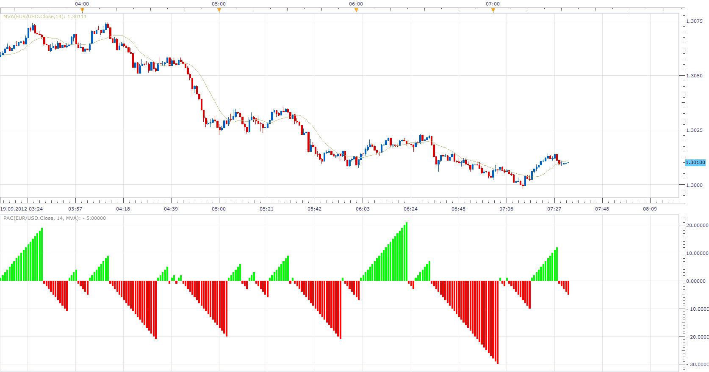

# Period After Cross

> Source: https://fxcodebase.com/code/viewtopic.php?f=17&t=23585  
> Forum: 17 · Topic 23585 · 3 post(s)

---

## Period After Cross

**Apprentice** · Wed Sep 19, 2012 6:28 am

This indicator shows number of periods since last Price / Moving Average Cross.

 [PAC.lua](files/40587/PAC.lua)

The indicator was revised and updated

---

## Re: Period After Cross

**Alexander.Gettinger** · Mon Oct 27, 2014 11:05 am

MQL4 version of Period After Cross oscillator: [viewtopic.php?f=38&t=61389](https://fxcodebase.com/code/viewtopic.php?f=38&t=61389).

---

## Re: Period After Cross

**Apprentice** · Tue Jun 27, 2017 3:31 am

The indicator was revised and updated.
