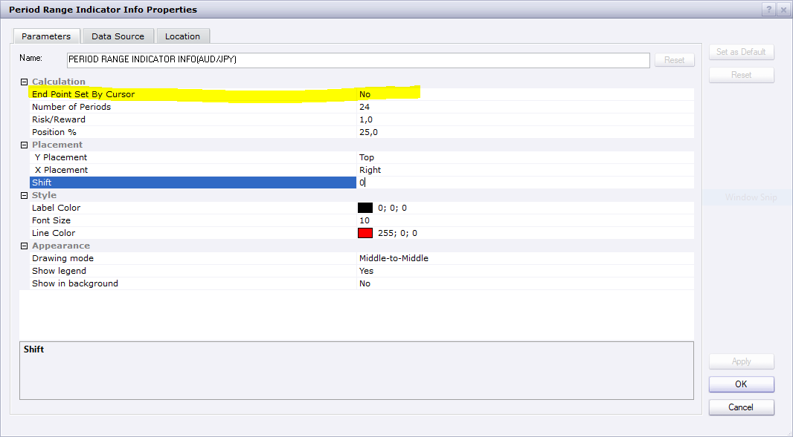
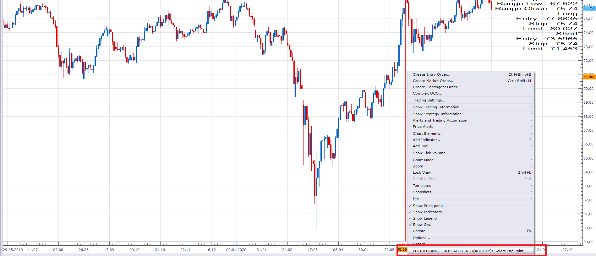

# Period Range Indicator Info

> Source: https://fxcodebase.com/code/viewtopic.php?f=17&t=70307  
> Forum: 17 · Topic 70307 · 8 post(s)

---

## Period Range Indicator Info

**Apprentice** · Tue Aug 18, 2020 5:03 am

Based on request.
[viewtopic.php?f=27&t=70296](https://fxcodebase.com/code/viewtopic.php?f=27&t=70296)

 [Period Range Indicator Info.lua](files/136911/Period%20Range%20Indicator%20Info.lua)

 

 

 [Period Range Indicator Info With Selector.lua](files/136911/Period%20Range%20Indicator%20Info%20With%20Selector.lua)

---

## Re: Period Range Indicator Info

**Apprentice** · Thu Aug 20, 2020 10:55 am

Period Range Indicator Info With Selector.lua added.

---

## Re: Period Range Indicator Info

**fxtrading** · Thu Aug 20, 2020 5:05 pm

Awesome - Thank you very much!

Very satisfied!!!

---

## Re: Informations sur l’indicateur de la plage de période

**bruno2017** · Fri Aug 21, 2020 6:52 am

Hello
can we make a strategy with this indicator
tank you

---

## Re: Period Range Indicator Info

**Apprentice** · Mon Aug 24, 2020 3:59 am

can you define the rules?

---

## Re: Informations sur l’indicateur de la plage de période

**bruno2017** · Tue Aug 25, 2020 4:18 am

> **Apprentice wrote:**
> Fxtrading, can you define the rules?

like that.

---

## Re: Period Range Indicator Info

**Apprentice** · Tue Aug 25, 2020 5:30 am

Your request is added to the development list.
Development reference 1926.

---

## Re: Period Range Indicator Info

**Apprentice** · Tue Aug 25, 2020 6:35 am

Try this version.
[viewtopic.php?f=31&t=70328](https://fxcodebase.com/code/viewtopic.php?f=31&t=70328)

Make sure you re-download Period Range Indicator Info.lua
