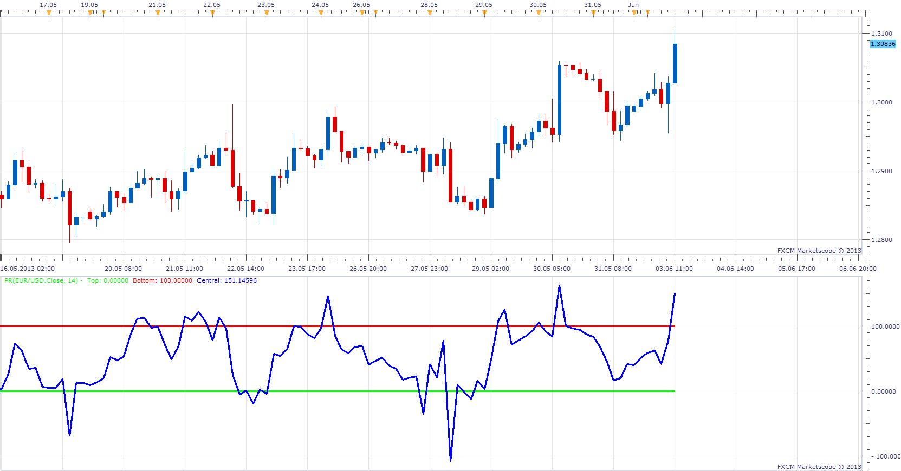
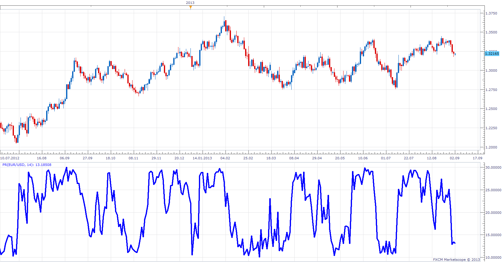

# Period Range

> Source: https://fxcodebase.com/code/viewtopic.php?f=17&t=39716  
> Forum: 17 · Topic 39716 · 9 post(s)

---

## Period Range

**Apprentice** · Mon Jun 03, 2013 12:10 pm

Indicator Will show percent position of the closing price within the range for last N periods,
which have preceded.

 [PR.lua](files/65210/PR.lua)

The indicator was revised and updated

---

## Re: Period Range

**sho-me-pips** · Wed Jun 26, 2013 12:39 pm

Would you modify this indicator or create a new indicator. Scale the numbering from 50% as 0.

100% = 10
0% = 10

I believe the math is: if > 50% (50%-PR)/PR*10 elseif < 50% -(50%-PR)/PR*10

Thank you in advance. This has been a very useful indi so far...

---

## Re: Period Range

**Apprentice** · Fri Jun 28, 2013 2:26 am

Your request is added to the development list.

---

## Re: Period Range

**Apprentice** · Sun Jun 30, 2013 11:32 am

 [PR.lua](files/69327/PR.lua)

---

## Re: Period Range

**sho-me-pips** · Sun Jun 30, 2013 11:25 pm

The formula works perfectly in excel.

You are correct, after looking closely at the formula, these are the changes I made and it is working perfectly.

Code: [Select all](https://fxcodebase.com/code/)
`Central[period]=((source.close[period]-min) /((max-min)/100));
 end
 
 if Central[period] > 50 then
 Central[period]=((Central[period]-50)/50*10)
 elseif  Central[period]< 50  then
 Central[period]=((50-Central[period])/50*10)
 end`

Thank You Very much...

---

## Re: Period Range

**Apprentice** · Wed Jul 03, 2013 2:37 am

Upper indicator is updated according to the new formula.

---

## Re: Period Range

**Apprentice** · Mon Sep 02, 2013 4:00 am

Use Last Period, parameter introduced.
If set to Yes, the current period is used in the calculation.

---

## Re: Period Range

**Alexander.Gettinger** · Thu Sep 26, 2013 11:52 am

MQL4 version of Period range oscillator: [viewtopic.php?f=38&t=59589](https://fxcodebase.com/code/viewtopic.php?f=38&t=59589).

---

## Re: Period Range

**Apprentice** · Fri Jun 09, 2017 7:33 am

The indicator was revised and updated.
