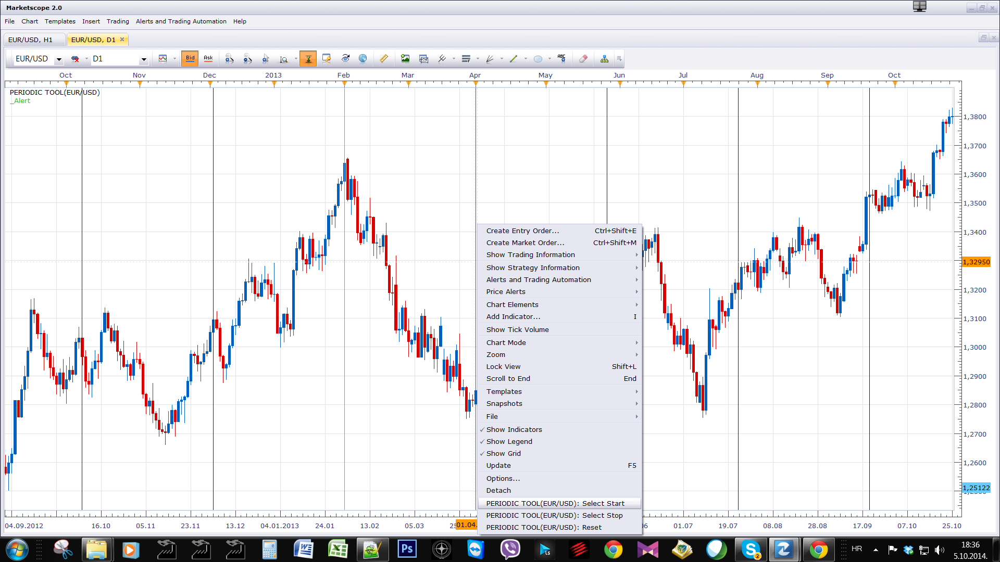
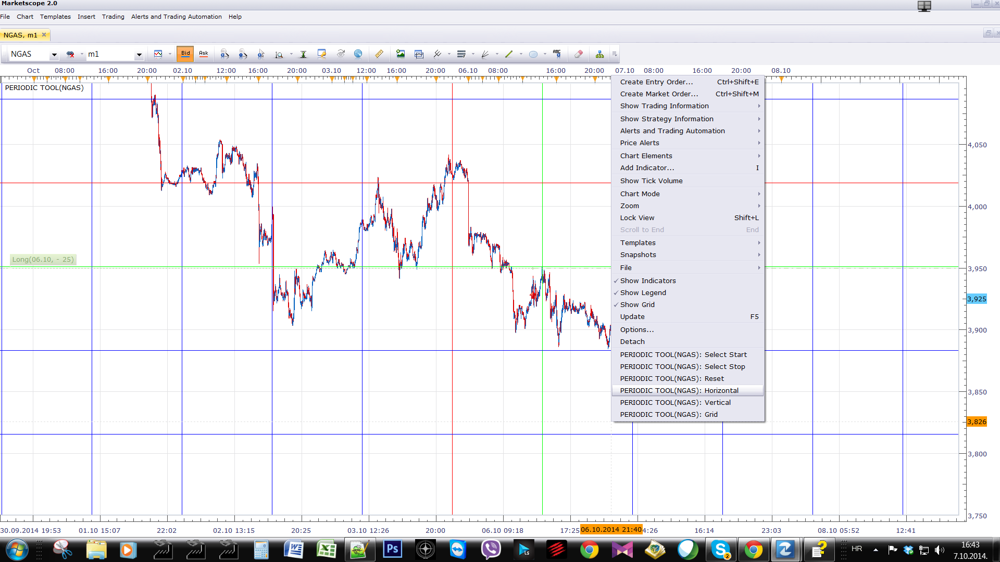

# Periodic Tool

> Source: https://fxcodebase.com/code/viewtopic.php?f=17&t=61301  
> Forum: 17 · Topic 61301 · 10 post(s)

---

## Periodic Tool

**Apprentice** · Sun Oct 05, 2014 11:37 am

 

Price action can sometimes have periodically repeating pattern.
This tool will draw a vertical line.
The distance between two adjacent lines is defined by the Start / Stop line.

 [Periodic Tool.lua](files/96378/Periodic%20Tool.lua)

 

Grid, allows manual input.

 [Grid.lua](files/96378/Grid.lua)

The indicator was revised and updated

---

## Re: Periodic Tool

**volnmar** · Mon Oct 06, 2014 2:38 pm

can you do this for horizontal lines too?

---

## Re: Periodic Tool

**Apprentice** · Tue Oct 07, 2014 9:41 am

"Horizontal, "Vertical & "Grid" Option Added.

---

## Re: Periodic Tool

**volnmar** · Wed Oct 08, 2014 7:00 am

god job thanks

---

## Re: Periodic Tool

**Apprentice** · Sun Dec 07, 2014 5:12 am

Update

---

## Re: Periodic Tool

**Apprentice** · Wed Jul 27, 2016 8:53 am

Grid.lua added.

---

## Re: Periodic Tool

**Hailkayy** · Wed Jul 27, 2016 12:05 pm

That's lit apprentice.

You got the core aspect of my query with the cursor to be able to select the date.
That's next level. Thanks.

On the final tweakings, I got plenty of stuff on chart so can you make
thickness and lines style option please ?

Dope !
Thanks.

---

## Re: Periodic Tool

**Apprentice** · Thu Jul 28, 2016 5:43 am

Try it now.

---

## Re: Periodic Tool

**Hailkayy** · Wed Aug 03, 2016 12:01 am

Thanks !

---

## Re: Periodic Tool

**Apprentice** · Fri May 05, 2017 4:46 pm

Indicator was revised and updated.
