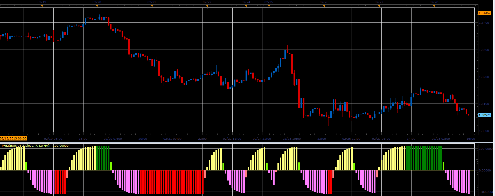

# PFE2 oscillator

> Source: https://fxcodebase.com/code/viewtopic.php?f=17&t=32540  
> Forum: 17 · Topic 32540 · 2 post(s)

---

## PFE2 oscillator

**Alexander.Gettinger** · Thu Feb 28, 2013 4:57 pm

This indicator is a ported MQL5 indicators from [http://www.mql5.com/en/code/1502](http://www.mql5.com/en/code/1502)

 

Download:

 [PFE2.lua](files/55433/PFE2.lua)

For this indicator must be installed Averages indicator ([viewtopic.php?f=17&t=2430](https://fxcodebase.com/code/viewtopic.php?f=17&t=2430)).

The indicator was revised and updated

---

## Re: PFE2 oscillator

**Apprentice** · Tue May 09, 2017 5:43 am

Indicator was revised and updated.
