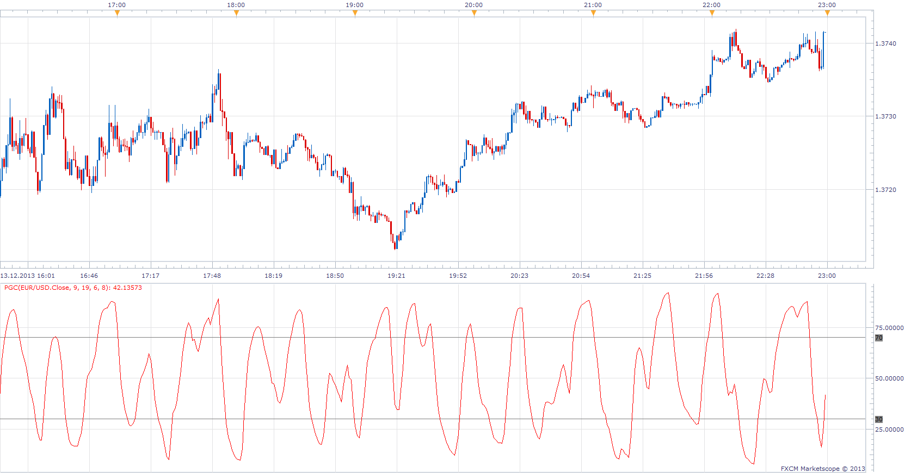

# PG Cycle

> Source: https://fxcodebase.com/code/viewtopic.php?f=17&t=60116  
> Forum: 17 · Topic 60116 · 6 post(s)

---

## PG Cycle

**Apprentice** · Sat Dec 14, 2013 2:51 pm

Posted by request.
[viewtopic.php?f=27&t=60115](https://fxcodebase.com/code/viewtopic.php?f=27&t=60115)

 [PGC.lua](files/91523/PGC.lua)

The indicator was revised and updated

---

## Re: PG Cycle

**PascalG** · Sun Dec 15, 2013 4:42 am

You are great ! and you've done it so quickly !...Thank you very much

---

## Re: PG Cycle

**supertrader123** · Wed Dec 18, 2013 2:54 am

can you create a strategy based on this indicator with ema

indicator:
1. pg cycle with default parameters

 buy level: 30
 sell level : 70

2. ema 9

3.ema 19

**buy:**

ema 9 > ema 19 and price > ema 9 and pg cycle cross over buy level

**sell:**

ema 9 < ema 19 and price < ema 9 and pg cycle cross under sell level

---

## Re: PG Cycle

**Apprentice** · Thu Dec 19, 2013 3:42 am

Your request is added to the development list.

---

## Re: PG Cycle

**Alexander.Gettinger** · Mon Aug 18, 2014 2:18 pm

MQL4 version of PG Cycle oscillator: [viewtopic.php?f=38&t=61053](https://fxcodebase.com/code/viewtopic.php?f=38&t=61053).

---

## Re: PG Cycle

**Apprentice** · Sun Jun 25, 2017 1:31 pm

The indicator was revised and updated.
