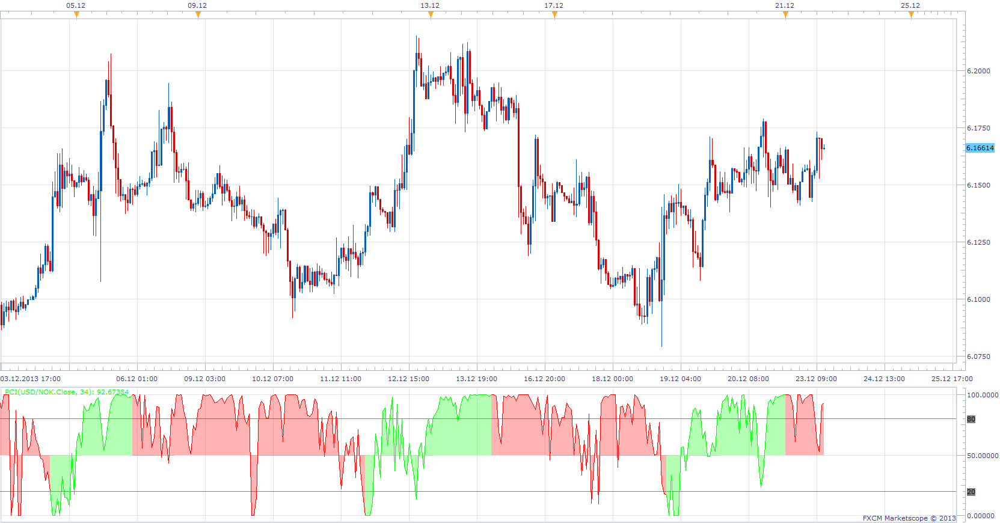

# Phase Change Index

> Source: https://fxcodebase.com/code/viewtopic.php?f=17&t=60141  
> Forum: 17 · Topic 60141 · 6 post(s)

---

## Phase Change Index

**Apprentice** · Mon Dec 23, 2013 6:06 am

Inspired by an article Waxing And Waning : Phase Change Index by M.H. Pee
Which phase is your market going through? Find out by using this indicator.
Published in S & C magazine.

 [PCI.lua](files/91652/PCI.lua)

 [PCI with Alert.lua](files/91652/PCI%20with%20Alert.lua)

The indicator was revised and updated

---

## Re: Phase Change Index

**Alexander.Gettinger** · Mon Aug 18, 2014 2:06 pm

MQL4 version of Phase Change Index: [viewtopic.php?f=38&t=61050](https://fxcodebase.com/code/viewtopic.php?f=38&t=61050).

---

## Re: Phase Change Index

**jamrocktrader** · Mon Feb 20, 2017 10:03 am

Hi Apprentice,

Could you add an alert that goes off on the close of candle when the indicator changes from color of short to color of long.

Thank You

---

## Re: Phase Change Index

**Apprentice** · Tue Feb 21, 2017 6:37 am

PCI with Alert.lua added.

---

## Re: Phase Change Index

**mulligan** · Tue Feb 21, 2017 12:51 pm

PCI with alert - Very handy indicator. Getting an error message at alerts "attempt to index up value 'Up' (a number value)" and similar referencing "down". Thanks for your help.

---

## Re: Phase Change Index

**Apprentice** · Tue Feb 21, 2017 4:00 pm

Try it now.
