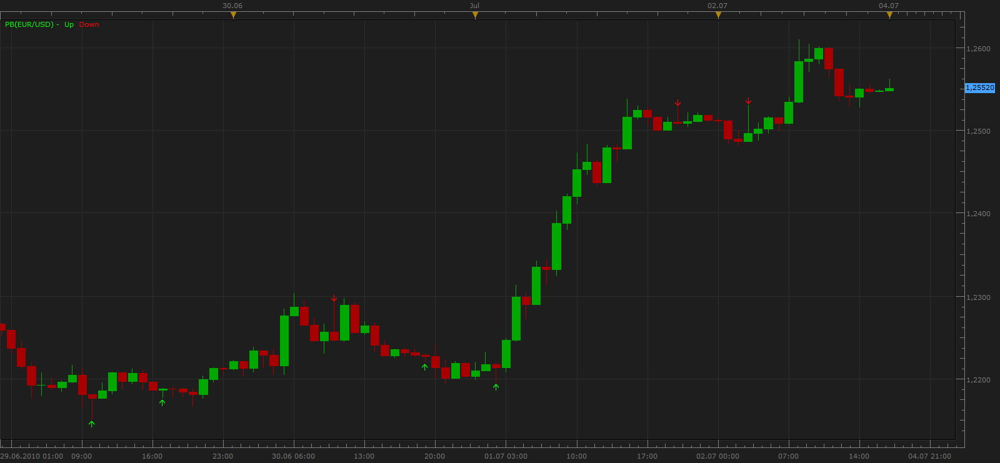
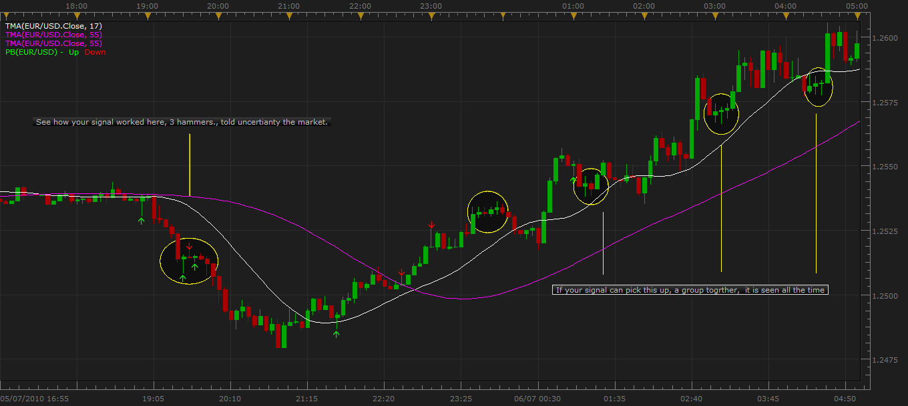

# Pin Bar a.k.a. "Pinocchio Bar"

> Source: https://fxcodebase.com/code/viewtopic.php?f=17&t=1459  
> Forum: 17 · Topic 1459 · 41 post(s)

---

## Pin Bar a.k.a. "Pinocchio Bar"

**Apprentice** · Sun Jul 04, 2010 5:18 pm

This indicator will help you find Pin bar a.k.a. "Pinocchio Bar" reversal pattern.

Pin Bar Characteristics
Open and Close of pin bar is within left eye
Open and Close of pin bar are very close together (the closer the better)
Open and Close of pin bar near one end of bar (the closer to an end the better)
A long nose that sticks out from surrounding prices (the longer the better)

Candle preceding is called left eye, and following candle is called right eye.
Option allows you to define the length of the nose as a percentage of the total length of candle,
 includ checks of the left eye rule.

If MA filter is ON.
We will only have up signals if Price > MA,
We will only have down signals if Price < MA

 [PB.lua](files/2852/PB.lua)

 [PB with Alert.lua](files/2852/PB%20with%20Alert.lua)

This indicator provides Audio / Email Alerts if and when Pin Bar has been confirmed.
Compatibility issue Fix. _Alert helper is not longer needed.

 

 [PB Oscillator.lua](files/2852/PB%20Oscillator.lua)

Simplified Pin Bar Characteristics

Open and Close of pin bar are very close together (the closer the better)
Open and Close of pin bar near one end of bar (the closer to an end the better)
A long nose that sticks out from surrounding prices (the longer the better)

If MA filter is ON.
We will only have up signals if Price > MA,
We will only have down signals if Price < MA

 [Simplified Pin Bar.lua](files/2852/Simplified%20Pin%20Bar.lua)

 [MTF MCP Simplified Pin Bar List.lua](files/2852/MTF%20MCP%20Simplified%20Pin%20Bar%20List.lua)

---

## Re: Pin Bar a.k.a. "Pinocchio Bar"

**gravboy** · Thu Jul 08, 2010 5:26 pm

This is a great indicator. I love it, helps me see the hammer without looking. . I am no programer, but if you could do the same with a Doji, and a spinning top + Hammer, that would make my day.
If you notice, when a market turns on a 5 min chart also a 15 min, you usually get a spinning top or doji, followed by a hammer, then the market turns., If you could make one signal with a group of 2 or more, that would be super.

 

*DOJI, SPINNING TOP,HAMMERS*

---

## Re: Pin Bar a.k.a. "Pinocchio Bar"

**costock** · Thu Jul 22, 2010 8:50 am

Hi

This is a very useful tool, just been evaluating it. I notice that there is a new command terminal:alertEmail which would be really handy to add to indicators like this.

Can you give me some clues how this could be done?

thanks

---

## Re: Pin Bar a.k.a. "Pinocchio Bar"

**Apprentice** · Thu Jul 22, 2010 10:38 am

For now this option is available only in beta version.
I advise you waited until the moment when this functionality is included in the commercial version.

---

## Re: Pin Bar a.k.a. "Pinocchio Bar"

**ajgregg720** · Tue Sep 14, 2010 6:20 pm

Any ideas on when this will be in commercial version?

---

## Re: Pin Bar a.k.a. "Pinocchio Bar"

**Apprentice** · Wed Sep 15, 2010 2:51 am

It is available now.

---

## Re: Pin Bar a.k.a. "Pinocchio Bar"

**MrDavide79** · Thu Nov 15, 2012 7:24 am

Hello Apprentice,
where is avaible now this indicator?

thanks

---

## Re: Pin Bar a.k.a. "Pinocchio Bar"

**MrDavide79** · Thu Nov 15, 2012 8:05 am

Can someone please post a screenshot of parameters ?
what means number of parameters? pips or % ?
thanks

---

## Re: Pin Bar a.k.a. "Pinocchio Bar"

**Apprentice** · Fri Nov 16, 2012 4:37 am

Body Lengt, 33
The body is at least 33 percent of the candle.

Body Position, 33
The body is in the first 33 percent of candle.
(this can be top or bottom percent)

Nose Leng, 33
Nose or Wick,is at least 33 percent of candle.

---

## Re: Pin Bar a.k.a. "Pinocchio Bar"

**MrDavide79** · Sat Nov 17, 2012 10:34 am

> **Apprentice wrote:**
> Body Lengt, 33
> The body is at least 33 percent of the candle.
>
> Body Position, 33
> The body is in the first 33 percent of candle.
> (this can be top or bottom percent)
>
> Nose Leng, 33
> Nose or Wick,is at least 33 percent of candle.

sorry but are you sure that Body Lengt, is:
The body **is at least** 33%
or
The Body **is the**33%

because if i put Body Lengt, 100% Indicator found candle

---

## Re: Pin Bar a.k.a. "Pinocchio Bar"

**MrDavide79** · Sat Nov 17, 2012 10:44 am

i dont understand why if i put
**Body Lengt, 100%, the Indicator found me PINBAR**
es.
Candle = 50pips
BodyLengt 100% = 50pips

this mean that impossible found a PINBAR, correct?

is possible to put % about:
Body **is** % of candle
Position Body **is**% of candle
Nose or Wick **is** % of candle

thanks

---

## Re: Pin Bar a.k.a. "Pinocchio Bar"

**Apprentice** · Sun Nov 18, 2012 8:25 am

Here we are talking about the largest body value.
if you put 100 % all body lengths match

---

## Re: Pin Bar a.k.a. "Pinocchio Bar"

**MrDavide79** · Fri Nov 23, 2012 3:02 am

> **Apprentice wrote:**
> Here we are talking about the largest body value.
> if you put 100 % all body lengths match

sorry but i dont understand

if i want to put:
BODY LENGT MAXIMUM 20% of the candle,
which parameter i have to change and what value i have to put ?

the same question is for NOSE LENGT

thanks a lot

---

## Re: Pin Bar a.k.a. "Pinocchio Bar"

**Apprentice** · Fri Nov 23, 2012 3:56 am

To have 20 % max. Body Lengt, set Body Lengt to 20.
Wich and Nose are not same thing!!!
Nose is length of the candles,
higher / lower then the high / low of the previous candle.

---

## Re: Pin Bar a.k.a. "Pinocchio Bar"

**parisblue2** · Wed Sep 04, 2013 12:28 pm

Hola,

Would someone with scripting experience add an email and/or sound alert to the pinbar indicator?

This MA indicator has email and sound alert but I wouldn't even know where to begin:
[viewtopic.php?f=17&t=59311&p=89035&hilit=alert#p89035](https://fxcodebase.com/code/viewtopic.php?f=17&t=59311&p=89035&hilit=alert#p89035)

Would be greatly appreciated.

---

## Re: Pin Bar a.k.a. "Pinocchio Bar"

**Apprentice** · Thu Sep 05, 2013 2:00 am

Your request is added to the development list.

---

## Re: Pin Bar a.k.a. "Pinocchio Bar"

**Apprentice** · Thu Sep 05, 2013 8:04 am

Pin Bar Updated.
Pin Bar with Alert Added.

---

## Re: Pin Bar a.k.a. "Pinocchio Bar"

**parisblue2** · Sat Sep 14, 2013 8:14 am

Thank you for PB with Alert.lua!

---

## Re: Pin Bar a.k.a. "Pinocchio Bar"

**bluegreen** · Tue Feb 04, 2014 5:51 am

could you help me please, I installed and activated alert.lua and installed pin bar helper with alert and turned on sound alert but I get no sound alert or popup or anything when there's a pin bar? The arrows do display correctly on the chart and I can see alert is running in strategy dashboard with the green triangle symbol next to it and it's set to the correct pair. any help would be much appreciated.

---

## Re: Pin Bar a.k.a. "Pinocchio Bar"

**Apprentice** · Tue Feb 04, 2014 7:28 am

Works as expected for me.
Did you set the "Play Sound" to Yes.

One note, this version works, in the End of Turn mode.
Alert is given at the end of the turn.

---

## Re: Pin Bar a.k.a. "Pinocchio Bar"

**bluegreen** · Tue Feb 04, 2014 12:58 pm

yes apprentice I set "play sound" to yes, and I have found through some experimenting that the sound does work but only if I leave a chart with the relevant pair open with the indicator loaded on it (obviously), If I change the chart to another pair then it stops generating sound alerts, but I still don't get any popup message so I have no idea which pair or time frame has a pin bar. has anyone else had this problem?

---

## Re: Pin Bar a.k.a. "Pinocchio Bar"

**Apprentice** · Thu Feb 06, 2014 3:25 am

Make sure to have (One) Active _Alert for Each currency pair used.

---

## Re: Pin Bar a.k.a. "Pinocchio Bar"

**DAVIDR** · Sat Nov 15, 2014 3:42 am

Hi, is there and MT4 version available for this indicator?

All the best.

---

## Re: Pin Bar a.k.a. "Pinocchio Bar"

**Apprentice** · Sat Nov 15, 2014 5:43 am

Not as this time.
Will add your request to the development list.

---

## Re: Pin Bar a.k.a. "Pinocchio Bar"

**Delta3** · Sun Feb 22, 2015 5:14 pm

Hello there

Is there a possibility to add an option to make the arrows bigger ?

TIA

---

## Re: Pin Bar a.k.a. "Pinocchio Bar"

**Apprentice** · Tue Feb 24, 2015 6:27 am

Arrow Size Option Added.

---

## Re: Pin Bar a.k.a. "Pinocchio Bar"

**Delta3** · Tue Feb 24, 2015 7:42 am

Chairs

---

## Re: Pin Bar a.k.a. "Pinocchio Bar"

**Apprentice** · Mon Dec 14, 2015 4:17 am

Compatibility issue Fix. _Alert helper is not longer needed.

If you want to use updated version of this indicator,
please make sure to use TS Version 01.14.101415. or higher.

---

## Re: Pin Bar a.k.a. "Pinocchio Bar"

**Cactus** · Sun Feb 28, 2016 11:13 am

This is useful however I am after a slight modification of this indicator. Instead of displaying arrows, can it be turned into an oscillator that displays value 1 when a bearish pin bar forms and -1 when a bullish pin bar forms? Behaving in a similar fashion to the existing "Elliot Wave Indicator" found in Trading Station (line jumps from 1 to -1), thanks.

---

## Re: Pin Bar a.k.a. "Pinocchio Bar"

**Apprentice** · Mon Feb 29, 2016 6:08 am

PB Oscillator.lua Added.

---

## Re: Pin Bar a.k.a. "Pinocchio Bar"

**Apprentice** · Wed Aug 10, 2016 4:57 am

Strategy is available here.
[viewtopic.php?f=31&t=63747](https://fxcodebase.com/code/viewtopic.php?f=31&t=63747)

---

## Re: Pin Bar a.k.a. "Pinocchio Bar"

**Apprentice** · Wed Mar 22, 2017 5:54 pm

Indicator was revised and updated.

---

## Re: Pin Bar a.k.a. "Pinocchio Bar"

**baccicin** · Thu Mar 23, 2017 12:02 pm

Hello Apprentice, may I ask to add these conditions?
an arrow is shown only if:
- the spike is at least 75% of the total range of the candle and, in an uptrend the spike shoots up and the "high" is higher than the last 4 highs; the opposite shadow is no more than a 3% of the total range of the candle
- the spike is at least 75% of the total range of the candle and, in a downtrend the spike shoots down and the "low" is lower than the last 4 lows; the opposite shadow is no more than a 3% of the total range of the candle
The best would be the possibility to change these options in the parameters, so to change them if needed.
Many thanks, ciao. Fabio

---

## Re: Pin Bar a.k.a. "Pinocchio Bar"

**Apprentice** · Thu Mar 23, 2017 1:36 pm

Your request is added to the development list, Under Id Number 3770
 If someone is interested to do this task, please contact me.

---

## Re: Pin Bar a.k.a. "Pinocchio Bar"

**Apprentice** · Thu Mar 23, 2017 2:05 pm

Try this version.
[viewtopic.php?f=17&t=64539](https://fxcodebase.com/code/viewtopic.php?f=17&t=64539)

---

## Re: Pin Bar a.k.a. "Pinocchio Bar"

**Apprentice** · Tue Mar 27, 2018 3:50 pm

The Indicator was revised and updated.

---

## Re: Pin Bar a.k.a. "Pinocchio Bar"

**Apprentice** · Tue Mar 27, 2018 6:05 pm

Simplified Pin Bar.lua added.

---

## Re: Pin Bar a.k.a. "Pinocchio Bar"

**chipsoft** · Tue Apr 03, 2018 7:10 am

Hi Apprentice,
Could you please add one more filter (% Range) to this nice indicator to qualify specific type of Pin bar:
1. Kindly add %Range of the Pin bar as compare to Average Range of n bars behind it in terms of %. So suppose % range of the Pin bar I have selected as 30% for last 5 bars, which mean the range of the pin bar is 130% of the range of last 5 bars range.

I will appreciate your great work....

---

## Re: Pin Bar a.k.a. "Pinocchio Bar"

**Apprentice** · Wed Apr 04, 2018 4:39 am

Simplified Pin Bar has been updated accordingly.

---

## Re: Pin Bar a.k.a. "Pinocchio Bar"

**chipsoft** · Wed Apr 04, 2018 12:41 pm

Thanks very much Apprentice.
Could I have multi time frame and multi instruments scanner for this Indicator.

Regards

---

## Re: Pin Bar a.k.a. "Pinocchio Bar"

**Apprentice** · Thu Apr 05, 2018 5:06 am

MTF MCP Simplified Pin Bar List.lua added.
Please re-download Simplified Pin Bar.
