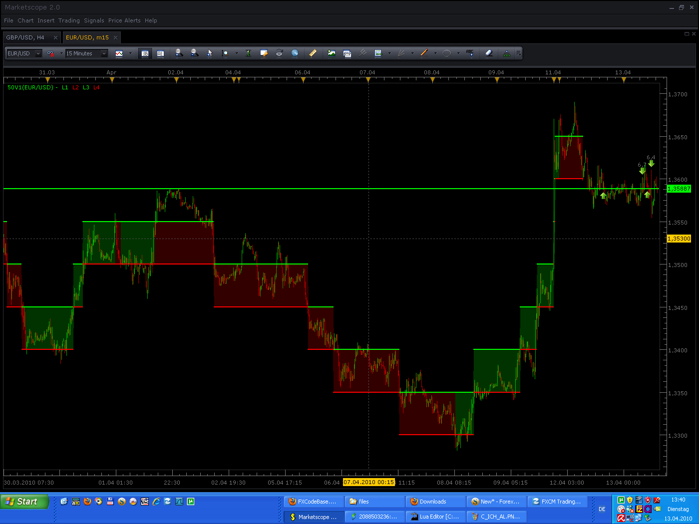
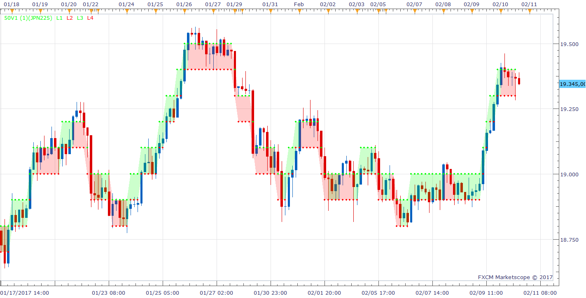

# PIP Boxed Indicator Update New Version

> Source: https://fxcodebase.com/code/viewtopic.php?f=17&t=628  
> Forum: 17 · Topic 628 · 12 post(s)

---

## PIP Boxed Indicator Update New Version

**Gidien** · Tue Apr 13, 2010 6:46 am

Pip Boxed Indicator.

Each time the price move 50 pips up, it draw a green Cloud.
Each time the price move 50 pips down, it draw a red Cloud.

This Indicator does not take care about time, a cloud is drawn when 50 pips are done whatever the time to reach it.

Is Part of the 50 Pips Candle System found on Forex Factory.

You can set the Pips to your own feeling.

Pic:

 

Code:

 [50V1.lua](files/1116/50V1.lua)

New Version, now it should work on all pairs, 2 or 4 digit Pairs. Older Version only works on 4 digits

The indicator was revised and updated

---

## Re: PIP Boxed Indicator

**Gidien** · Tue Apr 13, 2010 7:49 am

Trading Pattern could be:

Taken from Forex Factory Forum:

GG = Long, because Market seems to be in a UP Trend
RR = Short, because Market seems to be in a DOWN Trend
GGR = No Trade
RRG = No Trade
RGR = Long , because Market seems to be in a Range
GRG = Short, because Market seems to be in a Range

---

## Re: PIP Boxed Indicator

**patick** · Tue Apr 13, 2010 9:13 pm

Y E S

---

## Re: PIP Boxed Indicator Update New Version

**danielsandrin** · Mon Nov 22, 2010 9:52 am

Hi. Why doesn't it work for the gold chart?. When I activate the indicator it doesn't appear in the chart, and if I try to change the parameters, an error sign appears. Thanks

---

## Re: PIP Boxed Indicator Update New Version

**Apprentice** · Mon Nov 22, 2010 12:23 pm

Corrected (Temporary Fix).
Author of indicators, did not allow the values above 1000
I've expanded the range to 2000.

But because the pace of gold rises,
two years ago one of my analysis indicated possible growth to $ 1800 per ounce,
I'll have to find a universal solution, when I find time.

---

## Re: PIP Boxed Indicator Update New Version

**Apprentice** · Mon Nov 22, 2010 1:20 pm

Universal solution added.

However, I would ask the author to contact me.
I'm not sure whether it achieved what was his goal.
Maybe I can help.

---

## Re: PIP Boxed Indicator Update New Version

**Apprentice** · Thu Feb 02, 2017 4:15 pm

Indicator was revised and updated.

---

## Re: PIP Boxed Indicator Update New Version

**gustavonoves** · Sun Feb 12, 2017 8:12 am

Hello. This is my favourite indicator, and I've been trying to use it in Symbols such us JPN225, SPX500 among others, but it doesn't seem to be working. Is there anything I can do? Thanks so much for your help

---

## Re: PIP Boxed Indicator Update New Version

**Apprentice** · Sun Feb 12, 2017 2:58 pm

Try it now.

---

## Re: PIP Boxed Indicator Update New Version

**gustavonoves** · Thu Mar 06, 2025 1:13 pm

Could you please make a strategy out of this indicator?.

Logic: Every time a greeen square is drawn, buy market order is placed. Every time a red square is drawn, sell market order is placed. Limit and stop to be defined by user in parameters (yes/no, and how much).

Thanks

---

## Re: PIP Boxed Indicator Update New Version

**Apprentice** · Mon Mar 10, 2025 2:48 pm

We have added your request to the development list.
Development reference 178

---

## Re: PIP Boxed Indicator Update New Version

**Apprentice** · Thu Jun 05, 2025 5:49 am

Indicator based strategy.
[https://fxcodebase.com/code/viewtopic.p ... 66#p159466](https://fxcodebase.com/code/viewtopic.php?f=31&t=75994&p=159466#p159466)
