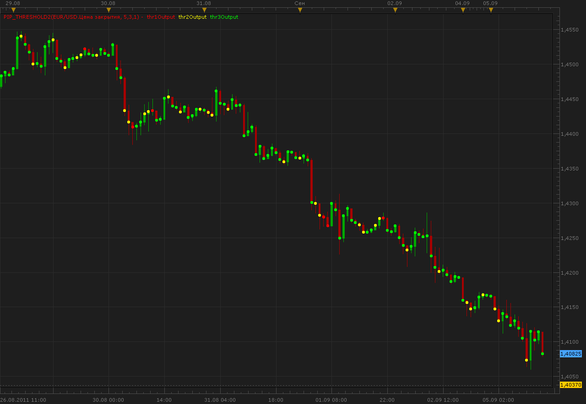

# Pip threshold indicator

> Source: https://fxcodebase.com/code/viewtopic.php?f=17&t=6309  
> Forum: 17 · Topic 6309 · 3 post(s)

---

## Pip threshold indicator

**Alexander.Gettinger** · Mon Sep 05, 2011 12:25 pm

The indicator shows the sequence of candles in one direction.
[Thr1], [Thr2], [Thr3] is a length of sequences (simultaneously displayed 3 sequences).

 

Download:

 [Pip_Threshold.lua](files/14556/Pip_Threshold.lua)

The indicator was revised and updated

---

## Re: Pip threshold indicator

**Apprentice** · Tue Apr 10, 2012 1:32 am

Updated.

---

## Re: Pip threshold indicator

**Apprentice** · Mon Apr 03, 2017 5:48 am

Indicator was revised and updated.
