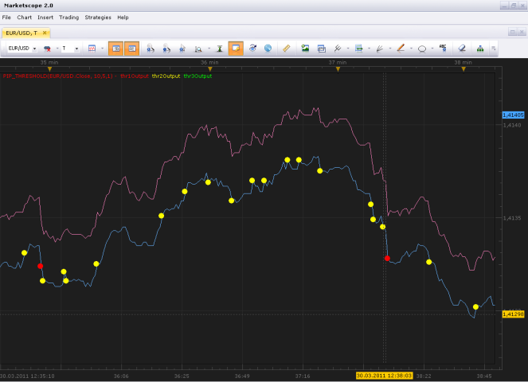

# Pip-tick threshold.

> Source: https://fxcodebase.com/code/viewtopic.php?f=17&t=3781  
> Forum: 17 · Topic 3781 · 4 post(s)

---

## Pip-tick threshold.

**Timon55** · Wed Mar 30, 2011 11:46 am

> What about this, for ease of use and simplicity, an indicator that only shows a signal for when a tick movement- to -pip threshold has been met. For example; if we get a 15pip move in 1 tick, it shows a red dot(or some simple graphic, the simpler the better) and if we get a 10 pip move or greater in 1 tick it displays an amber dot and if we get a <5 pip move in 1 tick it displays a green dot etc.

 

Full description can be found here [http://fxcodebase.com/code/viewtopic.php?f=27&t=3666](https://fxcodebase.com/code/viewtopic.php?f=27&t=3666)

 [pip_threshold.lua](files/9201/pip_threshold.lua)

The indicator was revised and updated

---

## Re: Pip-tick threshold.

**Trader1** · Thu Sep 01, 2011 8:04 pm

this is a great idea. thank you!

---

## Re: Pip-tick threshold.

**Apprentice** · Tue Apr 10, 2012 2:56 am

Update.

---

## Re: Pip-tick threshold.

**Apprentice** · Sun Apr 02, 2017 7:35 am

Indicator was revised and updated.
