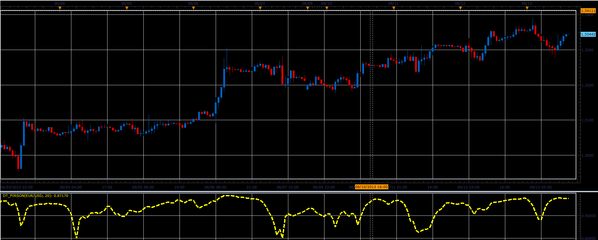

# Pirson oscillator

> Source: https://fxcodebase.com/code/viewtopic.php?f=17&t=41283  
> Forum: 17 · Topic 41283 · 2 post(s)

---

## Pirson oscillator

**Alexander.Gettinger** · Tue Jun 18, 2013 12:21 pm

This indicator is a ported MQL5 indicator from [http://www.mql5.com/en/code/1681](http://www.mql5.com/en/code/1681)
The indicator shows the volatility.

Formulas:
Pirson = Sum/Res, where
Sum = sum((Close-MA)*(Close-MA)),
Res = Period*StdDev[i]*StdDev[i-1].

 

Download:

 [DT_Pirson.lua](files/67503/DT_Pirson.lua)

For this indicator must be installed StdDev indicator ([viewtopic.php?f=17&t=870](https://fxcodebase.com/code/viewtopic.php?f=17&t=870)).

The indicator was revised and updated

---

## Re: Pirson oscillator

**Apprentice** · Tue May 23, 2017 5:45 am

Indicator was revised and updated.
