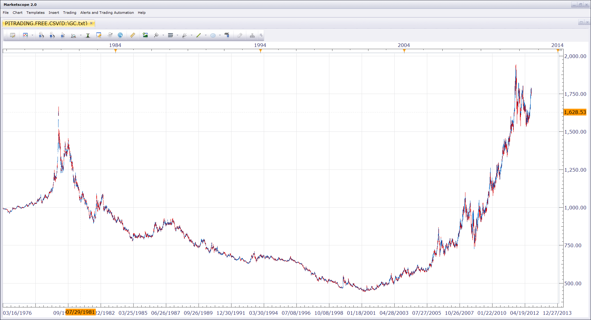

# Pitrading CSV files view

> Source: https://fxcodebase.com/code/viewtopic.php?f=17&t=58426  
> Forum: 17 · Topic 58426 · 2 post(s)

---

## Pitrading CSV files view

**Nikolay.Gekht** · Wed Jul 31, 2013 12:19 pm

The view displays CSV files published on [Pi Trading web site](http://pitrading.com/historical_data.htm). In order to be used, the CSV file must be downloaded to the client computer and extracted from the ZIP archive.

The data is displayed as a regular chart and can be handled as any other chart in Marketscope.

 

Download:

 [pitrading.free.csv.lua](files/87585/pitrading.free.csv.lua)

Gold example data (more data can be loaded from pi trading, see link above)

 [GC.txt](files/87585/GC.txt)

The indicator was revised and updated

---

## Re: Pitrading CSV files view

**Apprentice** · Mon Jun 12, 2017 5:57 am

The indicator was revised and updated.
