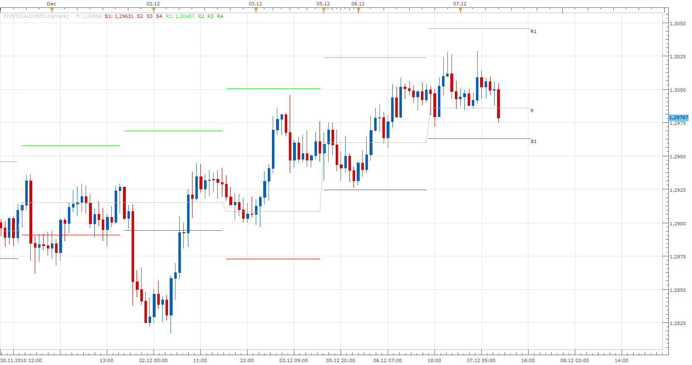

# Pivot Levels

> Source: https://fxcodebase.com/code/viewtopic.php?f=17&t=2894  
> Forum: 17 · Topic 2894 · 11 post(s)

---

## Pivot Levels

**Apprentice** · Tue Dec 07, 2010 9:34 am

Demark Pivots added.

To work, you need to download both files.

 [pivot2.lua](files/6599/pivot2.lua)

 [pivot2.lua.rc](files/6599/pivot2.lua.rc)

The indicator was revised and updated

---

## Re: Pivot Levels

**DS0167** · Tue Dec 07, 2010 9:56 am

Apprentice,

No word to say how helpful you are !

I told my broker we have a big chance to have you, but I did not really realize how much !

Thank you.
Danielle

---

## Re: Pivot Levels

**Apprentice** · Tue Dec 07, 2010 1:38 pm

Update

---

## Re: Pivot Levels

**gimmegimme** · Tue Dec 07, 2010 2:14 pm

why doesn't my chart look like that with previous pivot levels?

---

## Re: Pivot Levels

**Apprentice** · Wed Dec 08, 2010 5:35 am

Two reasons.
I have a beta version of TS,
 along with, custom indicator version for this version.

---

## Re: Pivot Levels

**KyleScalp** · Mon Feb 27, 2012 3:15 pm

Great Pivots

Currently the 4 hourly pivots change at:
06:00 10:00 14:00 18:00 GMT etc

I was wondering if there is a way to shift the calculation of the pivots along 2 hours so they would change at:
08:00 12:00 16:00 20:00 etc

I presume there is a variable in the code that would do this somewhere... Can anyone help me with this please?

---

## Re: Pivot Levels

**Apprentice** · Tue Feb 28, 2012 5:41 am

I assume that the time adjustment is possible.

---

## Re: Pivot Levels

**KyleScalp** · Fri Mar 02, 2012 11:03 am

> **Apprentice wrote:**
> I assume that the time adjustment is possible.

I have been staring at the code for hours, but I cant see where I would need to change anything to make the calculation of the 4 hourly pivots shift along by 2 hours, or to move the calculation in any way.

Would the adjustment be something you could explain how to do? Or is it too complicated for someone who cant program?

---

## Re: Pivot Levels

**Apprentice** · Sun Mar 04, 2012 3:49 am

I had planned to write update.
I just did not find the time.

---

## Re: Pivot Levels

**KyleScalp** · Sat Mar 31, 2012 11:16 pm

Well if you can manage to shift those 4 hour pivots to come in at 4:00-8:00-12:00 etc, or even better still allow the user to set a variable start time (eg calculate from x hours) then I think these pivots would be just about perfect!

I am sure you have a lot to do but I appreciate the effort and the other great indicators on this site.

---

## Re: Pivot Levels

**Apprentice** · Tue Apr 04, 2017 3:53 am

Indicator was revised and updated.
