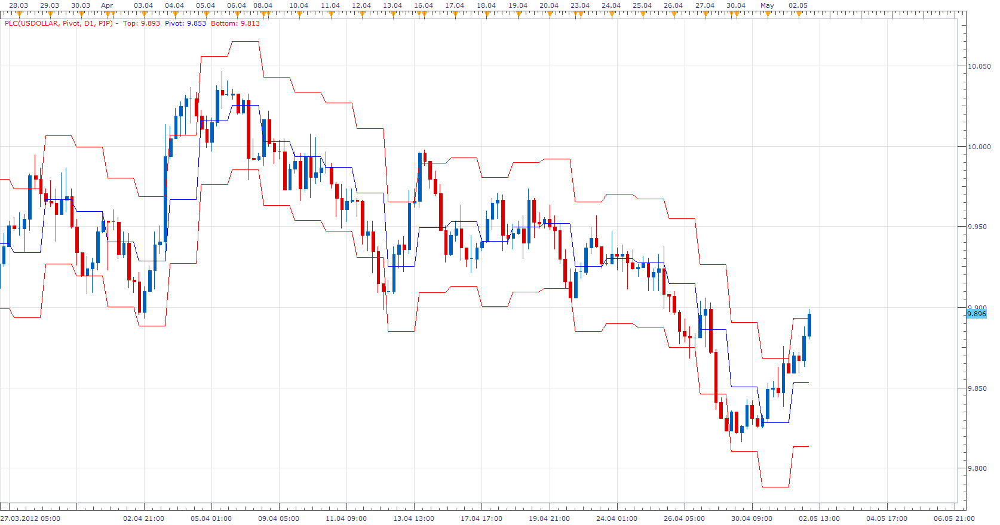

# Pivot Line channel

> Source: https://fxcodebase.com/code/viewtopic.php?f=17&t=17533  
> Forum: 17 · Topic 17533 · 5 post(s)

---

## Pivot Line channel

**Apprentice** · Wed May 02, 2012 7:10 am

The indicator allows the formation of channels around the Pivot Point.
There are two modes. Pip and ATR.

 [PLC.lua](files/31949/PLC.lua)

Phantom Pivot Chart can occur occasionally.
The reason newly discovered Bug.

The indicator was revised and updated

---

## Re: Pivot Line channel

**Jeffreyvnlk** · Wed May 02, 2012 11:16 am

The lines not appeared in my platform

---

## Re: Pivot Line channel

**Apprentice** · Wed May 02, 2012 2:01 pm

Hm, this is true.
While I do not resolve this.
You can use a quick fix, Load more data, move the chart to the right.

---

## Re: Pivot Line channel

**arindam89** · Fri May 18, 2012 7:26 am

> **Apprentice wrote:**
> Hm, this is true.
> While I do not resolve this.
> You can use a quick fix, Load more data, move the chart to the right.

hi
i have tried what you said
but its not working
please fix this issue
thanks
by
arindam roy

---

## Re: Pivot Line channel

**Apprentice** · Sun Apr 02, 2017 7:29 am

Indicator was revised and updated.
