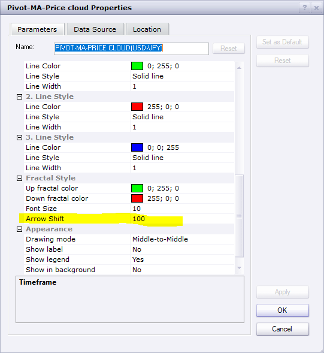
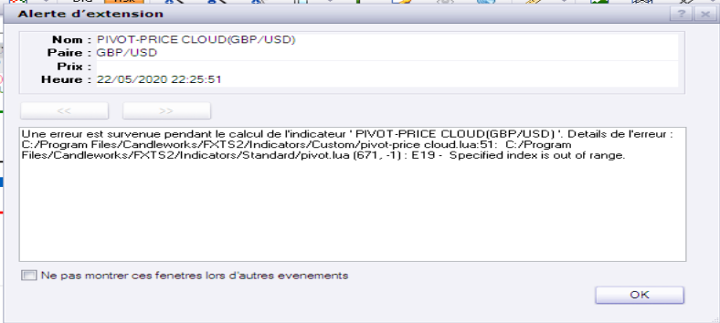

# pivot-ma-price cloud

> Source: https://fxcodebase.com/code/viewtopic.php?f=17&t=69833  
> Forum: 17 · Topic 69833 · 19 post(s)

---

## pivot-ma-price cloud

**Apprentice** · Sun May 10, 2020 4:28 am

Request based indicator.
[viewtopic.php?f=27&t=69831](https://fxcodebase.com/code/viewtopic.php?f=27&t=69831)

 [pivot-ma-price cloud.lua](files/133781/pivot-ma-price%20cloud.lua)

---

## Re: pivot-ma-price cloud

**MICKA76** · Sun May 10, 2020 11:38 am

> **Apprentice wrote:**
>
>
> EURUSD H1 (05-10-2020 0937).png
>
>
> Request based indicator.
> [viewtopic.php?f=27&t=69831](https://fxcodebase.com/code/viewtopic.php?f=27&t=69831)
>
>
> pivot-ma-price cloud.lua

good job apprentice, can we move the arrow a little away from the price because it is confused with the candle or why not put the arrow drop above the candle and the bullish candle under the candle.

 thank's for you experience

---

## Re: pivot-ma-price cloud

**Apprentice** · Mon May 11, 2020 4:10 am

Shift option added.

---

## Re: pivot-ma-price cloud

**MICKA76** · Mon May 11, 2020 4:49 am

> **Apprentice wrote:**
> Shift option added.

hi apprentice, i have download the indicator but i don't have the new modification!

---

## Re: pivot-ma-price cloud

**Apprentice** · Tue May 12, 2020 11:18 am

Try to download it from a different computer or browser.
You are downloading the file from the cache.

---

## Re: pivot-ma-price cloud

**Sospool** · Wed May 20, 2020 10:09 am

Hello Apprentice,

is it possible to modify, while keeping the other criteria, the signal of this indicator.

For example display the signal arrow on the chart when the K/D line Stochastic crosses in the oversold zone for long and overbought for shorts ?

Thank you

---

## Re: pivot-ma-price cloud

**Apprentice** · Wed May 20, 2020 4:24 pm

In uptrend show only ... ?
In downtrend show only ... ?

---

## Re: pivot-ma-price cloud

**Sospool** · Wed May 20, 2020 4:44 pm

Yes Apprentice, that's it.

Show only arrow when the K / D line Stochastic crosses down in the overbought area in downtrend or when the K / D line Stochastic crosses up in the oversold area in uptrend.

Thank you

---

## Re: pivot-ma-price cloud

**Apprentice** · Thu May 21, 2020 6:19 am

Your request is added to the development list.
Development reference 1325.

---

## Re: pivot-ma-price cloud

**Sospool** · Thu May 21, 2020 9:32 am

Thank you for adding my request, if I can allow it will be possible to add the alerts, and I may be wrong but I think there is a slight problem with the refreshment of the indicator after a while.

Thanks again.

---

## Re: pivot-ma-price cloud

**Apprentice** · Fri May 22, 2020 7:39 am

[Stochastic arrows.lua](files/134187/Stochastic%20arrows.lua)

Try this version.

---

## Re: pivot-ma-price cloud

**Avignon** · Fri May 22, 2020 11:24 am

Bug!

 

---

## Re: pivot-ma-price cloud

**Apprentice** · Fri May 22, 2020 2:16 pm

Your request is added to the development list.
Development reference 1336.

---

## Re: pivot-ma-price cloud

**Sospool** · Mon May 25, 2020 6:06 am

> **Apprentice wrote:**
>
>
> Stochastic arrows.lua
>
>
> Try this version.

Thank you Apprentice

---

## Re: pivot-ma-price cloud

**Apprentice** · Tue May 26, 2020 9:21 am

I can't find that indicator under this name.
Can you please upload it?

---

## Re: pivot-ma-price cloud

**Avignon** · Tue May 26, 2020 5:37 pm

I'm sorry, I got the wrong topic. It's here: [http://fxcodebase.com/code/viewtopic.php?f=17&t=69723](https://fxcodebase.com/code/viewtopic.php?f=17&t=69723)

If you could be so kind as to move the subject.

Thank you.

---

## Re: pivot-ma-price cloud

**Infime** · Thu Sep 17, 2020 9:11 am

Sorry Apprentice,

I got the wrong subject... I asked you to do a strategy based on the pivot-price cloud indicator but I wanted a strategy based on the pivot-MA-price cloud...

So can you create a new-one on the good indicator ? On this topic...
With the same rules :
Open long when it's green and open short when it's red.
Close on opposite or with position limit.
Enable time frame to execut positions.
Let the parameters of the indicator. (time frame enable, period of ma, ...)

Thanks and sorry for the trouble !

---

## Re: pivot-ma-price cloud

**Apprentice** · Fri Sep 18, 2020 2:52 am

Your request is added to the development list.
Development reference 2050.

---

## Re: pivot-ma-price cloud

**Apprentice** · Mon Sep 21, 2020 1:30 pm

Try this version.
[viewtopic.php?f=31&t=70445](https://fxcodebase.com/code/viewtopic.php?f=31&t=70445)
