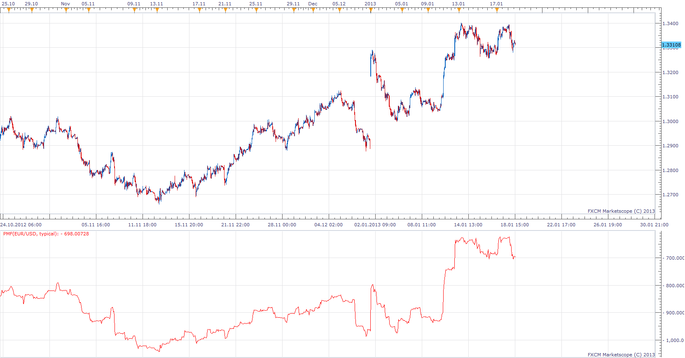

# Pivot Money Flow

> Source: https://fxcodebase.com/code/viewtopic.php?f=17&t=31212  
> Forum: 17 · Topic 31212 · 11 post(s)

---

## Pivot Money Flow

**Apprentice** · Sun Jan 20, 2013 3:28 pm

Description and method of use can be found here.
[viewtopic.php?f=27&t=28773&p=53243#p53243](https://fxcodebase.com/code/viewtopic.php?f=27&t=28773&p=53243#p53243)

 [PMF.lua](files/53242/PMF.lua)

The indicator was revised and updated

---

## Re: Pivot Money Flow

**Falkor** · Mon Jan 21, 2013 3:37 am

Thanks a lot!!

---

## Re: Pivot Money Flow

**Apprentice** · Tue Jan 22, 2013 3:53 am

MT4 version can be found here.
[viewtopic.php?f=38&t=31280](https://fxcodebase.com/code/viewtopic.php?f=38&t=31280)

---

## Re: Pivot Money Flow

**Falkor** · Fri Feb 01, 2013 8:33 am

Apologies for the delayed response but thanks a lot!

---

## Re: Pivot Money Flow

**Falkor** · Fri Feb 01, 2013 11:19 am

Hello Apprentice,

I am playing with this indicator has is already part of my main template. I am realizing this has its own 'properties' and very interesting.

May I request a version of this indicator. The formula is actually very simple (silly?):

BarVolume * (BarClose - BarTypicalPrice)

Representation:

1. I would like the bar count flows to be displayed as an Histogram (much like MACD)

2. Carry forward the same bars-cumulative logic that we had applied in the present version.

[I am also hoping to draw a MA on the Histogram to get an average for certain periods. I guess, this can be handled as usual in TS2]

Logic:

1. Assuming the mean price traded by all players is around Typical Price (ideally VWAP), the price increase or decrease to the Close_Price denotes the positive Mark-to-market for each bar. By plotting it on an histogram, the idea is to identify the bars / areas where the max-interest lies and also identify if bars are having positive or negative M2M-effect on market players.

2. The logic of cummulative is as explained in V1 i.e. to identify the sum total positive / negative M2Ms of the market, for the displayed periods.

3. Drawing an average over the Histogram, say 20, enables us to understand if the M2Ms have been positive or negative for past 20 days.

Hope you can help me with this. Feel free to tell me if I am being silly here, or if there is something similar out there.

Thank you.

---

## Re: Pivot Money Flow

**Apprentice** · Sat Feb 02, 2013 5:41 am

Your request is added to the developmental list.

---

## Re: Pivot Money Flow

**Falkor** · Sat Feb 02, 2013 10:25 am

Thank you.

---

## Re: Pivot Money Flow

**Apprentice** · Mon Feb 04, 2013 10:27 am

Second algorithm added.

---

## Re: Pivot Money Flow

**Falkor** · Wed Feb 06, 2013 2:24 pm

Thanks a lot!!

---

## Re: Pivot Money Flow

**Apprentice** · Wed May 03, 2017 1:38 pm

Indicator was revised and updated.

---

## Re: Pivot Money Flow

**Falkor** · Tue May 09, 2017 10:40 am

Thank you!
