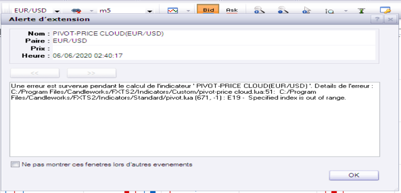
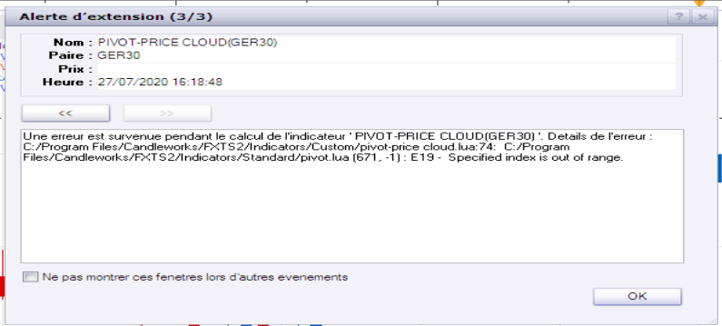

# pivot-price cloud

> Source: https://fxcodebase.com/code/viewtopic.php?f=17&t=69723  
> Forum: 17 · Topic 69723 · 26 post(s)

---

## pivot-price cloud

**Apprentice** · Thu Apr 23, 2020 5:16 am

Based on request.
[viewtopic.php?f=17&t=69715](https://fxcodebase.com/code/viewtopic.php?f=17&t=69715)

 [pivot-price cloud.lua](files/133115/pivot-price%20cloud.lua)

Indicator based strategy
[viewtopic.php?f=31&t=70445](https://fxcodebase.com/code/viewtopic.php?f=31&t=70445)

MT4 version
[https://fxcodebase.com/code/viewtopic.p ... 43#p160643](https://fxcodebase.com/code/viewtopic.php?f=38&t=76328&p=160643#p160643)

---

## Re: pivot-price cloud

**Avignon** · Tue Jun 02, 2020 6:20 pm

Bug!

[http://www.fxcodebase.com/code/viewtopi ... 31#p134194](http://www.fxcodebase.com/code/viewtopic.php?f=17&t=69833&p=134331#p134194)

---

## Re: pivot-price cloud

**Apprentice** · Wed Jun 03, 2020 5:34 am

Additional checks added.

---

## Re: pivot-price cloud

**Avignon** · Fri Jun 05, 2020 5:13 pm

It's not perfected yet.

 

---

## Re: pivot-price cloud

**fx1954** · Sun Jun 07, 2020 5:30 pm

it needs a lot of refreshing ( F5) to show up properly every time after the layout has been loaded.

---

## Re: pivot-price cloud

**fx1954** · Mon Jun 08, 2020 8:19 pm

The indictor works better after I took out some other indicators from the layout,but needs a refresh still from time to time.

---

## Re: pivot-price cloud

**fx1954** · Wed Jun 10, 2020 10:36 am

is this indicator also available without coding the averages, just calculating the price in ralation to the pivot?

---

## Re: pivot-price cloud

**fx1954** · Wed Jun 10, 2020 10:36 pm

after loading the chart the indicator in the current version needs some action on the mouse wheel to show up properly, can this issue be solved in a future version?

---

## Re: pivot-price cloud

**Apprentice** · Fri Jun 12, 2020 4:35 am

Try this version.

---

## Re: pivot-price cloud

**fx1954** · Sun Jun 14, 2020 11:06 am

Where can I find it?

---

## Re: pivot-price cloud

**Apprentice** · Sun Jun 14, 2020 7:15 pm

Re-download file from first post.

---

## Re: pivot-price cloud

**fx1954** · Sun Jun 14, 2020 8:18 pm

Thank you very much, this one is perfect.

---

## Re: pivot-price cloud

**fx1954** · Wed Jun 17, 2020 4:25 pm

the indicator gives options for the coolr up and color down, the line for the pivot is the same as color down. Is it possible to have an option for the color of the pivot additionaly?
(e.g. up green, down red and pivot line black)

---

## Re: pivot-price cloud

**Apprentice** · Thu Jun 18, 2020 5:15 am

Your request is added to the development list.
Development reference 1511.

---

## Re: pivot-price cloud

**Apprentice** · Thu Jun 18, 2020 5:42 am

Try it now.

---

## Re: pivot-price cloud

**fx1954** · Thu Jun 18, 2020 10:13 am

The names for up and down are twisted, but anyway, this version is what I had in mind.
Thank you very much for your good work.

---

## Re: pivot-price cloud

**Avignon** · Mon Jul 27, 2020 5:14 am

Hello,

Bug!

 

Thank you in advance.

---

## Re: pivot-price cloud

**Apprentice** · Mon Jul 27, 2020 3:36 pm

Can not repeat.
Was this during weekend or during regular trading days?

---

## Re: pivot-price cloud

**Avignon** · Mon Jul 27, 2020 5:36 pm

Both, sir.

Index and forex. On the other hand I use 2 or 3 in higher time units. That must be it.

---

## Re: pivot-price cloud

**Avignon** · Tue Jul 28, 2020 3:35 am

I stand corrected. In the same unit of time I also get this error message.

---

## Re: pivot-price cloud

**Infime** · Tue Sep 15, 2020 7:51 am

Hi,
Can you create a strategy based on this indicator ?
Open long when it's green and open short when it's red.
Close on opposite or with position limit.
Enable time frame to execut positions.
Let the parameters of the indicator.

Thanks !

---

## Re: pivot-price cloud

**Apprentice** · Wed Sep 16, 2020 10:59 am

Your request is added to the development list.
Development reference 2037.

---

## Re: pivot-price cloud

**Apprentice** · Thu Sep 17, 2020 3:24 am

Indicator based strategy
[viewtopic.php?f=31&t=70445](https://fxcodebase.com/code/viewtopic.php?f=31&t=70445)

---

## Re: pivot-price cloud

**marcelo2k9** · Tue Sep 09, 2025 1:48 pm

Please Sir can we have the mt4 version of this indicator.. thanks alot

---

## Re: pivot-price cloud

**Apprentice** · Thu Sep 11, 2025 10:56 am

We have added your request to the development list.
Development reference 577

---

## Re: pivot-price cloud

**Apprentice** · Sat Sep 27, 2025 4:04 pm

MT4 version.
[https://fxcodebase.com/code/viewtopic.p ... 43#p160643](https://fxcodebase.com/code/viewtopic.php?f=38&t=76328&p=160643#p160643)
