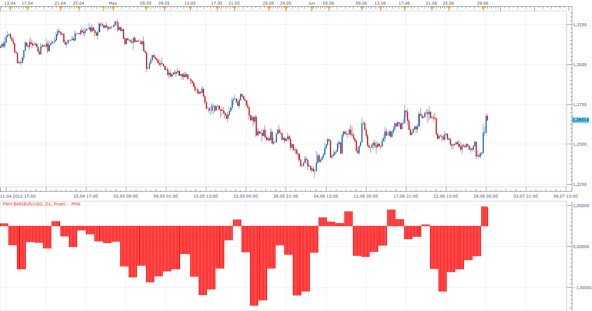

# Pivot Width Histogram

> Source: https://fxcodebase.com/code/viewtopic.php?f=17&t=20668  
> Forum: 17 · Topic 20668 · 4 post(s)

---

## Pivot Width Histogram

**Apprentice** · Fri Jun 29, 2012 10:57 am

 [PWH.lua](files/36240/PWH.lua)

 

The second version, which fluctuates around 0.5

 [Pivot Boss.lua](files/36240/Pivot%20Boss.lua)

The indicator was revised and updated

---

## Re: Pivot Width Histogram

**Apprentice** · Tue Oct 15, 2013 2:07 am

Bump Up

---

## Re: Pivot Width Histogram

**pdesai** · Sat Sep 26, 2015 5:24 am

Hi
In the formula the period(p) is refering to current period where as in pivot point calculation it should refer to the previous period, hence the histogram level is continously changing and sometimes shift from >0 to <0 level within the same period

---

## Re: Pivot Width Histogram

**Apprentice** · Tue Jul 25, 2017 11:26 am

The indicator was revised and updated.
