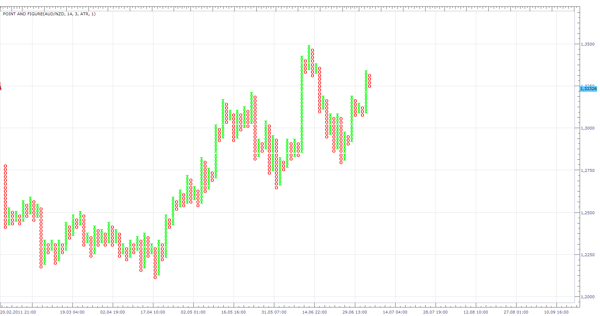
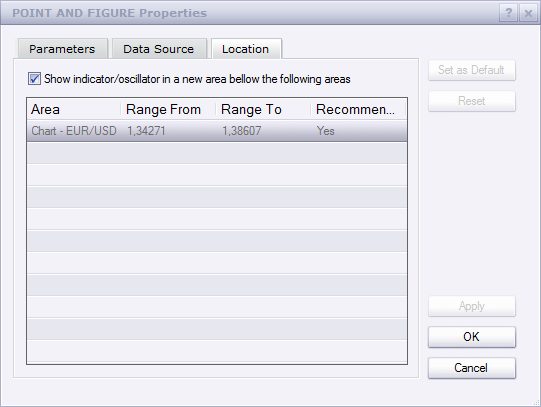

# Point and Figure (P&F)

> Source: https://fxcodebase.com/code/viewtopic.php?f=17&t=3470  
> Forum: 17 · Topic 3470 · 12 post(s)

---

## Point and Figure (P&F)

**Apprentice** · Sat Feb 19, 2011 5:58 pm

My favorite types of charts, I use it daily,
Is extremely useful for detecting changes in long-term trends.

It is used by position and Swing Trader.

Point & Figure charts is drawn from X and O elements
Draw X for uptrend and O elements for downtrens.

Change greater then Box value generates a new element.

Benefits
Removes noise from chart.
Removes the element of time from the process of analysis.
Easier to identify support and resistance levels.
Easier to identify trend lines.
Helped you to focus on long-term trends.

Pip value can be defined in three ways.
As Pip, percent, or ATR.

 [Point and Figure.lua](files/8271/Point%20and%20Figure.lua)

The indicator was revised and updated

---

## Re: Point and Figure (P&F)

**Apprentice** · Mon Feb 21, 2011 7:07 am

Style Update.
ATR Multiplier added.

---

## Re: Point and Figure (P&F)

**Apprentice** · Tue Feb 22, 2011 4:19 am

High/Low Filter Added.

---

## Re: Point and Figure (P&F)

**Apprentice** · Tue Feb 22, 2011 6:39 am

P & F now can work as stand-alone chart.

---

## Re: Point and Figure (P&F)

**rjmah319** · Sat Feb 26, 2011 7:16 pm

How is it a stand alone chart ?
I apply the Point and Figure indicator and it overlays on my exsisting chart.

---

## Re: Point and Figure (P&F)

**Apprentice** · Sun Feb 27, 2011 3:09 am

Still need to use the "Show Indicator / Oscillator in new area ...." option.

 

---

## Re: Point and Figure (P&F)

**rjmah319** · Sun Feb 27, 2011 10:45 pm

ah...thanks

---

## Re: Point and Figure (P&F)

**amr alhwetat** · Fri Feb 10, 2012 4:42 pm

i want to help me do default p&f chart in smaller chart

---

## Re: Point and Figure (P&F)

**Apprentice** · Sun Feb 12, 2012 4:20 am

I do not understand your request.

---

## Re: Point and Figure (P&F)

**ElhamyHelmy** · Mon Apr 01, 2013 5:12 am

I'm so sorry for the inconvenience. I am new to this forum and I'm not actually familiar with how things go down here.

Please, I want to install Point and Figure charts on my FXCM Trading Station, all the versions here doesn't work properly. Can you please help me ?

Thanks in advance

---

## Re: Point and Figure (P&F)

**Apprentice** · Tue Apr 02, 2013 6:55 am

I learned that the old version will not refresh.
I fix this issue.

Can you test this new version, specify problem with old version.

---

## Re: Point and Figure (P&F)

**Apprentice** · Wed May 10, 2017 5:30 am

Indicator was revised and updated.
