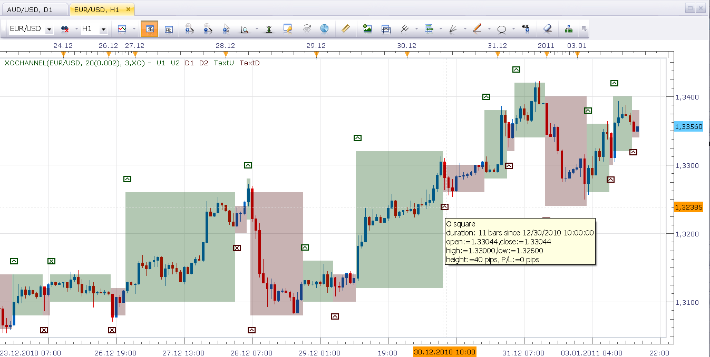

# Point & Figure channel indicator

> Source: https://fxcodebase.com/code/viewtopic.php?f=17&t=3082  
> Forum: 17 · Topic 3082 · 3 post(s)

---

## Point & Figure channel indicator

**Nikolay.Gekht** · Mon Jan 03, 2011 4:52 pm

The indicator is just an interpretation of classic X&O (Point & Figure) diagram (read more about such kind of diagrams here: [http://www.investopedia.com/articles/te ... 081303.asp](http://www.investopedia.com/articles/technical/03/081303.asp)), which combines the classic chart view and Point & Figure approach to detect the trend.

The indicator highlights the candles which forms X and O columns using different colors. Also, the indicator provides an estimation whether following to the detected trend is profitable or not. For the profitable areas it puts "Check" sign and for non-profitable areas it puts "No" sign. You can see the parameters of the area by moving the mouse cursor over the mark and wait a bit until tooltip appears.

Unlike the earlier Point & Figure implementations on this forum, this algorithm is pretty optimal and is safe to use it on the "live" charts because it calculates only the latest X or O column on each tick, not the whole diagram as before.

 

Download:

 [xochannel.lua](files/7181/xochannel.lua)

The idea of this indicator belongs to [skipper](https://fxcodebase.com/code/memberlist.php?mode=viewprofile&u=18509)

The indicator was revised and updated

---

## Re: Point & Figure channel indicator

**Nikolay.Gekht** · Mon Jan 10, 2011 11:42 am

Moved from the beta forum to the production forum.

---

## Re: Point & Figure channel indicator

**Apprentice** · Sun Feb 12, 2017 7:21 am

Indicator was revised and updated.
