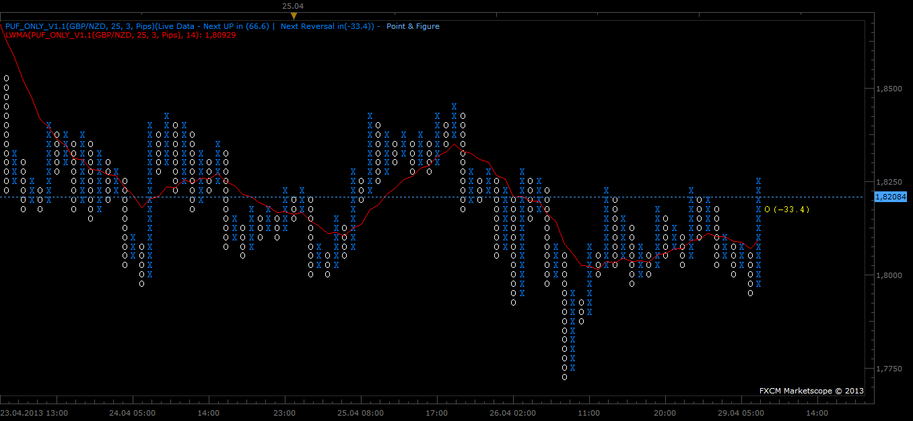

# Point & Figure Only V1.1 (Sync) Update 29.04.2013

> Source: https://fxcodebase.com/code/viewtopic.php?f=17&t=35595  
> Forum: 17 · Topic 35595 · 6 post(s)

---

## Point & Figure Only V1.1 (Sync) Update 29.04.2013

**Gidien** · Fri Apr 26, 2013 8:43 am

Hi,

i want to share my P&F Chart indicator.

You will need the last TS2 Version, because i use the "getSyncHistory" function to load data source.

This is the "pure" Version. No signals no trendlines at the moment.

You can put the indicator to every TimeFrame .

Point & Figure will allways calculate at the specified TimeFrame not on the chart Timeframe.
The default Timeframe is "m1".

The MaxRows setting is for limiting the creating of TextOutputstreams. The default is 200. If you expect to see more then 200 rows in one column X or O or recieving an error that the index is a nil, then set it higher number.

The calculation has two phases.

Phase 1:
P&F will be calculated with the loaded source data. Smaller Timerframes so much accurate the calculation. Also take attention to the boxsize and the limitation of the maximum 15000 bars , which can be loaded. If your boxsize is high and your timeframe small, then it will hapen, that you will see not so much columns at the chart. So take higher source timeframe for bigger boxsizes to see more columns.

Phase 2:
History calculation is done, and you can see the first columns on the chart. From this point the calculation is done at each tick, and you will see the most accurate calculation.

Indicator can reset and a redraw occurs. This is normal and cannot be fixed, otherwise the TS will crash or the indicator have an error.

A reset of the indicator will occur, when more history data were loaded to the chart. This can happen , if you zoom out or scroll the chart to see data from the past.

If the indicator recieved a reset , then the calculation will start again with phase 1 and your most accurate live column will overwrite by the less accurate phase 1 calcuation.

**Update P&F V 1.1**

- fixed some Bugs
- increase Performance (little bit)
- Font can be changed in the settings
- Font Size can be changed in the settings
- added counter for next row or next reversal
- added support indicator source. You can use now the P&F as indicator source.
- added Candle Color DO NOT CHANGE IT , candle color is automatic set to chart Background color, if indicator is loaded. If you change it other than the chart background color, then candle will be visible.

File:

 [PuF_only_V1.1.lua](files/60142/PuF_only_V1.1.lua)

---

## Re: Point & Figure Only V1.1 (Sync) Update 29.04.2013

**[email protected]** · Tue Apr 30, 2013 11:35 am

The request MQL4 version of this indicator.

---

## Re: Point & Figure Only V1.1 (Sync) Update 29.04.2013

**Gidien** · Thu May 02, 2013 1:45 am

Im sorry , but i didnt have any mql4 experience. So i couldnt provide a mql4 version. Maybe anybody else.

---

## Re: Point & Figure Only V1.1 (Sync) Update 29.04.2013

**Terrance** · Thu May 09, 2013 1:18 pm

Thank you for this puf chart it works very well
Do you plan to add trendlines or fractionals

---

## Re: Point & Figure Only V1.1 (Sync) Update 29.04.2013

**Gidien** · Mon May 13, 2013 2:40 am

Can be found here

[viewtopic.php?f=17&t=31328](http://www.fxcodebase.com/code/viewtopic.php?f=17&t=31328)

---

## Re: Point & Figure Only V1.1 (Sync) Update 29.04.2013

**Apprentice** · Sun Oct 21, 2018 5:29 am

Bump up.
