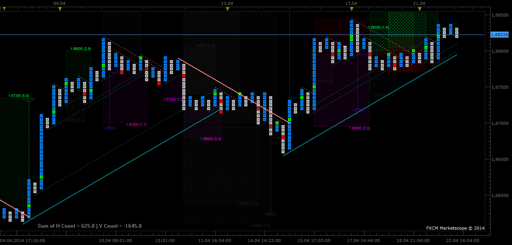
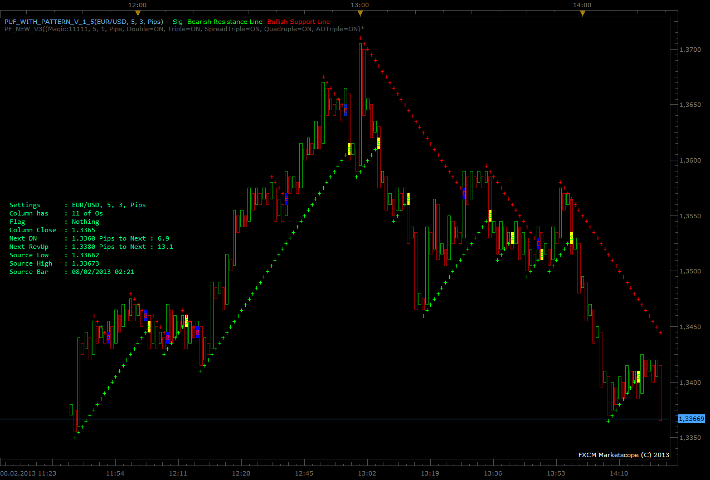
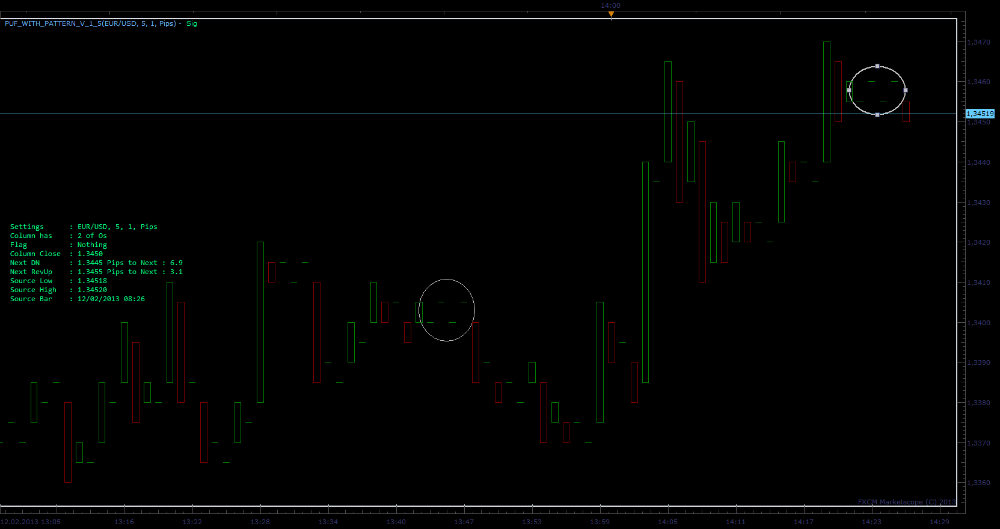
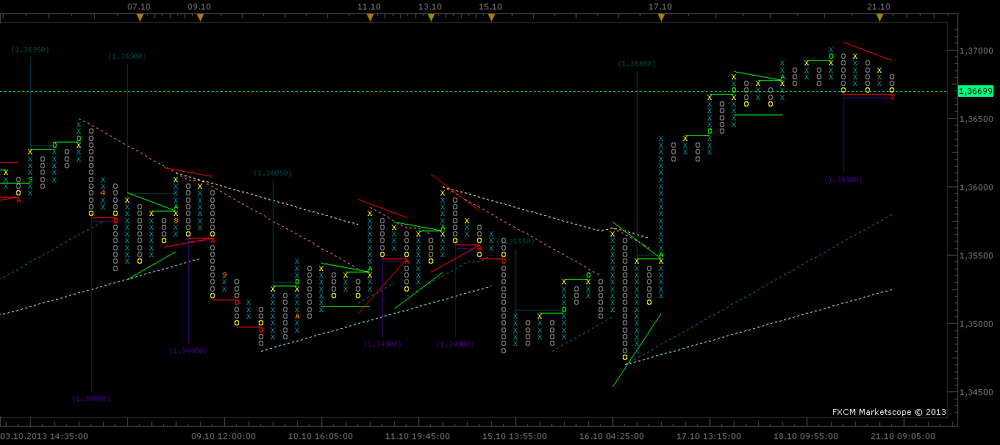
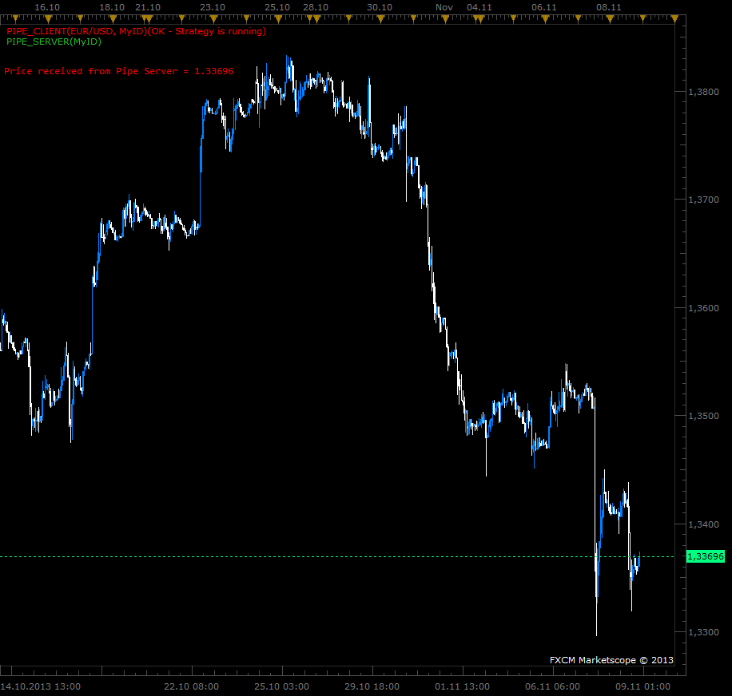
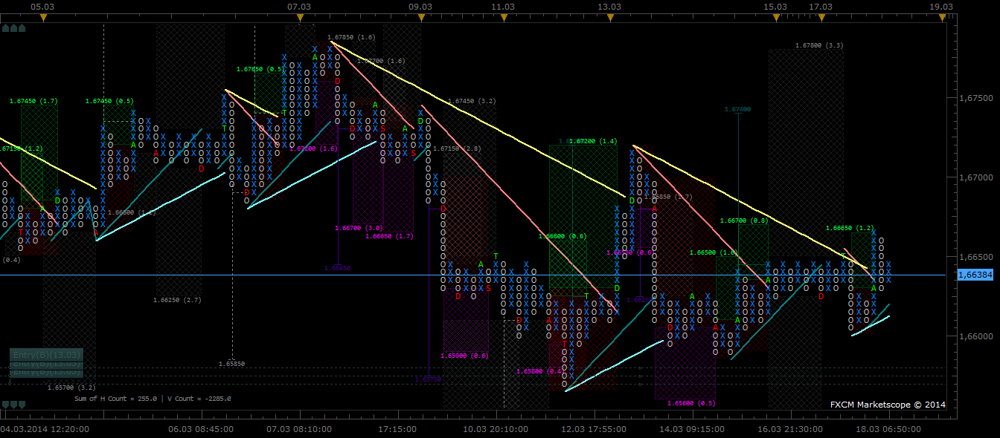
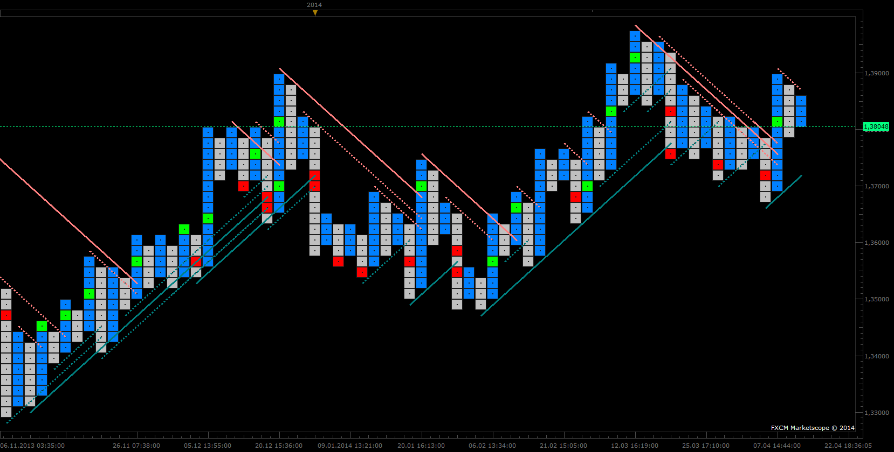
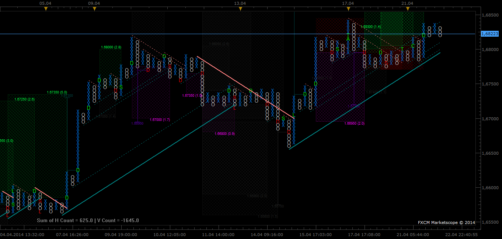
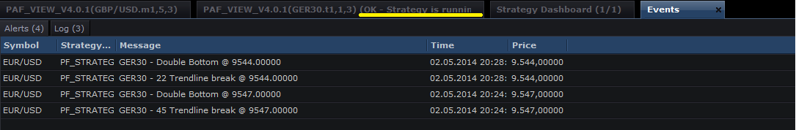
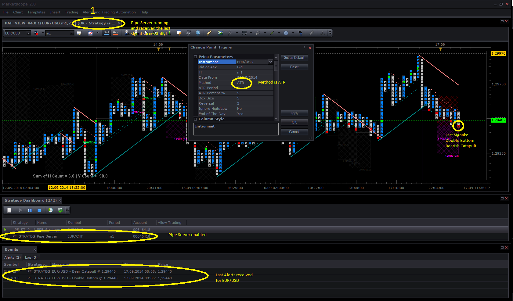

# Point & Figure (Update 08. Oct 2014) V4.0.2

> Source: https://fxcodebase.com/code/viewtopic.php?f=17&t=31328  
> Forum: 17 · Topic 31328 · 85 post(s)

---

## Point & Figure (Update 08. Oct 2014) V4.0.2

**Gidien** · Wed Jan 23, 2013 7:59 am

**New Version 4.0.2**

**Changelog:**

**PNF drawing**
	- if not EndofTheDay and TF > t1 then
 new highs or lows will draw immediately, reversals only at new Source Candles
	- Trendlines also drawed in Line mode (if zoom out to high for drawing X and O's)

**Pattern**
	- added Trendline breakout to pattern, was allready there, but now we can disable this signal
	- added Price projection to each pattern
 select Enabled, Disabled, Enabled only with vorizontal, Enabled only with vertical or Enabled with horizontal and vertical price projection

**Horizontal Target**
	- because Horizontal price projection is moved to each pattern, i changed the function "Show Horizontal Count"
	- "Show Horizontal Count" now search for price projection against X or O Walls.
	- added Max Ratio filter to horizontal price projection.

**BETA testing**
	- added find Bullish Resistance and Bearish Support line to 45° Trendline Section
	- only the last 4 lines and allready broken lines should be visable

File:

 [PaF_View_V4.0.2.lua](files/53405/PaF_View_V4.0.2.lua)

-------------------------------------------------------------------------------------------------------------------------
**Point and Figure Overhauled**

The last Version is V 4.0.1 .

I overhauled my point and figure indicator. The code became more complex and changes are more difficult to program. I hope the new structure, helps me to be able to make changes faster.

**What is new?**

**Price parameters**

Method: ATR or PIP
-- ATR:	Get the boxsize from the daily ATR * ATR_Percent (Request from Jabez)
-- PIP:	Get the boxsize from the boxsize parameter

EndOftheDay:
 the calculation will be done at the beginning of a new source Candle. You will see,
 that no new X or O's will be drawn, even if the price is lower or higher then the
 last X or O, until a new candle begins. The standard PF version only works with end of
 the day data. Disable it and PF will be updated every tick.
 If TF == "t1" then "EndOftheDay" and "Ignore high/low" are ignored, the calculation is
 then tick based.

**Column Style:**

Boxes: Font or Squares
-- Font: Rows are drawn as X and O's
-- Square:	Rows are drawn as Squares (Request from Jabez)

**Trendlines:**
 I added internal Trendlines.
 Select "no-line" for Main or internal trendline to disable it.

 New Trendline:
"At breakout" or "At breakout with Adaption" or "At breakout with Confirmation "

-- At breakout:
 New trendline is drawn, if the breakthrough occurred with a double top/bottom.

-- At breakout with Adaption:
 New trendline is drawn, if the breakthrough occurred with a double top/bottom.
 If the close of the column is at the trendline
 one box is added/removed to the position of the trendline.

-- At breakout with Confirmation :
 New trendline is drawn, if the breakthrough occurred with a double top/bottom
 and then the next low or high is above or below the trendline.

**Pattern:**
I added a Tooltip to each Box , which has a signal to buy or sell. Moving the mouse over the box, will show the type of the pattern.

List of pattern:
Double Top/Bottom - Letter D
Triple Top/Bottom - Letter T
Bullish/Bearish Catapult - Letter C
Bullish/Bearish Triangle - Letter A
ShakeOut - Letter S
Flag - Letter F

Upcoming Signals will draw with entry , TP and SL line only if horizontal targets could calculated. These lines will be removed if the signal is finished.

Alerts are available with

 [PF_Strategy_Server.lua](files/53405/PF_Strategy_Server.lua)

Alert occurred with all Pattern and new trendline .
Set Magic String to the same value in the strategy and indicator.

Indicator:

 [PaF_View_V4.0.1.lua](files/53405/PaF_View_V4.0.1.lua)

Picture square:

 

Picture Font:

 

Gidien

---

## Re: Point & Figure on Chart (5 Pattern added) new V0.9

**Gidien** · Mon Jan 28, 2013 5:24 am

New Version V 0.9 see post one.

---

## Re: Point & Figure on Chart (5 Pattern added) new V1.1

**Gidien** · Tue Jan 29, 2013 9:11 am

New Version V 1.1

changes:

 - rewriting parts of the code
 - improved performance

file:

 [PuF_with_Pattern_v_1_1.lua](files/53756/PuF_with_Pattern_v_1_1.lua)

---

## Re: Point & Figure (5 Pattern) new V1.5 add TrendLines

**Gidien** · Fri Feb 08, 2013 9:45 am

Hi,

i updated my indicator.

**Version 1.5**

added 45° trendlines with breakout signal
Type 1: Upside Breakout above a Bearish Resistance Line
Type 2: Downside Breakout Below a Bullish Support Line

screen :

 

file:

 [PuF_with_Pattern_v_1_5.lua](files/54353/PuF_with_Pattern_v_1_5.lua)

---

## Re: Point & Figure (5 Pattern added) new V1.5 Trendlines

**Blackcat2** · Tue Feb 12, 2013 6:22 am

Looks good but it repaints, sometimes even several bars back, can't really use it like this >_<

Could you please fix it?

Cheers..
BC

---

## Re: Point & Figure (5 Pattern added) new V1.5 Trendlines

**Gidien** · Tue Feb 12, 2013 3:47 pm

Can you tell which version do you use? And also which settings do you use(timeframe, indi parameters,pairs?

With one box reversal the candle with only one O or X will not have a body.

like here at the marks.

 

---

## Re: Point & Figure (5 Pattern added) new V1.5 Trendlines

**Blackcat2** · Tue Feb 12, 2013 7:06 pm

> **Gidien wrote:**
> Can you tell which version do you use? And also which settings do you use(timeframe, indi parameters,pairs?
>
> With one box reversal the candle with only one O or X will not have a body.
>
> like here at the marks.
>
>
>
> puf.png

Hi,

I'm using version 1.5, with default indi parameters in 1H chart, EUR/USD.

I didn't get the screenshots when it changed but I know it changed because I went in based on a signal and then it changed to no signal several bars after.

Thanks..
BC

---

## Re: Point & Figure (5 Pattern added) new V1.5 Trendlines

**Gidien** · Wed Feb 20, 2013 8:53 am

Hi,

sorry for waiting so long.

could you try the fixed version. Repaint should now only occur , if you load more data to the chart by scrolling the chart back. If you scroll back the chart more history is loaded, the update function is called with flag core.updateall. This will reset the indicator and the indi will recalculate with the new history data.

If this happen after a long time the indicator was build with live data, then it could be that you will lost some signals. This will happen, if you use higher timeframes with small boxsize.

Fixed version:

 [PuF_with_Pattern_v_1_5_fix.lua](files/54968/PuF_with_Pattern_v_1_5_fix.lua)

---

## Re: Point & Figure (5 Pattern added) new V1.5 Trendlines

**evgeniyn** · Fri Feb 22, 2013 4:40 am

On any version (1.5) of indicator we have the error,

> **PuF_with_Pattern_v_1_5_fix.lua"]:345: invalid option '%-' to 'format'**

---

## Re: Point & Figure (5 Pattern added) new V1.5 Trendlines

**Gidien** · Fri Feb 22, 2013 5:40 am

Sorry ,

do not have this error.

Which Trading station Version do you use ?

Happen it on every symbol ?

best

Gidien

---

## Re: Point & Figure (5 Pattern added) new V1.5 Trendlines

**evgeniyn** · Fri Feb 22, 2013 6:26 am

Which Trading station Version do you use ?
FXCM v 01.11.011212
Happen it on every symbol ?
Yes. After 1-2 second I'm receiving the error.

---

## Re: Point & Figure (5 Pattern added) new V1.5 Trendlines

**Gidien** · Mon Feb 25, 2013 4:36 am

Please try this version and let me know, if the eror is solved, because i do not have this error.

file:

 [PuF_with_Pattern_v_1_5_fix.lua](files/55232/PuF_with_Pattern_v_1_5_fix.lua)

---

## Re: Point & Figure (5 Pattern added) new V1.5 Trendlines

**Gidien** · Wed Feb 27, 2013 4:54 am

Is it working now ???

---

## Re: Point & Figure (5 Pattern added) new V1.5 Trendlines

**evgeniyn** · Wed Feb 27, 2013 8:15 am

No. Same result only without error. On load I can see the indicator, after that clean screen.

---

## Re: Point & Figure (5 Pattern added) new V1.5 Trendlines

**Gidien** · Thu Feb 28, 2013 1:34 am

Realy Nothing ,

no candles could be possible, if not enough history data were available, but text should be there, if debugging on screen is enabled.

I'm realy sorry about this, but i can't see this issue with my plattform.

---

## Re: Point & Figure V2.1 Pattern and TrendLines (Sync) 13.05.

**Gidien** · Mon May 13, 2013 2:42 am

Update to Version V2.1 Source coming from new version PuF Only.
[viewtopic.php?f=17&t=35595](http://www.fxcodebase.com/code/viewtopic.php?f=17&t=35595)

---

## Re: Point & Figure V2.1 Pattern and TrendLines (Sync) 13.05.

**Terrance** · Wed May 29, 2013 9:11 pm

this makes for a very good chart Thanks.

would it be possible to include fractionals or change source code on indicator FBSR.lua
I have installed this indicator on puf chart, but it updates every 1min and moves away from
puf chart.

Thanks

---

## Re: Point & Figure V2.1 Pattern and TrendLines (Sync) 13.05.

**ThemBonez** · Thu May 30, 2013 1:27 pm

Can you post a little bit of how you use this system in your trading?
Thank You

---

## Re: Point & Figure V2.1 Pattern and TrendLines (Sync) 13.05.

**Gidien** · Fri May 31, 2013 8:16 am

> **Terrance wrote:**
> this makes for a very good chart Thanks.
>
> would it be possible to include fractionals or change source code on indicator FBSR.lua
> I have installed this indicator on puf chart, but it updates every 1min and moves away from
> puf chart.
>
> Thanks

I know about this issue, but cannot solve it at the moment. The problem is that the P&F changes the sourcestream whenever a new column occur and the attached indicators does not recognize that. I think, we have to wait until TS2 supports real P&F charts or the new feature view indicator.

I have the information that a beta version should be available at the end of June. Lets waits and try with view indicators, when it is supported.

A view indicator creates a complete new Chart, which can have time independent periods(X-axis), which we will need for point & figure, renko and so on. The view indicator is written, but i need TS2 which will support it.

best
gidien

---

## Re: Point & Figure V2.1 Pattern and TrendLines (Sync) 13.05.

**Gidien** · Fri May 31, 2013 2:03 pm

> **ThemBonez wrote:**
> Can you post a little bit of how you use this system in your trading?
> Thank You

Hi,

there serveral ways i trade Point & Figure .

First and most import to me is the occurence of a double top(DT) or double bottom(DB). This will be allways my entry point for every trade. If a DT or DB occur , then i will check the chart, where the doubles occur.

**Trendlines:**
If a double occur and the column breaks the trendline, i will enter the trade.
SL: can be the most recent DT or DB or any other support or resistence area.
TP: any fixed value or most recent vertical count Target or only move the SL.

**Vertical Count Target(VCT):**
The entry point will be the activation of VCT:
SL: one Box above or below the Column, where the VCT was established.
TP: The calculated Target from this VCT or any other VCT , which target was not reached.

**Moving Avarages(MA):**
Doubles will be my entry point.
With one MA(13 or 21) i only take the first DT or DB after the price breaks the MA. Both Columns from the DT or DB must be at the same site of the MA.
With two MA(5,8 or 3,5) i don't use it very often. If the MA crosses, then i wait for the first DT or DB.

a good book is : "The Definitive Guide to Point and Figure" Autor: Jeremy du Plessis

best
gidien

---

## Re: Point & Figure V2.3 Pattern and TrendLines (Sync) 04.06.

**Gidien** · Tue Jun 04, 2013 3:27 am

Update 2.3 see post one [viewtopic.php?f=17&t=31328](http://www.fxcodebase.com/code/viewtopic.php?f=17&t=31328)

---

## Re: Point & Figure V2.3 Pattern and TrendLines (Sync) 04.06.

**Terrance** · Mon Jul 08, 2013 9:38 pm

Have done anything else to your V2.3
such as Ascending or Descending angles or Triangles

Thanks

---

## Re: Point & Figure V2.3 Pattern and TrendLines (Sync) 04.06.

**Gidien** · Tue Jul 09, 2013 7:15 am

> Have done anything else to your V2.3
> such as Ascending or Descending angles or Triangles

-- > No

still wait for the new TS beta version, which hopefully will support the new "view indicator" type.
A view indicator is an special case of the indicator which isn't applied to any source, but produces the source itself instead.

With this view indicator we are more flexible in developing Point and Figure specific indicators.

---

## Re: Point & Figure (Update 15. Aug 2013)

**Gidien** · Thu Aug 15, 2013 7:56 am

Update see post one [viewtopic.php?f=17&t=31328&p=53405#p53405](https://fxcodebase.com/code/viewtopic.php?f=17&t=31328&p=53405#p53405)

---

## Re: Point & Figure (Update 15. Aug 2013)

**Terrance** · Sun Oct 13, 2013 3:29 pm

Have you added anything to your PAF_VIEW_V1.3
Double tops , bottoms, angles, Double top or btm Reverse
or audible alerts.

Thanks

Terrance

---

## Re: Point & Figure (Update 15. Aug 2013)

**Gidien** · Mon Oct 14, 2013 1:47 am

Yes i did some updates to this indicator , but im not happy with the pattern section. I don't like the drawing of the pattern, also Flag and Triangle could be buggy.

**Version 2.2:**

 [PaF_View_V2.2.lua](files/90026/PaF_View_V2.2.lua)

**fixes:**
- fixed performance issue with separator scale

**changes:**
- month and day greater then 9 will be written in letters
 example month 1-9 will be 1-9 and 10-12 will be A-C.
- 1 Box Reversal now drawing in Wyckoff Method, Rows with only one Box will draw in the same
 column
- 1 Box Reversal no trendline will be drawn.
- Trendlines can be draw with Lines or "+"
- Trendlines add adaptive mode, if trendline is touched but not broken, then the touch is adapted
 to the calculation
- added Pattern T - Triples , C - Catapult , S - Shakeout, A - Triangles, F - Flags.
- Pattern still buggy

**know issues:**

- Pattern section still buggy lines are drawn, if pattern was not finished.
- pattern lines drawn with 1 box reversal chart, should not because pattern are for 3 box reversal
 charts only

This indicator is still beta. If you have any idea , how i can draw the pattern for better reading, then let me know. Also any enhancement are wellcome.

best

Gidien

---

## Re: Point & Figure (Update 14. Oct 2013)

**Terrance** · Fri Oct 18, 2013 8:31 pm

Would be good to have Pattern Line for double tops, bottoms again.
Be able to disable ignore feature.
To have Next colour, different than pattern lines. Reason I dont use Next so I change colour to background colour.
Have Pattern lines same as Colour of Bull , Bear.

Would be nice to have a Pattern Line for 45 deg angle ie. use four columns,
for bull (Col -4 low < Col -3 low < Col -2 low < Current low By 1 Box size each, and line would
be drawn after current column starts to display (ie 3 box sizes).

Thanks

Terrance

---

## Re: Point & Figure (Update 14. Oct 2013)

**Gidien** · Sat Oct 19, 2013 4:25 am

> **Terrance wrote:**
> Would be good to have Pattern Line for double tops, bottoms again.
> Be able to disable ignore feature.
> To have Next colour, different than pattern lines. Reason I dont use Next so I change colour to background colour.
> Have Pattern lines same as Colour of Bull , Bear.
>
> Would be nice to have a Pattern Line for 45 deg angle ie. use four columns,
> for bull (Col -4 low < Col -3 low < Col -2 low < Current low By 1 Box size each, and line would
> be drawn after current column starts to display (ie 3 box sizes).
>
> Thanks
>
> Terrance

Thanks for the feedback. I will upload PaF View Version 2.3 in the next days.
To your suggestions:
1. Double Tops and bottoms
 - I will do soon.

2. Pattern lines to same color of Bull or Bear
 . Allready done in the new version.

3. Be able to disable ignore feature
 - What do you mean ? Do you meen the ignore high/low or the ignore pattern feature from the
 old version for the older TS2 version? The ignore pattern feature is not part of the new PaF View
 versions.

4. Pattern Line for 45 deg angle
 - 45 degree triangle (symetrical triangle) are very very less in the market. Because of that, i
 allready change the triangle recognition in the new V2.3 . Lets see if it will good enough for us.

best

gidien

---

## Re: Point & Figure (Update 14. Oct 2013)

**Gidien** · Mon Oct 21, 2013 3:43 am

**Update 21. Oct 2013**

**View Version 2.3**

 [PaF_View_V2.3.lua](files/90191/PaF_View_V2.3.lua)

**added:**
 - Double Tops and Bottoms (requested)
 - Vertical Count Targets

**changes:**
 - Pattern lines have now same color as the Signal
 - Triangle pattern recognition
 there are three parameters to change the Triangle recognition
 1. Divergence -- 0 == Symetrical the top and the bottom line have the same slope.
 2. Bear MinBoxsize -- Minimum Box difference for the Topline between column and column - 2
 2 == 45 degree trendline
 3. Bull MinBoxsize -- Minimum Box difference for the Bottomline between column and column - 2
 2 == 45 degree trendline
 This will make the triangle recognition more flexible.
 A triangle will only valid with double top or bottom.

**chart:**

 

Gidien

---

## Re: Point & Figure (Update 21. Oct 2013)

**gpatel** · Mon Oct 21, 2013 1:36 pm

Can you apply a strategy to Point & Figure, Kagi, Renko charts? Do you have an example?

---

## Re: Point & Figure (Update 21. Oct 2013)

**Terrance** · Mon Oct 21, 2013 5:29 pm

Paf 2.3 view
problem, If patternlines enabled

missing row of x and o just above or below patternline.

---

## Re: Point & Figure (Update 21. Oct 2013)

**Gidien** · Tue Oct 22, 2013 2:55 am

> **Terrance wrote:**
> Paf 2.3 view
> problem, If patternlines enabled
>
> missing row of x and o just above or below patternline.

Didn't see this issue. But from your last statement , do you still use the background color for next color? If yes set next color to other then background color. The next color is used for forecasting the next signal, forcasting next rows are drawing if endoftheday feature is enable and also marking the rows which are involed with the pattern, even if patternline are disabled.

Example if we have a triple top then the highest row of column -2 and column -4 are drawed with the next color.

To the strategy request:

I work on it. But will need more time for it.

gidien

---

## Re: Point & Figure (Update 21. Oct 2013)

**gpatel** · Tue Oct 29, 2013 8:23 am

> **gpatel wrote:**
> Can you apply a strategy to Point & Figure, Kagi, Renko charts? Do you have an example?

Any ideas on this? I can't find anything on this forum that shows that.

---

## Re: Point & Figure (Update 21. Oct 2013)

**Gidien** · Wed Oct 30, 2013 8:43 am

> **gpatel wrote:**
>
>
> > **gpatel wrote:**
> > Can you apply a strategy to Point & Figure, Kagi, Renko charts? Do you have an example?
>
>
> Any ideas on this? I can't find anything on this forum that shows that.

I think there should be two possibillities .

1. create an indicator in the strategy with
 core.indicators:create (id, source, parameters...) for one of the view indicators KAKI, PF or RENKO.
 with the indicoreSDK it works fine, but TS II will crash if you apply the strategy. I don't know why at the moment.

2. Using a pipe between an indicator and a strategy using the interop function. I test it and it works but could be laggy.

---

## Re: Point & Figure (Update 21. Oct 2013)

**Apprentice** · Wed Oct 30, 2013 12:22 pm

[renko_indicross.lua](files/90438/renko_indicross.lua)

 [renko_indicross.lua.rc](files/90438/renko_indicross.lua.rc)

Example of Strategy for Renko View.

---

## Re: Point & Figure (Update 21. Oct 2013)

**gpatel** · Wed Nov 06, 2013 10:58 am

> **Apprentice wrote:**
>
>
> renko_indicross.lua
>
>
>
>
> renko_indicross.lua.rc
>
>
> Example of Strategy for Renko View.

This causes a crash. Occasionally I see the input window for couple of seconds, but most of the time it crashes before that.

---

## Re: Point & Figure (Update 21. Oct 2013)

**gpatel** · Wed Nov 06, 2013 11:00 am

> **Gidien wrote:**
>
>
> > **gpatel wrote:**
> >
> >
> > > **gpatel wrote:**
> > > Can you apply a strategy to Point & Figure, Kagi, Renko charts? Do you have an example?
> >
> >
> > Any ideas on this? I can't find anything on this forum that shows that.
>
>
>
> I think there should be two possibillities .
>
> 1. create an indicator in the strategy with
> core.indicators:create (id, source, parameters...) for one of the view indicators KAKI, PF or RENKO.
> with the indicoreSDK it works fine, but TS II will crash if you apply the strategy. I don't know why at the moment.
>
> 2. Using a pipe between an indicator and a strategy using the interop function. I test it and it works but could be laggy.

Hi Gidien, do you have an example of how to create the interop function? It seems like the best solution right now.

Thanks,
Gaurav

---

## Re: Point & Figure (Update 21. Oct 2013)

**Gidien** · Thu Nov 07, 2013 2:16 pm

Ich found migration project Naning Bob 10.4 Multi trader, but it is a very big one. It has over 2000 lines. I will pick and choose the part with the interob function and post it tomorrow.

---

## Re: Point & Figure (Update 14. Oct 2013)

**rplust** · Fri Nov 08, 2013 8:24 am

> **Gidien wrote:**
> **Update 21. Oct 2013**
>
> **chart:**
>
>
> paf_view_2.3.png
>
>
>
> Gidien

Hi, I have installed the Indi PaF_View_V2.3.lua but it is nowhere among the Indicators. When I open the manage extensions window I find it under a separate window named "views". I don't know how to handle this i.e. how can I get this Indi on the chart? Appreciate your help!

---

## Re: Point & Figure (Update 14. Oct 2013)

**Gidien** · Sat Nov 09, 2013 1:28 am

> **rplust wrote:**
>
>
> > **Gidien wrote:**
> > **Update 21. Oct 2013**
> >
> > **chart:**
> >
> >
> > paf_view_2.3.png
> >
> >
> >
> > Gidien
>
>
>
>
> Hi, I have installed the Indi PaF_View_V2.3.lua but it is nowhere among the Indicators. When I open the manage extensions window I find it under a separate window named "views". I don't know how to handle this i.e. how can I get this Indi on the chart? Appreciate your help!

You need to create a view chart.
In MarketScope Check Menu File and then select "Create View".
In TS Check ChartsFile and then select "Create View".

Gidien

---

## Re: Point & Figure (Update 14. Oct 2013)

**rplust** · Sun Nov 10, 2013 7:56 am

You need to create a view chart.
In MarketScope Check Menu File and then select "Create View".
In TS Check ChartsFile and then select "Create View".

Gidien[/quote]

Thank you Gidien!

---

## Re: Point & Figure (Update 21. Oct 2013)

**Gidien** · Sun Nov 10, 2013 11:50 am

> **gpatel wrote:**
>
> Hi Gidien, do you have an example of how to create the interop function? It seems like the best solution right now.
>
> Thanks,
> Gaurav

Here the example of the interop function.

Install both.
Start the PipeServer(Strategy) on EUR/USD or any other pair.
Open a Chart for example EUR/USD or any other parir.
Attach the Pipe_Client(Indicator).
If all work fine, then you will recieve the current Price from the Strategy due to the function getPrice() in the strategy.

Gidien

file :

 [Pipe.zip](files/90700/Pipe.zip)

picture:

 

---

## Re: Point & Figure (Update 21. Oct 2013)

**Terrance** · Sat Dec 07, 2013 11:01 am

2.3view. Many double tops btms missing patternlines through out charts.

Any changes to this indicator.

---

## Re: Point & Figure (Update 21. Oct 2013)

**Gidien** · Mon Dec 09, 2013 8:23 am

> **Terrance wrote:**
> 2.3view. Many double tops btms missing patternlines through out charts.
>
> Any changes to this indicator.

Hi Terrance,

hope i understand right. Missing Double Tops or bottoms could be true. I qualified most patterns.

Example:
The bold undlined text is the qualifier.
function doubleTB()
-- Double Top
if isGreater(high[period],high[period-2]) and**isGreaterOrEqual(low[period-1],low[period-3])**then
-- Double Bottom
if isSmaller(low[period],low[period-2]) and **isSmallerOrEqual(high[period-1],high[period-3])** then

If you remove this code, then all double tops or bottom should be drawn as they occurs.

Why i did it?
I think most top pattern are more reliable, if the occurs with rising or equal lows. And bottom pattern are more reliable, if the occurs with falling or equal highs.

best regards

Gidien

---

## Re: Point & Figure (Update 21. Oct 2013)

**Golddigger** · Wed Jan 15, 2014 1:13 pm

Hello Gidien

Great work on the PF view.
Is there any way to get a reccurrent alert everytime a new column starts ?

I know some indicator coding. If you don't have the time to code this alert yourself, could you put me on the track so that I can do it myself ?

Thanks

A trader

---

## Re: Point & Figure (Update 21. Oct 2013)

**Gidien** · Sat Jan 18, 2014 1:39 am

Hi Golddigger,

would be great , if you can do this. I didn't have so much time at the moment, because i have a house built.

This will take a while, i think the next 6 month , i will come to coding anything(i will miss it).

best

Gidien

---

## Re: Point & Figure (Update 21. Oct 2013)

**beatrice3** · Fri Feb 14, 2014 4:01 pm

> renko_indicross.lua
> (12.57 KiB) Downloaded 248 times
>
> renko_indicross.lua.rc
> (511 Bytes) Downloaded 129 times
>
> Example of Strategy for Renko View.

Hi,
I've been trying a renko based EMA crossover system in my trading. Was looking for a way to automate it, and a little searching turned this up. Exactly what I was looking for! Unfortunately, it crashes when I try to open it. Just wanted to ask if this is an easy fix, or something I am doing wrong? I have little to no coding knowledge. . .

Off topic, but thanks so much for the help with the renko alert, btw! It's great.

---

## Re: Point & Figure (Update 21. Oct 2013)

**Gidien** · Mon Feb 17, 2014 2:52 am

Check if this will solve the issue.

 [renko_indicross.lua](files/92711/renko_indicross.lua)

 [renko_indicross.lua.rc](files/92711/renko_indicross.lua.rc)

---

## Re: Point & Figure (Update 21. Oct 2013)

**beatrice3** · Tue Feb 18, 2014 9:58 am

Thanks, but unfortunately it still crashed.

---

## Re: Point & Figure (Update 21. Oct 2013)

**Gidien** · Wed Feb 19, 2014 2:05 am

> **beatrice3 wrote:**
> Thanks, but unfortunately it still crashed.

Yeah i see it too. but i did'nt know the cause of this issue, the strategy is working in the indicatorSDK debugger. But as i mention earlier, it seems that TS II has a problem with Strategies, where we use View inidcators as source. It allways crash .

I think you have to send the crash information to the TS II developer, Or you ask the coder of this strategy.

best

Gidien

---

## Re: Point & Figure (Update 21. Oct 2013)

**beatrice3** · Wed Feb 19, 2014 11:04 am

Thanks very much for the help and suggestions.

Does anyone know who coded this and how I might contact him or her?

---

## Re: Point & Figure (Update 21. Oct 2013)

**Gidien** · Tue Mar 18, 2014 2:12 am

**New Version 3.0**

Added Horizontal Count to Pattern.
Added ticks (t1) as source.
Added forecast signals with SL and TP.
Change drawing for the pattern lines.
Some other bugs solved.

file:

 [PaF_View_V3.0.lua](files/93100/PaF_View_V3.0.lua)

Picture:

 

best

Gidien

---

## Re: Point & Figure (Update 18. Mar 2014)

**Gidien** · Fri Mar 21, 2014 2:37 am

Fixed a bug.
if source other then t1 and end of the day is false, then it good be that indicator draw many columns only with 3 rows after each tick.

 [PaF_View_V3.0.lua](files/93175/PaF_View_V3.0.lua)

best

---

## Re: Point & Figure (Update 18. Mar 2014)

**Jabez3** · Wed Apr 09, 2014 10:15 am

Great job on this Gidien. Anyone who has read "The Definitive Guide To Point and Figure" by Jeremy Du Plessis will really appreciate your work. There are a couple of things that would be helpful; Alerts and the ability to change the "X's" and "O's" to a square.

Again great job,
Jabez

---

## Re: Point & Figure (Update 18. Mar 2014)

**Gidien** · Thu Apr 10, 2014 5:28 am

Thanks for your commendation.

For Alerts i will need to write a strategy, it is not possible to send it directly from the indicator.

All tries to write a strategy which use a "view indicator" like Point and figure, results in a crash of the trading station. I didn't find the source for this issue. In the SDK debugger it works fine.

Sqares will need some changes in the code. I will think about it.

best regards

Gidien

---

## Re: Point & Figure (Update 18. Mar 2014)

**Gidien** · Thu Apr 10, 2014 7:49 am

> **Jabez3 wrote:**
> Great job on this Gidien. Anyone who has read "The Definitive Guide To Point and Figure" by Jeremy Du Plessis will really appreciate your work. There are a couple of things that would be helpful; Alerts and the ability to change the "X's" and "O's" to a square.
>
> Again great job,
> Jabez

For Testing New Version V3.2

**Changes:**

added extending History function.
added alert function for the pattern.

for alert function you will need to install and run the "PF_strategy_server" too. Make sure , that the Magic string is identical in the strategy and the indicator.

Only Sound and Alert works at the moment. Email is not working.

V3.2

 [PaF_View_V3.2.lua](files/93451/PaF_View_V3.2.lua)

P&f Strategy

 [PF_Strategy_Server.lua](files/93451/PF_Strategy_Server.lua)

---

## Re: Point & Figure (Update 10. Apr 2014) Alerts

**Jabez3** · Thu Apr 17, 2014 6:33 am

Thank you for the changes. Would it be possible to have the Box Size and Reversal displayed in the upper left corner. I have found that Box size is the most important element when trading P&F charts. Volatility can change drastically between pairs, so I adjust my Box Size on this volatility. If Box Size was displayed I could tell if I have it set properly at a glance.

I currently set my Box Size at 33% of the Daily ATR. Now if you could add an option to automatically set Box Size based on a percentage of Daily ATR, that would be great.

Again thank you for the work you have done on this. I feel that it is the most comprehensive P&F charts I have seen.

Jabez

---

## Re: Point & Figure (Update 10. Apr 2014) Alerts

**Gidien** · Thu Apr 17, 2014 12:33 pm

HI Jabez,

it will take some time. I'm currently overhaul the indicator. I will add secondary trendlines and maybe a dashboard. Any ideas which informations the dashboard should provide?

Boxsize and Reversal can you see in the window description.

 [11539](files/93563/pf_settings.png)

For the auto ATR Boxsize:
Do you want, that the whole columns will redraw or only the upcoming columns?

best

Gidien

---

## Re: Point & Figure (Update 10. Apr 2014) Alerts

**Jabez3** · Thu Apr 17, 2014 3:53 pm

Thanks for pointing out where the box and reversal size are displayed, that works for me. As for a dashboard, I'm not sure that I would use it. Other P&F charts I have used show the the trend and next reversal point, but I never use it. I prefer to interpret the chart myself. But I know some people like that stuff. If it were to have a dashboard it would be great to be able to turn it off it one wanted to. Attached is a picture of another P&F chart I have used and you can see that in the left corner they tell you the trend and next reversal point. But I rarely look at it, my eyes tend to focus on the right edge and only to the as far to the left as my next S/R level. LOL

As for adjusting the box size using a percentage of daily atr, to me it would be perfectly fine if the past boxes changed or just changed on the new ones. It would not make any difference to me, I find that Daily Atr does not vary all that much on a pair. But varies a lot from pair to pair. For example, GbpNzd at this time has a Daily Atr of 158 pips so my box size on this one is 52. But at the same time EurUsd has an Atr of 66 pips and my box size here is 22 pips, less than half the size of GbpNzd. I am currently using the ATR_PIPS_Indicator on a daily chart with a multiplier of 0.33 and change the box size manually on my 5 minute P&F chart.

---

## Re: Point & Figure (Update 10. Apr 2014) Alerts

**Gidien** · Fri Apr 18, 2014 2:39 am

It seems , that i have only one option to implement ATR. I can only set Boxsize to the ATR Value during the first load of the indicator, any changes of the Boxsize , if the indicator is allready loaded, will result in unexpected drawing.
The columns, which allready calculated , can not changed. (Redraw whole chart not possible)
A dynamic change of the BS for upcoming columns avoids a correct pattern and trendline recognition.

I add ATR to the last version. Note the Boxsize is only calculated if load the indicator the first time(create view indicator). If the new day comes , you will need to reload the chart , to set the boxsize to the new ATR value.
You can do this fast by switching source period m1 to m5 or switching from bid to ask from the toolbar. F5 is not working with View indicators.

PF V3.2 ATR

 [PaF_View_V3.2_ATR.lua](files/93570/PaF_View_V3.2_ATR.lua)

**parameters**:
**method**
 ATR method -- use ATR for boxsize
 PIP method -- use Boxsize value

ATR period -- ATR period
ATR percent % -- Percent value in % 33 meens 33% of the ATR value

gidien

---

## Re: Point & Figure (Update 10. Apr 2014) Alerts

**Jabez3** · Fri Apr 18, 2014 11:48 am

The ATR addition, so far it seems to be working fine. It saves me a lot of time, thanks.

You mentioned that you were looking to add secondary trend lines. Would these be trend lines off what is referred to as a mini-bottom?

(Mini-bottom occurs when the price makes an intermediate low, where the "O" on a uptrend is at least one box below the previous column of "O's". This line is also drawn at 45 degrees, but does not offer as much support as the main 45 degree line.)

---

## Re: Point & Figure (Update 10. Apr 2014) Alerts

**Gidien** · Sat Apr 19, 2014 1:52 am

> **Jabez3 wrote:**
> (Mini-bottom occurs when the price makes an intermediate low, where the "O" on a uptrend is at least one box below the previous column of "O's". This line is also drawn at 45 degrees, but does not offer as much support as the main 45 degree line.)

Not sure that i understand this, can you show an example from the chart.

I meen with secondary trendline, every possible trendline , which is not the main trendline.
Example:
The Main Trendline is Bullish. Normaly this trendline must be broken, before we can draw a new bearish trendline. The secondary trendlines will show the "mini trends" in a strong trend.

Lets take a look to the screenshot of the next overhauled version.

 

The Solid line are the maintrendlines, which you allready know from my other version. The dotted lines are the secondary trendlines.

gidien

---

## Re: Point & Figure (Update 10. Apr 2014) Alerts

**Jabez3** · Sat Apr 19, 2014 8:33 am

I love the new version, very clean. The way you have the secondary lines are perfectly fine, I have seen it done this way on other P&F charts. But from the way I understand P&F Secondary Lines is on an up trend there needs to be an lower "O" before you draw the line. Looking at your chart the 1st dotted line back from the right edge of the chart, meets this criteria. But it should be ignored for now because the major trend line is down. I see some other examples of the "O's" column making a lower low and then reverse back in the direction of the trend, but it did it at the main uptrend line. So no secondary line would be drawn there.

I believe the dotted lines on this chart are referred to as Internal 45 degree lines. Which is great because they also give insight to order flow as well. I think someone who trades P&F can easily distinguish the valid secondary trend lines from the internal trend lines the way you have it here.

Good job and I look forward to your release of it.

Jabez

---

## Re: Point & Figure (Update 10. Apr 2014) Alerts

**Jabez3** · Sat Apr 19, 2014 3:18 pm

Both my brokers were down when I did the last reply on Secondary Trend Lines, so I could not attach a picture as you requested. Attached is a picture of a Secondary Trend Line on a P&F chart. It is the yellow dashed line in the middle of the picture. Secondary Trend Lines become important when price gets way ahead of the Main Trend Line. These often come into play after a major news event. Your Internal trend lines that you displayed in the program you are working on should cover this. Like everything else on the chart It is just a matter of the chartist interpreting it. I am sure your lines will help them do that.

FYI: These Internal Trend Lines and Secondary Trend Lines were both referred to as subjective trend lines by the early authors following Cohen's work in 1947 on Point and Figure. The only objective trend line to them was the Main 45 degree trend line.

Jabez

---

## Re: Point & Figure (Update 10. Apr 2014) Alerts

**Jabez3** · Tue Apr 22, 2014 4:27 am

At this time the Alert Lines do not display on PAF_View_V3.2 charts. Is it possible to have them display?

---

## Re: Point & Figure (Update 10. Apr 2014) Alerts

**Jabez3** · Tue Apr 22, 2014 7:23 am

My last post on Alerts, I meant to say "Price Alerts". These are not being displayed on PAF_View charts.

Thanks,
Jabez

---

## Re: Point & Figure (Update 10. Apr 2014) Alerts

**Gidien** · Tue Apr 22, 2014 9:03 am

**Point and Figure Overhauled**

I overhauled my point and figure indicator. The code became more complex and changes are more difficult to program.
I hope the new structure, helps me to be able to make changes faster.

**The new Version is V4.0**

**What is new?**
--------------------------------------------------------------------
**Price parameters:**
**Method**
 ATR : Get the boxsize from the daily ATR * ATR_Percent (Request from Jabez)
 PIP : Get the boxsize from the boxsize parameter
--------------------------------------------------------------------
**Column Style:**
**Rows**
 Font : Rows are drawn as X and O's
 Square : Rows are drawn as Squares (Request from Jabez)
--------------------------------------------------------------------
**Trendlines:**
 I added internal Trendlines.
 Select no-line for Main or internal trendline will disable it.
**New Trendline**
	At breakout	:
 New trendline is drawn, if the breakthrough occurred with a double top/bottom.
	At breakout with Adaption	:
 New trendline is drawn, if the breakthrough occurred with a double top/bottom.
 If the close of the column is at the trendline
 one box is added/removed to the position of the trendline
	At breakout with Confirmation :
 New trendline is drawn, if the breakthrough occurred with a double top/bottom
 and then the next low or high is above or below the trendline.

Alert are available with

 [PF_Strategy_Server.lua](files/93625/PF_Strategy_Server.lua)

Set Magic String to the same value in the strategy and indicator.

Indicator:

 [PaF_View_V4.0.lua](files/93625/PaF_View_V4.0.lua)

Picture square:

 

Picture Font:

 

Gidien

---

## Re: Point & Figure (Update 10. Apr 2014) Alerts

**Gidien** · Tue Apr 22, 2014 9:11 am

> **Jabez3 wrote:**
> My last post on Alerts, I meant to say "Price Alerts". These are not being displayed on PAF_View charts.
>
> Thanks,
> Jabez

Seem that "add Price Alert ..." are not supported with every view indicators.

---

## Re: Point & Figure (Update 24. Apr 2014) V4.0.1

**Jabez3** · Fri May 02, 2014 8:22 am

Using PaF_View_V4.0.1.lua I do not get the alerts. I have left the Magic String on both at MyID and also tried setting them both to PF. Does this value need to be numeric?

Thanks,
Jabez

---

## Re: Point & Figure (Update 24. Apr 2014) V4.0.1

**Gidien** · Fri May 02, 2014 2:49 pm

> **Jabez3 wrote:**
> Using PaF_View_V4.0.1.lua I do not get the alerts. I have left the Magic String on both at MyID and also tried setting them both to PF. Does this value need to be numeric?
>
> Thanks,
> Jabez

Annoying to hear that.

"Magic String" is a string value. You can use any chars.

I checked the uploaded version, but i don't see this issue .

 

Can you check the event log. Do you see the events?
To see the events log:
MarketScope:
enable show event under Alerts and Trading Automation .
TradingStation:
enable show event under Charts/Alerts and Trading Automation .

When an event should fired , then the chart header should show OK-Strategy is running(yellow line). If there is any communication error between Indicator and Strategy, then you will see Ups- Strategy is not running.

Check also if "Show Alert" is enabled on both indicator and strategy, for Sound "Play Sound" in the strategy only.

If all settings are correct , and you still not see any Alerts , then i will write a debug version for you.

Gidien

---

## Re: Point & Figure (Update 24. Apr 2014) V4.0.1

**moomoofx** · Wed May 28, 2014 7:31 am

This is a great thread. Well done on the coding, very impressive.

Any ideas why we can't use bar indicators on the view in a strategy? The backtester just keeps crashing for me.

Cheers,
MooMooFX

---

## Re: Point & Figure (Update 24. Apr 2014) V4.0.1

**Gidien** · Wed May 28, 2014 11:52 am

> **moomoofx wrote:**
> This is a great thread. Well done on the coding, very impressive.
>
> Any ideas why we can't use bar indicators on the view in a strategy? The backtester just keeps crashing for me.
>
> Cheers,
> MooMooFX

I thought, that I had solved this problem. Did have your code for me, then i can try to debug this issue.

Gidien

---

## Re: Point & Figure (Update 24. Apr 2014) V4.0.1

**moomoofx** · Thu May 29, 2014 2:45 am

I'm not talking about this specific view, I mean Views in general in the new MarketScope.

Here is a small example to illustrate the problem.

A simple strategy that creates an ATR indicator on top of the Renko_Charts view.

 [RenkoATR.lua](files/94178/RenkoATR.lua)

This is a slightly different version of the Renko_Charts view though because the original one crashes in the backtester.

 [Renko_candles_New.lua](files/94178/Renko_candles_New.lua)

 [Renko_candles_New.lua.rc](files/94178/Renko_candles_New.lua.rc)

You'll note that the ATR requires a bar source, and hence we use the view's candle group as the ATRs source. When this is done however, the strategy crashes the backtester and the debugger gets stuck in a loop.

Any ideas? If you have some work-around to this problem I would greatly appreciate knowing. Right now, the only thing I can think of is to re-implement bar indicator in the view!!

Cheers,
MooMooFX

---

## Re: Point & Figure (Update 24. Apr 2014) V4.0.1

**Gidien** · Thu May 29, 2014 3:56 am

I cannot test it, because i dont have "ATROMAR" indicator. If i use the standart "ATR" then i didn't see a crash.

Do you use the Lua Strategy Debugger or the Debugger from the Trading Station?

-- update indicators.
RenkoView:update(core.UpdateLast);

This part in the strategy is not needed , because a View indicator has no update function.

A View indicator is updated by the offers subscribtion.
core.host:execute("subscribeTradeEvents", 2000, "offers");

Gidien

---

## Re: Point & Figure (Update 24. Apr 2014) V4.0.1

**moomoofx** · Thu May 29, 2014 4:13 am

Oh so sorry!

I created a new version of ATR with trace stratements in it while trying to debug it. It turns out the update method in the ATR method never ends up getting called. The prepare does though.

You can either change ATROMAR to ATR, or use the attached.

Lua Strategy Debugger (stuck in a loop) and Strategy Backtester (crashes) both don't work. I don't know what the Debugger from Trading Station is?

Thanks for taking the time to look at this!

---

## Re: Point & Figure (Update 24. Apr 2014) V4.0.1

**moomoofx** · Thu May 29, 2014 7:04 am

Valeria fixed it for me.

It turns out the candleGroup needs a global reference.

Code: [Select all](https://fxcodebase.com/code/)
`local candles;

function Prepare( nameOnly)
....
    candles = RenkoView:getCandleOutput(0);
    ATR = core.indicators:create("ATR", candles, ATR_Period);
...`

Thanks Valeria!

---

## Re: Point & Figure (Update 24. Apr 2014) V4.0.1

**Jabez3** · Tue Sep 16, 2014 8:29 am

When using Method "ATR' I do not get alerts to work. But when using Method "Pip" they seem to work, most of the time. Since around April 2014 I have been using Paf_View V4.0.1 and PF_Strategy_Server, has there been any updates that I may have missed?

Thanks,
Jabez

---

## Re: Point & Figure (Update 24. Apr 2014) V4.0.1

**Gidien** · Wed Sep 17, 2014 2:27 am

> **Jabez3 wrote:**
> When using Method "ATR' I do not get alerts to work. But when using Method "Pip" they seem to work, most of the time. Since around April 2014 I have been using Paf_View V4.0.1 and PF_Strategy_Server, has there been any updates that I may have missed?
>
> Thanks,
> Jabez

You don't miss any update. I just working on a Point and Figure Strategy without the pipe workaround. I also did some changes in the PaF_View , but is not public at the moment.

There is not different between ATR and PIP. Alerts should send in the same way.

Sometimes the Pipe is not working. If this happen then "Upps - Strategy is not running" is shown at point 1. See attached picture.

I used ATR method and the last Signals were received successfully.

I think the Strategy will be available in 4 or 6 weeks.

best

Gidien

 

---

## Re: Point & Figure (Update 24. Apr 2014) V4.0.1

**Jabez3** · Wed Sep 17, 2014 10:59 am

Thanks for the update Gidien, I look forward to your new release.

Jabez

---

## Re: Point & Figure (Update 08. Oct 2014) V4.0.2

**Gidien** · Wed Oct 08, 2014 4:18 am

Push new version, see post 1.

best

Gidien

---

## Re: Point & Figure (Update 08. Oct 2014) V4.0.2

**Hibachi** · Fri Oct 10, 2014 9:28 pm

Hey Gidien, great job first of all. I'm new to this and I'm using a macbook. is it compatible? sorry for such a basic question. new to this.

---

## Re: Point & Figure (Update 08. Oct 2014) V4.0.2

**Gidien** · Sun Oct 12, 2014 12:53 am

> **Hibachi wrote:**
> Hey Gidien, great job first of all. I'm new to this and I'm using a macbook. is it compatible? sorry for such a basic question. new to this.

No problem, you welcome.

This indicator is for the FXCM Trading Station II. The TSII is not available for MAC OS.
But you can try to use Wine to install windows apps on MAC OS.

[http://www.fxcodebase.com/wiki/index.ph ... _under_Mac](http://www.fxcodebase.com/wiki/index.php/How_to_Run_Trading_Station_2_under_Mac)

When TS II is runing with Wine on your macbook, then you can install this indicator.

Gidien

---

## Re: Point & Figure (Update 08. Oct 2014) V4.0.2

**suhas316** · Mon Mar 02, 2015 12:06 am

to Gidien

HI How are you?
 Im Suhas from India. I use point and figure chart for my trading. I was searching for pnf chart for mt4 but did not found a good one then i came accross ur indicator for fxcm tradestation. I tried to install it but i it does not show. But I want to know can we convert ur pnf tradestation indicator to mt4 indicator? is it possible? and will it work same sa in trade station? i want to use trend lines..i can not find a good indicator in mt4..can you help me?

Suhas

---

## Re: Point & Figure (Update 08. Oct 2014) V4.0.2

**Gidien** · Mon Mar 02, 2015 11:35 am

Hi ,

sorry , but i don't have any experience with Mt4. Maybe someone in the mt4 Forums can convert this indicator. I cannot, sorry.

best regards

Gidien

---

## Re: Point & Figure (Update 08. Oct 2014) V4.0.2

**zorrong** · Wed Apr 10, 2024 10:39 am

Dear @Gidien!
 This code can convert to pine script on tradingview .

Thanks
