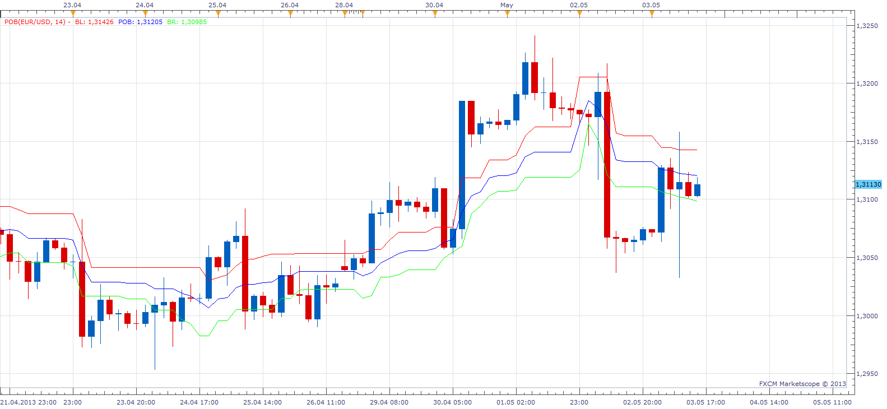
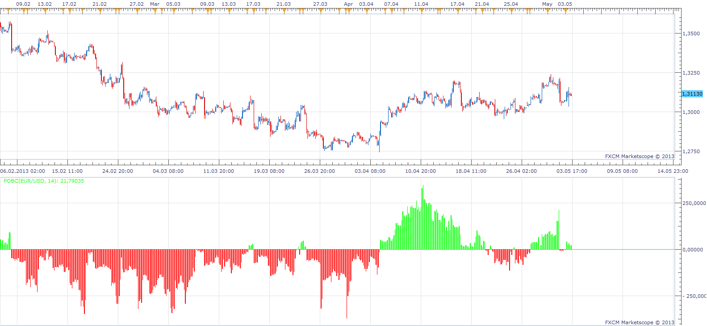

# Point of Balance

> Source: https://fxcodebase.com/code/viewtopic.php?f=17&t=36543  
> Forum: 17 · Topic 36543 · 4 post(s)

---

## Point of Balance

**Apprentice** · Sun May 05, 2013 12:11 pm

BLF = ((HH[n]+LH[n]) /2)
BRF = ((HL[n]+LL[n]) /2)
POB = ((BLF-BRF) /2) + BRF

 [POB.lua](files/61225/POB.lua)

---

## Point of balance oscillator

**Apprentice** · Sun May 05, 2013 1:00 pm

 [POBC.lua](files/61228/POBC.lua)

---

## Re: Point of Balance

**Alexander.Gettinger** · Wed Aug 14, 2013 3:23 pm

MQL4 version of Point of Balance indicator: [http://www.fxcodebase.com/code/viewtopi ... 38&t=59135](http://www.fxcodebase.com/code/viewtopic.php?f=38&t=59135).

---

## Re: Point of Balance

**Apprentice** · Wed Aug 01, 2018 10:04 am

The Indicator was revised and updated.
