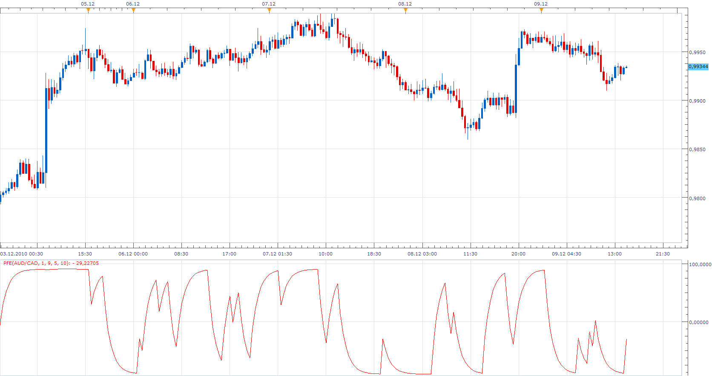
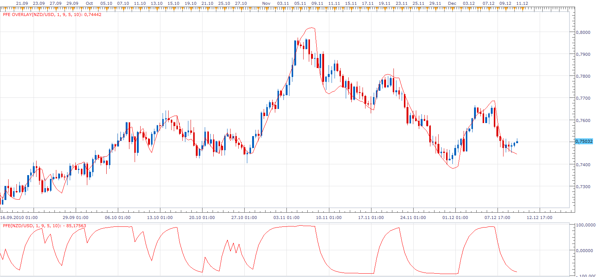

# Polarized Fractal Efficiency (PFE)

> Source: https://fxcodebase.com/code/viewtopic.php?f=17&t=2921  
> Forum: 17 · Topic 2921 · 5 post(s)

---

## Polarized Fractal Efficiency (PFE)

**Apprentice** · Thu Dec 09, 2010 3:07 pm

PFE < 0 - trend is down.
PFE > 0 - trend is up

I found several different formulas,
so I compare several variants

 [PFE.lua](files/6675/PFE.lua)

---

## Re: Polarized Fractal Efficiency (PFE)

**a135711** · Thu Dec 09, 2010 4:11 pm

Apprentice,

i was wondering if you could print this oscillator on the price chart in the following way

the high band (100.00) equal to a BB band high band, or a simple stdev band
the low band(0.0) equal to the BB low band, or a stdev band

in short, the PFE would bounce between the deviation bands and right through the price

---

## Re: Polarized Fractal Efficiency (PFE)

**Apprentice** · Fri Dec 10, 2010 3:09 am

 [PFE Overlay.lua](files/6688/PFE%20Overlay.lua)

---

## Re: Polarized Fractal Efficiency (PFE)

**Alexander.Gettinger** · Mon Dec 22, 2014 10:34 am

MQL4 version of PFE oscillators: [viewtopic.php?f=38&t=61627](https://fxcodebase.com/code/viewtopic.php?f=38&t=61627).

---

## Re: Polarized Fractal Efficiency (PFE)

**Apprentice** · Sun Oct 07, 2018 9:00 am

The indicator was revised and updated.
