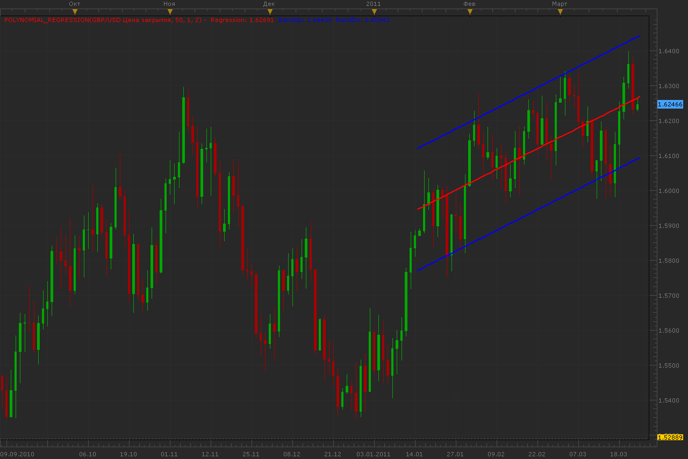
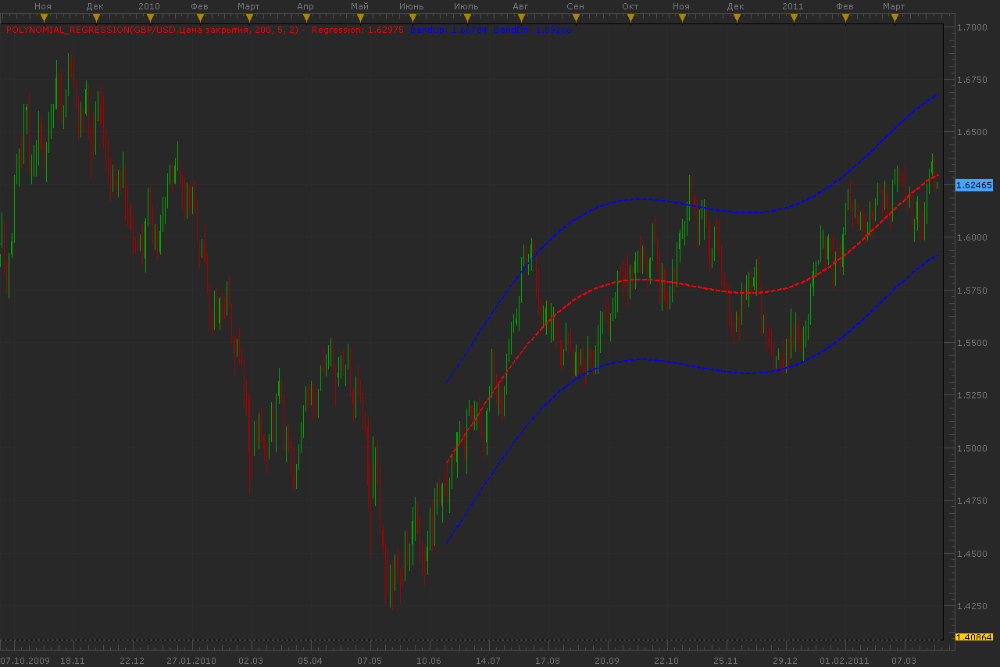
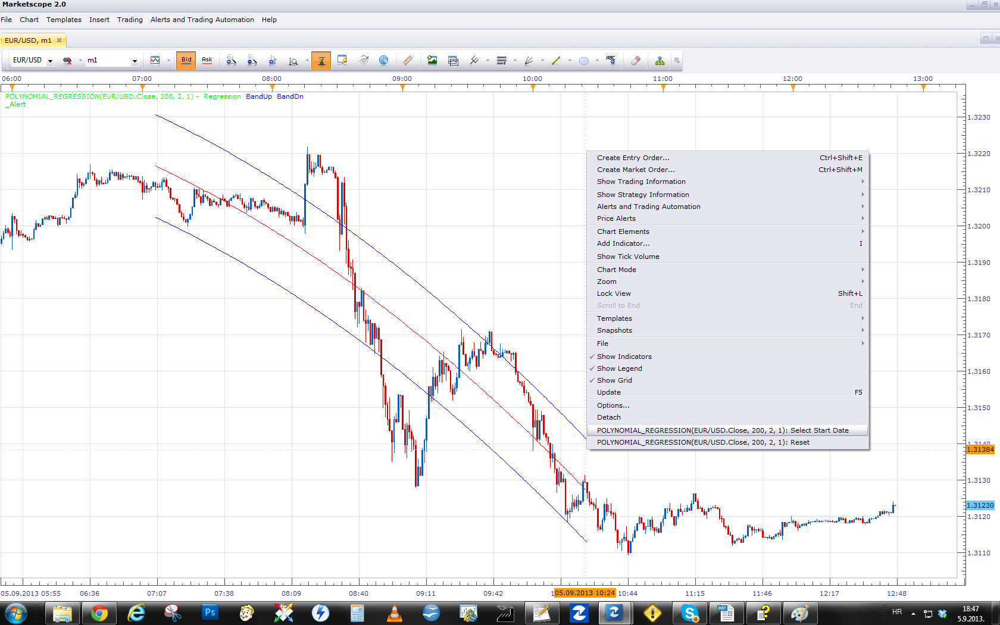

# Polynomial regression

> Source: https://fxcodebase.com/code/viewtopic.php?f=17&t=3715  
> Forum: 17 · Topic 3715 · 47 post(s)

---

## Polynomial regression

**Alexander.Gettinger** · Wed Mar 23, 2011 9:38 pm

Indicator draw a regression curve that is best fits the prices between a starting price point and an ending point.

Parameter [Power] defines power of polynomial which will be used.
[Period] defines range of data on chart.
[Deviation] is used for building band.

If Power=1 we have a linear regression,
if power=2 - quadratic regression and etc.

Power=1:

 

Power=5:

 

Formulas for band:
BandUp=Regression+[Deviation]*variance,
BandDn=Regression-[Deviation]*variance, where
variance=sqrt(Sum((Price-Regression)*(Price-Regression)))/Period.

Download:

 [Polynomial_Regression.lua](files/9006/Polynomial_Regression.lua)

 

This version provides you option to choose end points for Polynomial regression.
End Point selection is achieved via "Set Start Date" menu.
Reset menu will return the end point to last period of data stream.

 [Customizable_Polynomial_Regression.lua](files/9006/Customizable_Polynomial_Regression.lua)

 

You can notice, End point of Polynomial regression moving average and Polynomial Regression have the same value.
Polynomial regression moving average will therefore show End point of Polynomial regression for each of the historical periods.

 [Polynomial Regression Moving Average.lua](files/9006/Polynomial%20Regression%20Moving%20Average.lua)

Polynomial Regression Slope is an indicator based on Polynomial Regression.
[viewtopic.php?f=17&t=59565](https://fxcodebase.com/code/viewtopic.php?f=17&t=59565)

 [Polynomial regression Range With Alert.lua](files/9006/Polynomial%20regression%20Range%20With%20Alert.lua)

---

## Re: Polynomial regression

**lisa_baby_xx** · Tue Apr 26, 2011 10:13 am

Hi Guys,

This is a fantastic indicator! I would like to request two modifications:
1) That the "Power=5" regression type has just two lines based on the centre (red line) instead of the three lines in total that it currently displays. And:
2) That this new second line is set N horizontal deviations/periods back from the first (red line), thereby giving crossover signals.

Is this possible? I hope this is clear, if not then just drop me a line.

 If Power 1 = linear regression and Power 2 = quadratic regression, what about powers 3 to 5??

Much love and a big Thank you for all your hard work. XX
lisa_baby_xx

---

## Re: Polynomial regression

**Alexander.Gettinger** · Tue Apr 26, 2011 9:25 pm

> **lisa_baby_xx wrote:**
> Hi Guys,
>
> This is a fantastic indicator! I would like to request two modifications:
> 1) That the "Power=5" regression type has just two lines based on the centre (red line) instead of the three lines in total that it currently displays. And:
> 2) That this new second line is set N horizontal deviations/periods back from the first (red line), thereby giving crossover signals.
>
> Is this possible? I hope this is clear, if not then just drop me a line.
>
> If Power 1 = linear regression and Power 2 = quadratic regression, what about powers 3 to 5??
>
> Much love and a big Thank you for all your hard work. XX
> lisa_baby_xx

Please explain me about modifications.
"Power" defines power of polynomial which will be used.

---

## Re: Polynomial regression

**lisa_baby_xx** · Wed Apr 27, 2011 4:50 am

Hello Alex,

The changes/modifications are as follows:
- The two blue lines (top and bottom) on Polynominal Regression type 5 are removed.
- The first red line (centre) has a second line set N horizontal periods back but still in syncronization with the first (red) line, thus allowing for trend crossovers.
-Could this new line, have custom colour and line type just the first red line??

I hope this is clear, if not not just drop me another line.

Many thanks and much love. XX
lisa_baby_xx

---

## Re: Polynomial regression

**Blackcat2** · Wed Apr 27, 2011 6:27 pm

What is the best TF to apply this and the recommended setting? I tried this on 15M (96,5,2) but the curve change quite dramatically during whipsaw/volatility period. Is the angle suggest the direction of the trend as well?

Cheers..
BC

---

## Re: Polynomial regression

**lisa_baby_xx** · Fri Apr 29, 2011 8:01 am

Hi Blackcat2,

The indicator settings you are using look okay to me, try using a bigger timeframe. I have found that using a 30m TF reduces the whipsaw factor. But remember: 80% of money made on the financial markets is make through pure speculation, that means checking economic annoucements and anticipating price movement.

Hope this helps, sweetie.

Much love. XX
lisa_baby_xx

---

## Re: Polynomial regression

**Blackcat2** · Sun May 01, 2011 7:09 pm

Thanks Lisa

What settings and TF do you used? Do you use other indicator to confirm? If yes, could you please share?

BC

---

## Re: Polynomial regression

**lisa_baby_xx** · Mon May 02, 2011 5:35 am

Hi BC,

> What settings and TF do you used? Do you use other indicator to confirm? If yes, could you please share?

Okay, the setting I am using are: 115, 3, 1.7 and Power #3, TF is 30 Minutes (although these can change). As for confirmation, I do not really use anything except the ZIGZAG, but thats mainly for directional reasons because it filters out a lot of noise.

Remember: Nothing is guaranteed

Hope this helps, sweetie.
lisa_baby_xx

---

## Re: Polynomial regression

**Alexander.Gettinger** · Wed May 04, 2011 1:40 am

Strategy based on this indicator: [viewtopic.php?f=31&t=4105](https://fxcodebase.com/code/viewtopic.php?f=31&t=4105)

---

## Re: Polynomial regression

**RJH501** · Fri Jul 22, 2011 7:35 am

Hello Alexander,

The indicator loads up just fine but the strategy won't load.

Any suggestions?

Thanks,

RJH

---

## Re: Polynomial regression

**Alexander.Gettinger** · Sun Jul 24, 2011 10:29 pm

I have updated strategies.
Please, try again.

---

## Re: Polynomial regression

**virgilio** · Tue May 29, 2012 2:51 pm

Is it possible to add the "Distance" variable to the indicator so to match the strategy variables?
Right now in the indicator we have: Period, Power, Deviation
Right now in the strategy we have: Period, Power, Deviation, Distance

Thank you kindly for taking this request in consideration.

---

## Re: Polynomial regression

**Apprentice** · Wed May 30, 2012 2:36 am

Distance? What would be the role of this parameter.

---

## Re: Polynomial regression

**Alexander.Gettinger** · Tue Jun 19, 2012 5:29 pm

MQL4 version of polynomial regression: [viewtopic.php?f=38&t=20393](https://fxcodebase.com/code/viewtopic.php?f=38&t=20393)

---

## Re: Polynomial regression (Static)

**Scrat_Power** · Wed Aug 22, 2012 1:53 am

Hi all,

Here my contribution to this nice and useful forum.
I modified a bit this indicator to print the history.
As this indicator is full dynamic, it's nearly impossible to watch the past.
Now, you can !

I let the dynamic one printed and you can read the past of this indicator.
Color indicate the way (up or down trend).

kind regards,
Scrat.

PS : Sorry for my english ...

---

## Re: Polynomial Regression

**Riccardo Burns** · Mon Aug 27, 2012 12:55 pm

Alexander,I've been dabblin' with your Polynomial Regression. Please see if this is ok?
 Add two togeter please: #1 @ 100,2, 1.5,----Blue, Red outside....
 #2 @ 100,2, 1.0,--- Green, Blue
It works out Aok for me and responds very well at anyspeed..I Thank You Very Much Alexander. I call this "The Flow" in honor of You.............
 Riccardo

 [7230](files/39276/The%20Flow.jpg)

---

## Re: Polynomial regression

**mulligan** · Thu Mar 28, 2013 10:41 am

Great indicator. Is it possible to add style option for up and down color for regression line? Thanks for all your work.

---

## Re: Polynomial regression

**Apprentice** · Fri Mar 29, 2013 2:15 pm

Style Options Added (Topmost post)

---

## Re: Polynomial regression

**mulligan** · Fri Mar 29, 2013 4:57 pm

I'm sorry I was not clear in my request. I was wanting the regression line (center line) to change color as the "averages" indicators do. That is to change color as the line changes direction up and down. I understand the indicator changes with every candle so it would be dynamic and not static in nature. The momentum change from up to down or down to up is sometimes subtle so the regression line giving an exact point of change would be very helpful. As always, your work is appreciated.

---

## Re: Polynomial regression

**Apprentice** · Mon Apr 01, 2013 7:05 am

Central Line Color Option Added.

---

## Re: Polynomial regression

**Tigre3** · Sat May 25, 2013 10:23 am

Could you write here the code to calculate the polynomial regression without using lua?

Thank you

---

## Re: Polynomial regression

**Apprentice** · Sun Jun 02, 2013 11:48 am

U have to use some programming language.
What is your target platform.

---

## Re: Polynomial regression

**Tigre3** · Wed Jul 17, 2013 7:07 am

Could you write it in visual basic? Thank you! (It's the only language I know and I'd like to understand something about polynomial regression looking to the code)

---

## Re: Polynomial regression

**Apprentice** · Thu Jul 18, 2013 1:40 pm

Unfortunately, I do not know Visual Basic very well.
My interest are MQ4 and Lua.

---

## Re: Polynomial regression

**Tigre3** · Sat Jul 20, 2013 9:21 am

Could you write it with algorithms language? Something like this:

for i=0 to n-1
if a<...
end for

etc..

---

## Re: Polynomial regression

**Apprentice** · Sat Jul 20, 2013 10:00 am

More about Polynomial_regression and the exact formula can be found here.
[http://en.wikipedia.org/wiki/Polynomial_regression](https://en.wikipedia.org/wiki/Polynomial_regression)

Channel Calculating

 sum=Pow(Price-Regression,2)

 sum = (SUM, N)

variance= sqrt(SUM/Period);

BandUp=Regression+Deviation*variance
BandDn=Regression-Deviation*variance

---

## Re: Polynomial regression

**Tigre3** · Sat Aug 17, 2013 8:19 pm

Could you make a version without the channel? Only the regression line.

Thank you!

---

## Re: Polynomial regression

**Apprentice** · Mon Aug 19, 2013 2:10 am

Your request is added to the development list.

---

## Re: Polynomial regression

**Himalaya** · Sun Sep 01, 2013 2:39 pm

Guys,

Would it be possible to add an adjustable start point feature to this indicator.

i.e.; The way the indicator is coded now is that it starts always at the current bar/candle and then calculates back 'X' periods.

Could the indicator have the feature of starting 'X' bars/candle back and then calculate 'X' periods back from the chosen start point?

This would allow anyone to see where the Polynomial Regression Channel was in the past.

Thanks in advance.

Himalaya

---

## Re: Polynomial regression

**Patrick Sweet** · Mon Sep 02, 2013 2:03 am

Hi,
Good idea and I think it would be helpful, too.
If you need an historical polyreg line that does not repaint (shows historically where it was for any given candle at the time of calculating that candle in the past) our friend ScratPower published a modification of PolyReg called Polynomial regression static that does not repaint and posted it here. It is located above (2nd of 3 pages in this post) and it is very useful. If this is not what you need and I misunderstood you, please excuse my intrusion.....and I too would like to see what you ask for if the crew gets time to prioritise it. Until then I find Polyregstatic to be useful if not complete. Thanks to ScratPower, too!

---

## Re: Polynomial regression

**Himalaya** · Mon Sep 02, 2013 10:49 am

Patrick,

Yes I am looking for a feature different then Scratpower's Poly-reg-Static which fixes in time the centerline/MA.

I.e., on a D1 chart I am interested to to see where the Deviation Channels where last week, last month or on any given date.

Having an adjustable start date will allow one to truly see where the channel was historically as the end date is already adjustable through the "Period" setting.

This will allow visual backtesting of any method using Polynomial Regression Channels on any time frame as one could go back in time and verify where the channels where on any given date/time series.

Thanks for your support of the feature request. When I look at code it looks like hieroglyphics so I am not sure how difficult or easy adding this type of feature is.

Himalaya

---

## Re: Polynomial regression

**Apprentice** · Tue Sep 03, 2013 2:11 am

I'm not sure whether I understand you.
Do you want Polynomial regression for the whole period from the first this last,
or Do you want Polynomial regression, for the current period,
from current-period Thill current period.

---

## Re: Polynomial regression

**Himalaya** · Tue Sep 03, 2013 9:05 am

Hi Apprentice,

I would like to be able to see where the Polynomial Regression Channel was in the past.

Currently if the "Period" parameter is set to 100, the indicator will use the current bar/candle as the first data point and then include the previous 99 data points.

I would like the indicator to have an adjustable "Start Bar/Candle" feature (an offset first data point). So that a user could set the first data point "X" bars back. The indicator would then use that "Start" bar as the first data point and then look back 99 bars or whatever the user had chosen in the "Period" parameter.

Let me know if I have still not explained it clearly.

Himalaya

---

## Re: Polynomial regression

**Apprentice** · Thu Sep 05, 2013 1:56 am

Your request is added to the development list.

---

## Re: Polynomial regression

**Apprentice** · Thu Sep 05, 2013 11:56 am

Customizable_Polynomial_Regression has the desired functionality.
See topmost (first) post of this topic.

---

## Re: Polynomial regression

**Himalaya** · Thu Sep 05, 2013 3:24 pm

Big Thanks Apprentice,

This is exactly what I was looking for.

Himalaya

---

## Re: Polynomial regression

**Apprentice** · Mon Sep 23, 2013 4:47 am

Polynomial Regression Moving Average added.

---

## Re: Polynomial regression

**volnmar** · Thu Oct 02, 2014 5:41 am

can you please add alert after price cross Deviation?

---

## Re: Polynomial regression

**Apprentice** · Sat Oct 04, 2014 2:40 am

Can you specify for which of indicators above, you're interested.

---

## Re: Polynomial regression

**volnmar** · Mon Oct 06, 2014 7:16 am

Polynomial_Regression.lua and Customizable_Polynomial_Regression.lua

---

## Re: Polynomial regression

**Apprentice** · Tue Oct 07, 2014 8:40 am

Your request is added to the development list.

---

## Re: Polynomial regression

**Apprentice** · Sun Sep 04, 2016 5:12 am

Minor Update.

---

## Re: Polynomial regression

**Apprentice** · Mon Aug 28, 2017 3:30 am

The indicator was revised and updated.

---

## Re: Polynomial regression

**Trader** · Thu Oct 05, 2017 9:41 am

Hello Alexander Gettinger
Hello Apprentice
1] reference the 'Polynomial Regression' can you please make a small modification so that it can be displayed only on the last candle/ meaning;
Show Historical = Yes/No
2] instead of a Dot please make this to appear as a horizontal line with the option of changing the color and width of the line
3] just/only for example of the horizontal line and its options it should be the same as used in 'Range With Alert'
[viewtopic.php?f=17&t=32324&hilit=range+with+alert](https://fxcodebase.com/code/viewtopic.php?f=17&t=32324&hilit=range+with+alert)
4] Thank you; and
Regards
Trader

---

## Re: Polynomial regression

**Apprentice** · Fri Oct 06, 2017 12:55 pm

Polynomial regression Range With Alert.lua added.

---

## Re: Polynomial regression

**Apprentice** · Fri Jun 08, 2018 7:57 am

The indicator was revised and updated.

---

## Re: Polynomial regression

**Alexander.Gettinger** · Thu Jan 24, 2019 3:52 pm

Please try this indicator:

 [Polynomial_Regression_Line.lua](files/123524/Polynomial_Regression_Line.lua)
