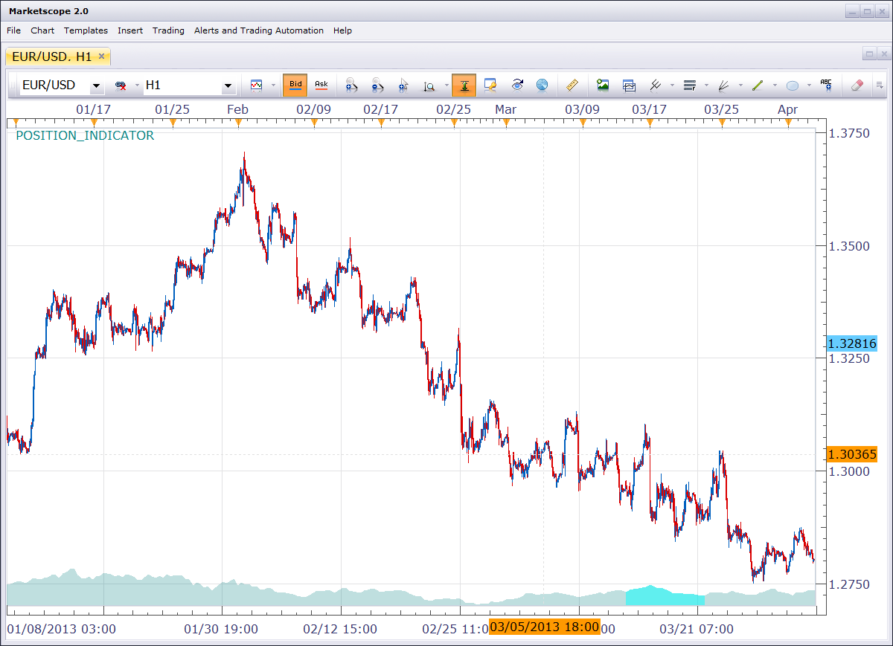

# Position Indicator

> Source: https://fxcodebase.com/code/viewtopic.php?f=17&t=58433  
> Forum: 17 · Topic 58433 · 3 post(s)

---

## Position Indicator

**Nikolay.Gekht** · Wed Jul 31, 2013 12:34 pm

The indicator draws the prices of the whole data set loaded on the bottom of the chart and highlights prices which are currently displayed.

 

Download:

 [position_indicator.lua](files/87594/position_indicator.lua)

The indicator was revised and updated

---

## Re: Position Indicator

**Apprentice** · Tue Oct 15, 2013 1:47 am

Bump Up

---

## Re: Position Indicator

**Apprentice** · Wed Jun 14, 2017 4:04 am

The indicator was revised and updated.
