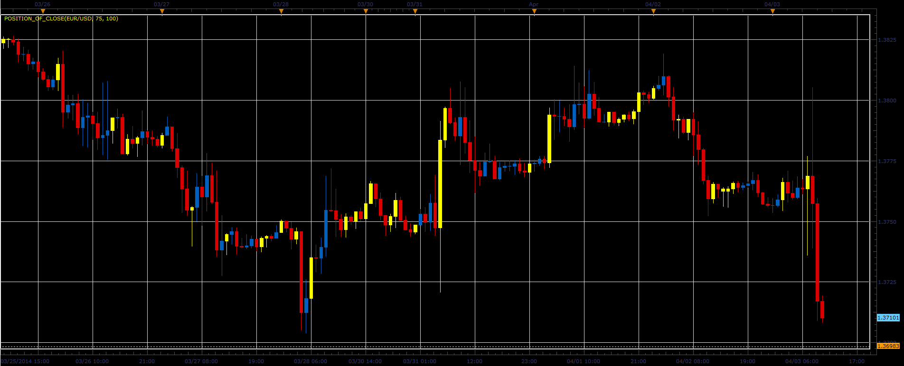

# Position of Open/Close

> Source: https://fxcodebase.com/code/viewtopic.php?f=17&t=60486  
> Forum: 17 · Topic 60486 · 3 post(s)

---

## Position of Open/Close

**Alexander.Gettinger** · Thu Apr 03, 2014 10:39 am

The indicators highlight the bars with the specified position of Open/Close within the bar.

 

Download:

 [Position_Of_Open.lua](files/93344/Position_Of_Open.lua)

 [Position_Of_Close.lua](files/93344/Position_Of_Close.lua)

The indicator was revised and updated

---

## Re: Position of Open/Close

**Alexander.Gettinger** · Thu Apr 03, 2014 10:42 am

MQL4 version of Position of Open/Close indicators: [viewtopic.php?f=38&t=60487](https://fxcodebase.com/code/viewtopic.php?f=38&t=60487).

---

## Re: Position of Open/Close

**Apprentice** · Fri Jun 16, 2017 7:28 am

The indicator was revised and updated.
