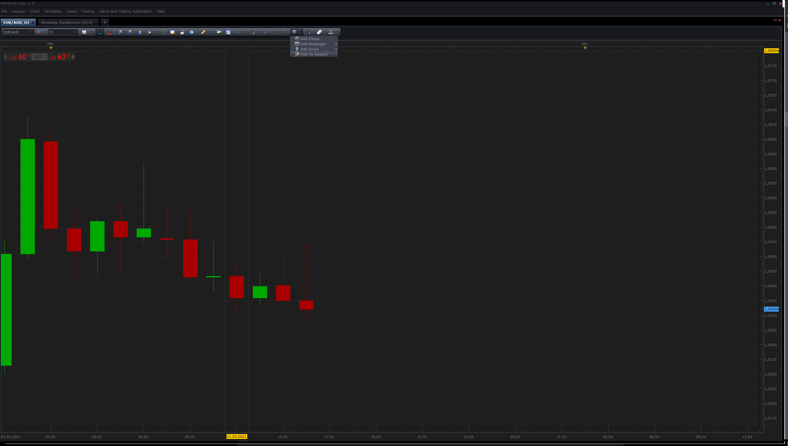

# Position Sizing & Risk To Reward Ratio

> Source: https://fxcodebase.com/code/viewtopic.php?f=17&t=689  
> Forum: 17 · Topic 689 · 16 post(s)

---

## Position Sizing & Risk To Reward Ratio

**Apprentice** · Mon Apr 19, 2010 5:27 am

*Position Sizing with ATR*

Risk To Reward Ratio
Helper for defining these, Entry Orders Stop Levels.

It enables you to the definition, risk to reward ratio, number of contract,
Entry level (manual or automatic), automatic or manual definition of capital that you are willing to risk (Pip or $) ...

Position Sizing
Tool has two modes. Volatility and Risk.
If you use a volatility mod, increased volatility, ATR, move away, Stop Entry level.
Risk mod - you define the distance for stop orders manualy.

 [Position Sizing.lua](files/1256/Position%20Sizing.lua)

 [Risk To Reward.lua](files/1256/Risk%20To%20Reward.lua)

MT4/MQ4 versions
[https://fxcodebase.com/code/viewtopic.php?f=38&t=65690](https://fxcodebase.com/code/viewtopic.php?f=38&t=65690)
[https://fxcodebase.com/code/viewtopic.php?f=38&t=73029](https://fxcodebase.com/code/viewtopic.php?f=38&t=73029)

 

 [Risk To Reward Tool.lua](files/1256/Risk%20To%20Reward%20Tool.lua)

---

## Re: Position Sizing & Risk To Reward Ratio

**Apprentice** · Thu Dec 15, 2011 4:08 pm

Position Sizing & Risk To Reward Ratio Tool Update.
Both now Support the automatic retrieval of Equity / Balance status of your account.

---

## Re: Position Sizing & Risk To Reward Ratio

**Apprentice** · Sun Sep 22, 2013 3:47 pm

Bit of a face lift for both.

---

## Re: Position Sizing & Risk To Reward Ratio

**Silverthorn** · Wed Apr 08, 2015 2:11 am

Is it possible to make the stop loss line able to be repositioned on the chart for the Position Sizing Indicator? ie.

Select and drag the stop loss to under the nearest swing, support or resistance point and have the TP and position size adjust to maintain your correct position size for the required exposure. Also display your RR ratio based on the SL and TP.

---

## Re: Position Sizing & Risk To Reward Ratio

**AliRaza08** · Wed Apr 08, 2015 7:04 am

Select and drag the stop loss to under the nearest swing, support or resistance point and have the TP and position size adjust to maintain your RR ratio and correct position size.

---

## Re: Position Sizing & Risk To Reward Ratio

**Apprentice** · Wed Jan 31, 2018 9:17 am

The strategy was revised and updated.

---

## Re: Position Sizing & Risk To Reward Ratio

**Silverthorn** · Sun Mar 04, 2018 11:43 pm

Hi Apprentice,

Is it not possible to have the stop loss able to be repositioned on the chart for this indicator?

---

## Re: Position Sizing & Risk To Reward Ratio

**Apprentice** · Mon Mar 05, 2018 7:42 am

Sure. Use "Value/Pips at Risk"
Entry price will be used as a reference value.

---

## Re: Position Sizing & Risk To Reward Ratio

**Silverthorn** · Mon Mar 05, 2018 6:44 pm

Sorry I wasn't clear in my last post.

Is it not possible to reposition the stop loss by dragging it on the screen?

---

## Re: Position Sizing & Risk To Reward Ratio

**Apprentice** · Tue Mar 06, 2018 4:28 pm

> Is it not possible to reposition the stop loss by dragging it on the screen?

Unfortunately no.

---

## Re: Position Sizing & Risk To Reward Ratio

**Apprentice** · Tue Mar 16, 2021 1:07 pm

Risk To Reward Tool.lua added.

---

## Re: Position Sizing & Risk To Reward Ratio

**helenoftroy** · Wed Mar 17, 2021 12:47 pm

Hi,
probably a stupid question for which I apologise in advance.
I am writing my own strategies and have downloaded some examples from this site. I note that several require indicators to be "installed" - but I don't see how this can be done when using the debugger to run the strategy.
An example is "Strategy Example 1" which references to Indicators (Indicator_A) and (Indicator_B). I have downloaded the indicators and saved them, but the Strategy will not run or load the indicators.
How can I do this? Including the file does not seem to help!
Apologies in advance i have struggled on for several hours trying to solve myself but now getting tired!
Thanks in advance

---

## Re: Position Sizing & Risk To Reward Ratio

**Apprentice** · Thu Mar 25, 2021 6:45 am

[viewtopic.php?f=17&t=71019](https://fxcodebase.com/code/viewtopic.php?f=17&t=71019)
Will this help as a template?

---

## Re: Position Sizing & Risk To Reward Ratio

**NobleRace** · Fri Jan 20, 2023 5:12 pm

Thanks so much pal.

Just coming online now. I was seriously engaged offline.

Sorry for late reply.

---

## Re: Position Sizing & Risk To Reward Ratio

**mjf1288** · Fri Aug 23, 2024 11:54 am

is it possible to modify this to show both buy and sell levels at the same time?

could it also show the levels only to the left side of screen and without prices/numbers?

Thanks!

[https://fxcodebase.com/code/download/file.php?id=444](https://fxcodebase.com/code/download/file.php?id=444)

---

## Re: Position Sizing & Risk To Reward Ratio

**Apprentice** · Mon Aug 26, 2024 6:20 pm

We have added your request to the development list.
Development reference 681
