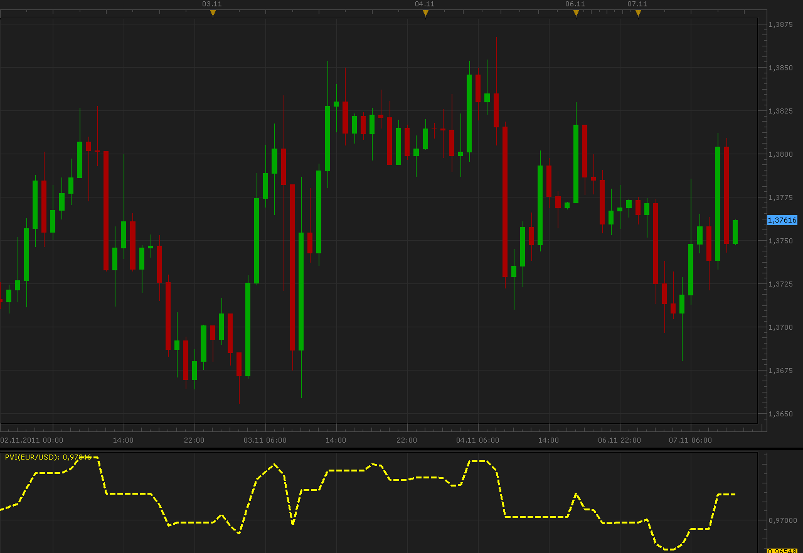

# Positive Volume Index

> Source: https://fxcodebase.com/code/viewtopic.php?f=17&t=7886  
> Forum: 17 · Topic 7886 · 2 post(s)

---

## Positive Volume Index

**Alexander.Gettinger** · Mon Nov 07, 2011 11:04 am

This indicator is a ported MQL5 indicator from [http://www.mql5.com/ru/code/518](http://www.mql5.com/ru/code/518) (in Russian).

Formulas:
PVI[i]=PVI[i-1], if Volume[i]<=Volume[i-1] and
PVI[i]=PVI[i-1]*(1+(Close[i]-Close[i-1])/Close[i-1]), if Volume[i]>Volume[i-1].

 

Download:

 [PVI.lua](files/17488/PVI.lua)

Negative Volume Index is available here.
[viewtopic.php?f=17&t=9707&p=113](https://fxcodebase.com/code/viewtopic.php?f=17&t=9707&p=113)

Volume Index is combination of two.
[viewtopic.php?f=17&t=65176](https://fxcodebase.com/code/viewtopic.php?f=17&t=65176)

The indicator was revised and updated

---

## Re: Positive Volume Index

**Apprentice** · Thu May 03, 2018 4:10 pm

The indicator was revised and updated.
