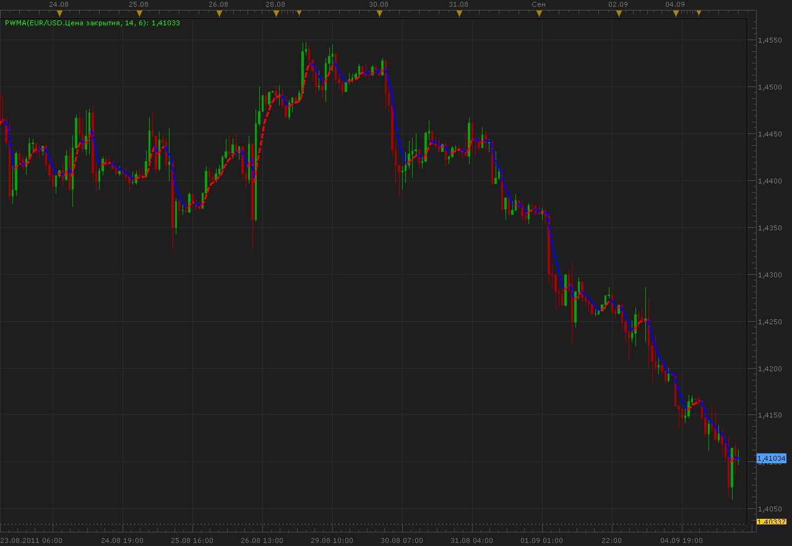

# Power weighted moving average (PWMA)

> Source: https://fxcodebase.com/code/viewtopic.php?f=17&t=6305  
> Forum: 17 · Topic 6305 · 2 post(s)

---

## Power weighted moving average (PWMA)

**Alexander.Gettinger** · Mon Sep 05, 2011 11:47 am

PWMA = SUM(Price(i)*(i^Power), Period)/SUM(i^Power, Period).
For Power=1 PWMA is identical to Linear Weighted Moving Average (LWMA).

 

Download:

 [PWMA.lua](files/14548/PWMA.lua)

MT4/MQ4 version.
[viewtopic.php?f=38&t=64546](https://fxcodebase.com/code/viewtopic.php?f=38&t=64546)

The indicator was revised and updated

---

## Re: Power weighted moving average (PWMA)

**Apprentice** · Thu Mar 16, 2017 5:49 am

Indicator was revised and updated.
