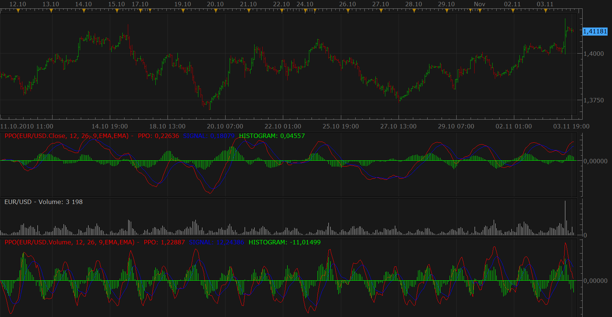

# PPO (Percentage Price Oscillator)

> Source: https://fxcodebase.com/code/viewtopic.php?f=17&t=2587  
> Forum: 17 · Topic 2587 · 5 post(s)

---

## PPO (Percentage Price Oscillator)

**Nikolay.Gekht** · Wed Nov 03, 2010 7:20 pm

> **stockcharts.com wrote:**
> The Percentage Price Oscillator (PPO) is a momentum oscillator that measures the difference between two moving averages as a percentage of the larger moving average. As with its cousin, MACD, the Percentage Price Oscillator is shown with a signal line, a histogram and a centerline. Signals are generated with signal line crossovers, centerline crossovers and divergences.
> [read more...](http://stockcharts.com/school/doku.php?id=chart_school:technical_indicators:price_oscillators_pp)

Formula:
PPO = (EMA(12) - EMA(26)) / EMA(26)
SIGNAL = EMA(PPO, 9)
HISTOGRAM = PPO - SIGNAL

 

Download:

 [PPO.lua](files/5796/PPO.lua)

Code: [Select all](https://fxcodebase.com/code/)
`function Init()
    indicator:name("Percentage Price Oscillator");
    indicator:description("A momentum oscillator that measures the difference between two moving averages as a percentage of the larger moving average.");
    indicator:requiredSource(core.Tick);
    indicator:type(core.Oscillator);

    indicator.parameters:addGroup("Calculation");
    indicator.parameters:addInteger("SN", "Fast MA", "", 12, 2, 1000);
    indicator.parameters:addInteger("LN", "Slow MA", "", 26, 2, 1000);
    indicator.parameters:addInteger("IN", "Signal Line", "", 9, 2, 1000);
    indicator.parameters:addString("MA", "Smoothing Method", "The methods marked by an asterisk (*) require the appropriate indicators to be loaded.", "EMA");
    indicator.parameters:addStringAlternative("MA", "MVA", "", "MVA");
    indicator.parameters:addStringAlternative("MA", "EMA", "", "EMA");
    indicator.parameters:addStringAlternative("MA", "LWMA", "", "LWMA");
    indicator.parameters:addStringAlternative("MA", "TMA", "", "TMA");
    indicator.parameters:addStringAlternative("MA", "SMMA*", "", "SMMA");
    indicator.parameters:addStringAlternative("MA", "Vidya (1995)*", "", "VIDYA");
    indicator.parameters:addStringAlternative("MA", "Vidya (1992)*", "", "VIDYA92");
    indicator.parameters:addStringAlternative("MA", "Wilders*", "", "WMA");
    indicator.parameters:addString("SMA", "Signal smoothing Method", "The methods marked by an asterisk (*) require the appropriate indicators to be loaded.", "EMA");
    indicator.parameters:addStringAlternative("MA", "MVA", "", "MVA");
    indicator.parameters:addStringAlternative("MA", "EMA", "", "EMA");
    indicator.parameters:addStringAlternative("MA", "LWMA", "", "LWMA");
    indicator.parameters:addStringAlternative("MA", "TMA", "", "TMA");
    indicator.parameters:addStringAlternative("MA", "SMMA*", "", "SMMA");
    indicator.parameters:addStringAlternative("MA", "Vidya (1995)*", "", "VIDYA");
    indicator.parameters:addStringAlternative("MA", "Vidya (1992)*", "", "VIDYA92");
    indicator.parameters:addStringAlternative("MA", "Wilders*", "", "WMA");
    indicator.parameters:addGroup("Style");
    indicator.parameters:addColor("PPO_color", "PPO line color", "", core.rgb(255, 0, 0));
    indicator.parameters:addInteger("widthPPO", "PPO line width", "", 1, 1, 5);
    indicator.parameters:addInteger("stylePPO", "PPO line style", "", core.LINE_SOLID);
    indicator.parameters:setFlag("stylePPO", core.FLAG_LINE_STYLE);
    indicator.parameters:addColor("SIGNAL_color", "Signal line color", "", core.rgb(0, 0, 255));
    indicator.parameters:addInteger("widthSIGNAL", "Signal line width", "", 1, 1, 5);
    indicator.parameters:addInteger("styleSIGNAL", "Signal line style", "", core.LINE_SOLID);
    indicator.parameters:setFlag("styleSIGNAL", core.FLAG_LINE_STYLE);
    indicator.parameters:addColor("HISTOGRAM_color", "Historgram color", "", core.rgb(0, 255, 0));
end

-- Indicator instance initialization routine
-- Processes indicator parameters and creates output streams
-- Parameters block
local SN;
local LN;
local IN;

local firstPeriodPPO;

local firstPeriodSIGNAL;
local source = nil;

local EMAS = nil;
local EMAL = nil;
local MVAI = nil;

-- Streams block
local PPO = nil;
local SIGNAL = nil;
local HISTOGRAM = nil;

-- Routine
function Prepare()
    SN = instance.parameters.SN;
    LN = instance.parameters.LN;
    IN = instance.parameters.IN;
    source = instance.source;

    assert(core.indicators:findIndicator(instance.parameters.MA) ~= nil, "Please download and install " ..  instance.parameters.MA .. ".lua");
    assert(core.indicators:findIndicator(instance.parameters.SMA) ~= nil, "Please download and install " ..  instance.parameters.SMA .. ".lua");

    -- Check parameters
    if (LN <= SN) then
       assert(false, "The short MA period must be smaller than long MA period");
    end

    -- Create short and long EMAs for the source
    EMAS = core.indicators:create(instance.parameters.MA, source, SN);
    EMAL = core.indicators:create(instance.parameters.MA, source, LN);

    -- Base name of the indicator.
    local name = profile:id() .. "(" .. source:name() .. ", " .. SN .. ", " .. LN .. ", " .. IN .. "," .. instance.parameters.MA .. "," .. instance.parameters.SMA .. ")";
    instance:name(name);

    local precision = math.max(2, source:getPrecision());

    -- Create the output stream for the PPO. The first period is equal to the
    -- biggest first period of source EMA streams
    firstPeriodPPO = math.max(EMAS.DATA:first(), EMAL.DATA:first());
    PPO = instance:addStream("PPO", core.Line, name .. ".PPO", "PPO", instance.parameters.PPO_color, firstPeriodPPO);
    PPO:setWidth(instance.parameters.widthPPO);
    PPO:setStyle(instance.parameters.stylePPO);
    --PPO:setPrecision(precision);

    -- Create MVA for the PPO output stream.
    MVAI = core.indicators:create(instance.parameters.SMA, PPO, IN);
    -- Create output for the signal and histogram
    firstPeriodSIGNAL = MVAI.DATA:first();

    SIGNAL = instance:addStream("SIGNAL", core.Line, name .. ".SIGNAL", "SIGNAL", instance.parameters.SIGNAL_color, firstPeriodSIGNAL);
    SIGNAL:setWidth(instance.parameters.widthSIGNAL);
    SIGNAL:setStyle(instance.parameters.styleSIGNAL);
    --SIGNAL:setPrecision(precision);
    HISTOGRAM = instance:addStream("HISTOGRAM", core.Bar, name .. ".HISTOGRAM", "HISTOGRAM", instance.parameters.HISTOGRAM_color, firstPeriodSIGNAL);
    HISTOGRAM:setPrecision(precision);
end

-- Indicator calculation routine
function Update(period, mode)
    -- and update short and long EMAs for the source.
    EMAS:update(mode);
    EMAL:update(mode);

    if (period >= firstPeriodPPO) then
        -- calculate PPO output
         PPO[period] = (EMAS.DATA[period] - EMAL.DATA[period]) / EMAL.DATA[period] * 100;
    end

    -- update MVA on the PPO
    MVAI:update(mode);
    if (period >= firstPeriodSIGNAL) then
        SIGNAL[period] = MVAI.DATA[period];
        -- calculate histogram as a difference between PPO and signal
        HISTOGRAM[period] = PPO[period] - SIGNAL[period];
    end
end`

---

## Re: PPO (Percentage Price Oscillator)

**Apprentice** · Thu Feb 02, 2017 3:54 pm

Indicator was revised and updated.

---

## Re: PPO (Percentage Price Oscillator)

**cash4u** · Fri Feb 03, 2017 8:47 am

HI APPRENDICE ,

CAN YOU CREATE A STRATEGY BASED ON THIS INDICATOR PPO

INIDCATORS:

1.PPO DATA SOURCE PRICE(PPOP)
BUY LEVEL:0
SELL LEVEL;0

2.PPO DATA SOURCE VOLUME(PPOV)

BUY LEVEL:0
SELL LEVEL:0

**BUY;**

PPOP CROSS OVER SIGNAL AND PPOP > BUYLEVEL AND
PPOV > SIGNAL AND PPOV > BUY LEVEL

**SELL:**

PPOP CROSS UNDER SIGNAL AND PPOP< SELL LEVEL AND
PPOV<SIGNAL AND PPOV < SELL LEVEL

---

## Re: PPO (Percentage Price Oscillator)

**Apprentice** · Fri Feb 03, 2017 12:20 pm

Try this version.
[viewtopic.php?f=31&t=64384](https://fxcodebase.com/code/viewtopic.php?f=31&t=64384)

---

## Re: PPO (Percentage Price Oscillator)

**Apprentice** · Mon Feb 05, 2018 9:21 am

The Indicator was revised and updated.
