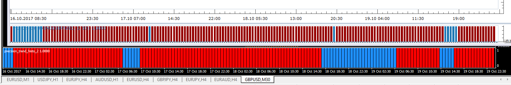

# Precision Trend

> Source: https://fxcodebase.com/code/viewtopic.php?f=17&t=65185  
> Forum: 17 · Topic 65185 · 4 post(s)

---

## Precision Trend

**Apprentice** · Thu Oct 19, 2017 9:57 am

Based MQ4 original.
[https://www.mql5.com/en/code/17927](https://www.mql5.com/en/code/17927)

 [Precision Trend.lua](files/115509/Precision%20Trend.lua)

---

## Re: Precision Trend

**ChrisM** · Thu Oct 19, 2017 8:49 pm

Hello Apprentice,

Thank you!!

but there is a difference (UP/DN) to the MT4 version
can you please check it.

 

---

## Re: Precision Trend

**Apprentice** · Mon Oct 23, 2017 5:09 am

Will revise this.
Note, Data that follows corresponds completely.

---

## Re: Precision Trend

**Apprentice** · Tue Aug 07, 2018 4:47 am

The Indicator was revised and updated.
