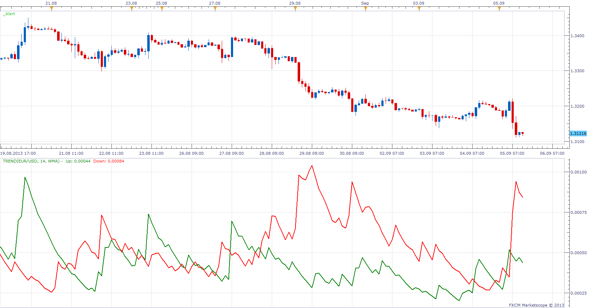

# Prevailing Trend

> Source: https://fxcodebase.com/code/viewtopic.php?f=17&t=59402  
> Forum: 17 · Topic 59402 · 31 post(s)

---

## Prevailing Trend

**Apprentice** · Thu Sep 05, 2013 1:49 pm

Up
moving average of UP candles for n periods

Down
moving average of DOWN candles for n periods

 [Trend.lua](files/89183/Trend.lua)

 [Tick Trend.lua](files/89183/Tick%20Trend.lua)

---

## Re: Prevailing Trend

**speakinmymind** · Thu Sep 05, 2013 3:11 pm

To verify, these are the moving averages of the SIZE of up/down candles and do not use price in the equation?

Also, with the same formula, can you create this MVA of all candles?
Basically, the same formula without the split.

Thanks alot!

> **Apprentice wrote:**
>
>
> Trend.png
>
>
>
> Up
> moving average of UP candles for n periods
>
> Down
> moving average of DOWN candles for n periods
>
>
> Trend.lua

---

## Re: Prevailing Trend

**Apprentice** · Fri Sep 06, 2013 3:38 am

1. Candle Size is used.
2. Use greater period.

---

## Re: Prevailing Trend

**speakinmymind** · Sat Sep 07, 2013 4:11 pm

Great!

Can you please create a strategy that executes upon cross.

Thanks alot!!

---

## Re: Prevailing Trend

**Apprentice** · Sun Sep 08, 2013 1:28 am

Your request is added to the development list.

---

## Re: Prevailing Trend

**Apprentice** · Sun Sep 08, 2013 5:07 am

Requested can be found here.
[viewtopic.php?f=31&t=59426&p=89256#p89256](https://fxcodebase.com/code/viewtopic.php?f=31&t=59426&p=89256#p89256)

---

## Re: Prevailing Trend

**Alexander.Gettinger** · Mon Sep 30, 2013 10:05 am

MQL4 version of Prevailing Trend oscillator: [viewtopic.php?f=38&t=59601](https://fxcodebase.com/code/viewtopic.php?f=38&t=59601).

---

## Re: Prevailing Trend

**evgeniyn** · Tue Oct 01, 2013 1:40 pm

Hi,
What difference with

> Drive

[http://fxcodebase.com/code/viewtopic.php?f=17&t=54880&p=89013&hilit=drive#p89013](https://fxcodebase.com/code/viewtopic.php?f=17&t=54880&p=89013&hilit=drive#p89013)
The Drive has same algoritm,

---

## Re: Prevailing Trend

**speakinmymind** · Wed Oct 23, 2013 9:07 am

Could you please add the same difference output as you updated in the split moving average indicator? Thanks!

[viewtopic.php?f=17&t=59276&start=10](https://fxcodebase.com/code/viewtopic.php?f=17&t=59276&start=10)

---

## Re: Prevailing Trend

**Apprentice** · Thu Oct 24, 2013 1:28 am

Show difference option added.

---

## Re: Prevailing Trend

**speakinmymind** · Fri Nov 08, 2013 12:49 am

Could you please add the option to turn off each components?

Cutting off the data stream instead of choosing "no line" is what I am looking for. This should help with display purposes.

Thanks

---

## Re: Prevailing Trend

**Apprentice** · Fri Nov 08, 2013 4:22 am

Try updated version.

---

## Re: Prevailing Trend

**speakinmymind** · Mon Nov 11, 2013 1:19 am

Could you please create a strategy that uses the difference line. Buy / Sell is at the cross of the zero line. Buy once it crosses into positive territory, sell when it crosses negative.

Thanks!

---

## Re: Prevailing Trend

**Apprentice** · Mon Nov 11, 2013 4:44 am

I have to say no.
If you look carefully, you'll notice that the Up / Down Cross coexistence along Histogram / ​​Zero Line crosses.
Similar to
[viewtopic.php?f=31&t=59426&p=89256#p89256](https://fxcodebase.com/code/viewtopic.php?f=31&t=59426&p=89256#p89256)

---

## Re: Prevailing Trend

**speakinmymind** · Mon Nov 11, 2013 9:50 am

> **Apprentice wrote:**
> I have to say no.
> If you look carefully, you'll notice that the Up / Down Cross coexistence along Histogram / ​​Zero Line crosses.
> Similar to
> [viewtopic.php?f=31&t=59426&p=89256#p89256](https://fxcodebase.com/code/viewtopic.php?f=31&t=59426&p=89256#p89256)

I do not understand, could you explain it a litte better? If a strategy can't be created, could an alert be created once the difference line crosses zero line?

---

## Re: Prevailing Trend

**speakinmymind** · Mon Dec 30, 2013 10:05 pm

could you please add two more decimal places to the data output? thank you

---

## Re: Prevailing Trend

**Apprentice** · Tue Dec 31, 2013 5:04 am

An additional two added.

---

## Re: Prevailing Trend

**speakinmymind** · Fri Jan 03, 2014 5:08 pm

I assume that this uses the high and low to determine candle size. Can you make it optional to make it the open and close that determine candle size instead? Thanks

---

## Re: Prevailing Trend

**Apprentice** · Sun Jan 05, 2014 7:25 am

I have trouble finding your original request.
Can you help.

In fact old version uses the open / close.

Newly introduced Tick Trend.lua uses close and previous close,
Applicable to Non Candle data sources.

Trend.lua is also updated.
I have add H/L and O/C selector.

---

## Re: Prevailing Trend

**speakinmymind** · Sun Jan 05, 2014 3:10 pm

> **Apprentice wrote:**
> I have trouble finding your original request.
> Can you help.

My original request can be found here: [viewtopic.php?f=27&t=59401](https://fxcodebase.com/code/viewtopic.php?f=27&t=59401)

Thanks for the clarification and update.

---

## Re: Prevailing Trend

**speakinmymind** · Thu Jan 30, 2014 11:22 am

I was wondering if the difference of this indicator can some how be imposed on the price chart.

Maybe using a formula it can be done. I was thinking multiplying the output of the difference by 100 or so, and adding (subtracting for negative) that number of pips to the current price to plot the line.

Does this seem feasible?

---

## Re: Prevailing Trend

**Apprentice** · Sat Feb 01, 2014 2:42 pm

Maybe we can use some method of normalization.

---

## Re: Prevailing Trend

**Apprentice** · Sun Feb 02, 2014 4:25 am

Something like this.

 [Trend with Normalization.lua](files/92415/Trend%20with%20Normalization.lua)

Without clear guidance, I am not willing to continue this task.

---

## Re: Prevailing Trend

**speakinmymind** · Sun Feb 02, 2014 11:42 am

I apologize if i seemed unresponsive.

The indicator with normalization is a very helpful tool!!

I was envisioning something different though. Based on the difference line (DL) output data only, I was hoping a line can be created.

The formula would be something like this for the line on the chart:

1) When ever the DL equals zero, that should plot a point on the Close/Open price.

2) When ever the DL is above zero, (say .00035) this number can be represented as a percentage increase from zero. (say and increase of .025%)

3) That percentage can be added to the Close/Open price to plot that point.

4) Step 2 and 3 used for negative output as well.

The resulting line should in theory basically show convergence/divergence between the line and what price is doing.

I hope that wasn't too confusing!!
Thanks!

---

## Re: Prevailing Trend

**speakinmymind** · Mon Feb 03, 2014 1:48 am

I just realized the normalization shows what I want except the difference line.

Could you just replace the difference line option with a line that is the mid point between the up and down line.

Thanks!!

---

## Re: Prevailing Trend

**Apprentice** · Mon Feb 03, 2014 5:57 am

Try Updated Version.

---

## Re: Prevailing Trend

**speakinmymind** · Mon Feb 03, 2014 10:48 am

Great! Thanks!!

Could you please create a strategy that buys on cross up and sells on cross down of trend norm diff line?

Thanks!

---

## Re: Prevailing Trend

**speakinmymind** · Mon Feb 03, 2014 12:59 pm

Hey this is a great tool!!

Could you please explain the normalization formula or give me a link on the topic to further understand what you did?

---

## Re: Prevailing Trend

**Apprentice** · Tue Feb 04, 2014 3:15 am

This formula was used.

Code: [Select all](https://fxcodebase.com/code/)
`min1,max1=minmax(close,NormalizationPeriod);
min2,max2=minmax(UPNormalizationPeriod);

Up=  ((UP - min2)/ (max2-min2))*(max1-min1) +min1  ;
Down=  ((DOWN- min2)/ (max2-min2))*(max1-min1) +min1  ;`

---

## Re: Prevailing Trend

**Apprentice** · Sat Aug 19, 2017 3:59 pm

The indicator was revised and updated.

---

## Re: Prevailing Trend

**Apprentice** · Wed Sep 12, 2018 6:02 am

The Indicator was revised and updated.
