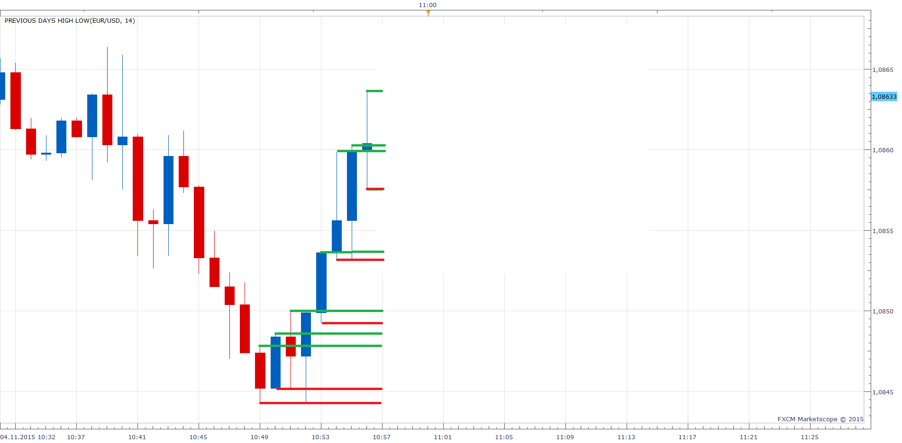

# Previous Days High Low

> Source: https://fxcodebase.com/code/viewtopic.php?f=17&t=62859  
> Forum: 17 · Topic 62859 · 7 post(s)

---

## Previous Days High Low

**Apprentice** · Fri Nov 06, 2015 5:22 am

This indicator should provide line for each high / low of last N candle.

 [Previous Days High Low.lua](files/103226/Previous%20Days%20High%20Low.lua)

Due to draw line TS bug, I use draw a rectangle as a workaround.
Some functionality may be impaired.

---

## Re: Previous Days High Low

**davidnwatson** · Wed Dec 02, 2015 3:08 pm

Can you make a strategy for this?

on Last candle or period set

At last candle high create a entry limit Buy order.
At last candle low create a entry limit Sell order.

Remove any entry orders not activated in past # of candles

Send an email if limit order is activated by price

Parameters
Allow to trade
Amount of lots to trade
set limit order
Limit Order in pips
Set stop orders
stop order in pips
Trailing stop order

Show alerts
play sound
sound file
recurrent sound
send email
email address

---

## Re: Previous Days High Low

**Apprentice** · Thu Dec 03, 2015 6:13 am

Your request is added to the development list.

---

## Re: Previous Days High Low

**davidnwatson** · Tue Mar 29, 2016 11:37 pm

Any update on the Strategy? it would be a nice thing to have.

---

## Re: Previous Days High Low

**Atmotrader** · Fri Apr 01, 2016 6:14 pm

Hello,

a version where the highs and lows of the daily chart would be visible in the lower time frames would be nice.

---

## Re: Previous Days High Low

**Apprentice** · Tue Apr 05, 2016 5:50 am

Something like this?
[viewtopic.php?f=17&t=20388&p=93525&hilit=day+high#p93525](https://fxcodebase.com/code/viewtopic.php?f=17&t=20388&p=93525&hilit=day+high#p93525)
You will find similar implementations on the forum also.

---

## Re: Previous Days High Low

**Apprentice** · Wed Aug 15, 2018 6:55 am

The indicator was revised and updated.
