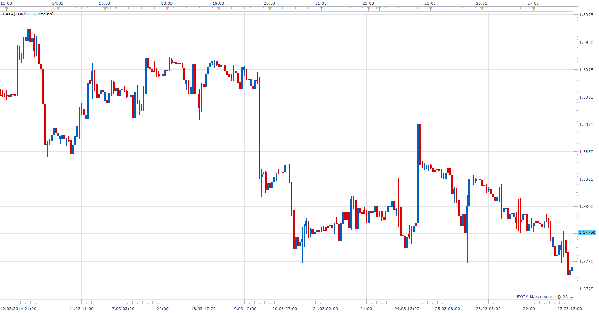

# Price Action Trading Assistant

> Source: https://fxcodebase.com/code/viewtopic.php?f=17&t=60477  
> Forum: 17 · Topic 60477 · 2 post(s)

---

## Price Action Trading Assistant

**Apprentice** · Mon Mar 31, 2014 4:43 am

Based on request.
[viewtopic.php?f=27&t=60476](https://fxcodebase.com/code/viewtopic.php?f=27&t=60476)

When a bullish candlestick closes below the mid-point of the whole candle itself, it should close bearish and red. The opposite should be for bearish candles that close above the mid-point of it's whole body.

 

 [PATA.lua](files/93302/PATA.lua)

The indicator was revised and updated

---

## Re: Price Action Trading Assistant

**Apprentice** · Sun Jun 18, 2017 12:43 pm

The indicator was revised and updated.
