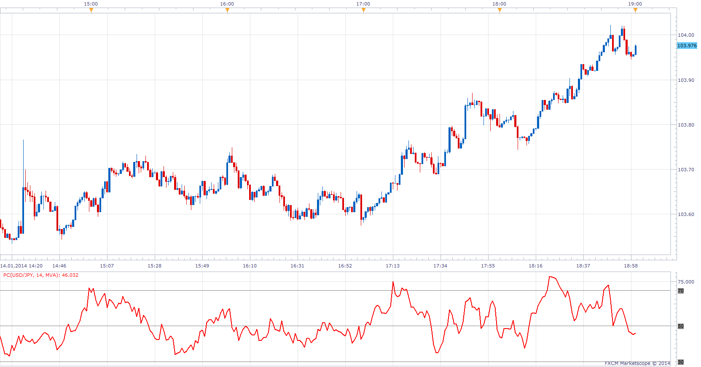

# Price Cycle

> Source: https://fxcodebase.com/code/viewtopic.php?f=17&t=60203  
> Forum: 17 · Topic 60203 · 3 post(s)

---

## Price Cycle

**Apprentice** · Tue Jan 14, 2014 1:02 pm

Posted by request.
[viewtopic.php?f=27&t=60200](https://fxcodebase.com/code/viewtopic.php?f=27&t=60200)

Indicator is defined by the formula
PC = MVA (Close-Low) /ATR(Close)

 [PC.lua](files/92028/PC.lua)

The indicator was revised and updated

---

## Re: Price Cycle

**Alexander.Gettinger** · Wed Mar 05, 2014 5:07 pm

MQL4 version of Price Cycle oscillator: [viewtopic.php?f=38&t=60405](https://fxcodebase.com/code/viewtopic.php?f=38&t=60405).

---

## Re: Price Cycle

**Apprentice** · Sun Jun 18, 2017 12:56 pm

The indicator was revised and updated.
