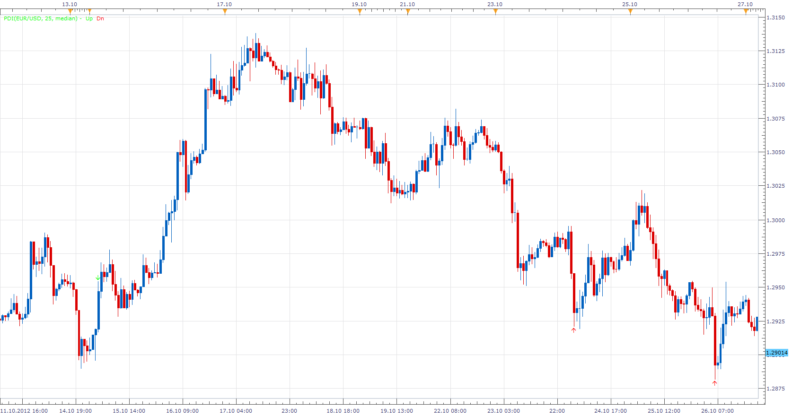

# Price Difference Indicator

> Source: https://fxcodebase.com/code/viewtopic.php?f=17&t=25133  
> Forum: 17 · Topic 25133 · 3 post(s)

---

## Price Difference Indicator

**Apprentice** · Mon Oct 29, 2012 2:35 pm

Price Difference Indicator a.k.a HiLo Scalper Indicator will mark candles,
if difference between the current and previous candle (for selected price source)
is higher than the set value.

 [PDI.lua](files/43188/PDI.lua)

The indicator was revised and updated

---

## Re: Price Difference Indicator

**Alexander.Gettinger** · Thu Oct 23, 2014 9:56 am

MQL4 version of Price Difference indicator: [viewtopic.php?f=38&t=61370](https://fxcodebase.com/code/viewtopic.php?f=38&t=61370).

---

## Re: Price Difference Indicator

**Apprentice** · Fri Jun 23, 2017 7:32 am

The indicator was revised and updated.
