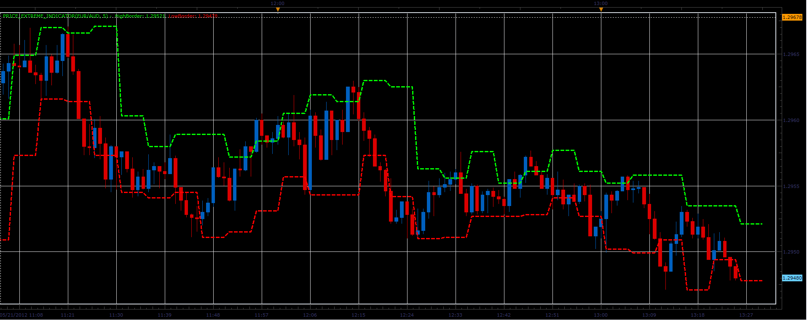

# Price extreme indicator

> Source: https://fxcodebase.com/code/viewtopic.php?f=17&t=18852  
> Forum: 17 · Topic 18852 · 5 post(s)

---

## Price extreme indicator

**Alexander.Gettinger** · Mon May 21, 2012 12:26 pm

The indicator is written at the request: [viewtopic.php?f=27&t=18013&p=32614#p32614](https://fxcodebase.com/code/viewtopic.php?f=27&t=18013&p=32614#p32614)

 

Download:

 [Price_Extreme_Indicator.lua](files/33673/Price_Extreme_Indicator.lua)

The indicator was revised and updated

---

## Re: Price extreme indicator

**Alexander.Gettinger** · Mon May 21, 2012 12:33 pm

MQL4 version of indicator: [viewtopic.php?f=38&t=18854](https://fxcodebase.com/code/viewtopic.php?f=38&t=18854)

---

## Re: Price extreme indicator

**Alexander.Gettinger** · Mon May 21, 2012 3:20 pm

Strategy based on price extreme indicator: [viewtopic.php?f=31&t=18865&p=33689#p33689](https://fxcodebase.com/code/viewtopic.php?f=31&t=18865&p=33689#p33689)

---

## Re: Price extreme indicator

**SuperTrader** · Sun Aug 12, 2012 12:26 pm

Great work once again Alexander, thank you. This is a very useful indicator.

---

## Re: Price extreme indicator

**Apprentice** · Thu Apr 06, 2017 4:06 pm

Indicator was revised and updated.
