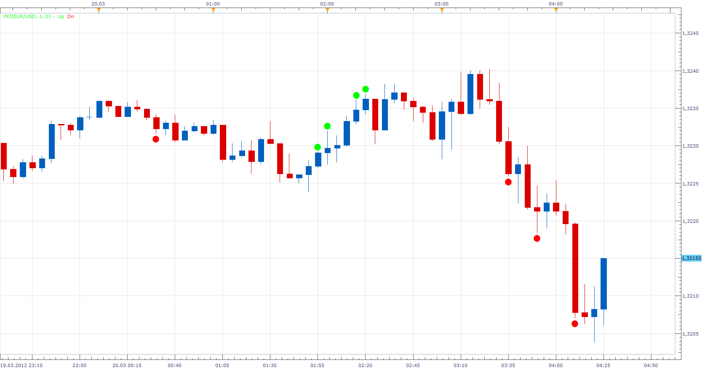

# Price Extreme

> Source: https://fxcodebase.com/code/viewtopic.php?f=17&t=14942  
> Forum: 17 · Topic 14942 · 4 post(s)

---

## Price Extreme

**Apprentice** · Tue Mar 20, 2012 3:27 am

Period parameter defines after how many consecutive price extremes we have a signal.
Price extreme is candles, which exceeded previous candle extreme.
Shift parameter is used to exclude signals within the shift period, from last candlestick.

 [PEI.lua](files/28309/PEI.lua)

 [PEI with Alert.lua](files/28309/PEI%20with%20Alert.lua)

Dec 29, 2015: Compatibility issue Fix. _Alert helper is not longer needed.

The indicator was revised and updated

---

## Re: Price Extreme

**juju1024** · Wed Jul 16, 2014 7:03 am

Hi developpers,

Can you generate a sound alert when signal appears please ?

Thanks.

---

## Re: Price Extreme

**Apprentice** · Thu Jul 17, 2014 5:45 am

PEI with Alert Added.

---

## Re: Price Extreme

**Apprentice** · Sun Jun 25, 2017 1:02 pm

The indicator was revised and updated.
