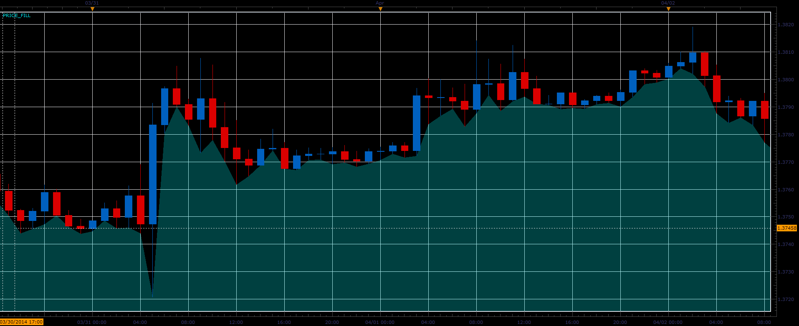

# Price fill indicator

> Source: https://fxcodebase.com/code/viewtopic.php?f=17&t=60503  
> Forum: 17 · Topic 60503 · 6 post(s)

---

## Price fill indicator

**Alexander.Gettinger** · Fri Apr 04, 2014 2:51 pm

The indicator fills the area below the chosen price with semi-transparent filling.

 

 [Tick_Price_Fill.lua](files/93386/Tick_Price_Fill.lua)

Download:

 [Price_Fill.lua](files/93386/Price_Fill.lua)

The indicator was revised and updated

---

## Re: Price fill indicator

**amine.dechemi** · Sat Aug 16, 2014 9:46 am

Hello
 i need to color the space between 2 line , to build a chanel like this :
[http://www.deballer.com/wp-content/uplo ... Bureau.jpg](http://www.deballer.com/wp-content/uploads/2014/05/Bureau.jpg)

thanks

---

## Re: Price fill indicator

**Apprentice** · Wed Aug 20, 2014 2:02 pm

Can u provide trend line algorithm?

---

## Re: Price fill indicator

**amine.dechemi** · Sun Aug 24, 2014 7:00 pm

Hello
the idea is the fill between two free line line 1 and line 2
in math line is determined by two point A and be
ligne 1 ( a, b )
a ( time , price )
b ( time price ) we can have a data directly from a selection of the line ( begin , end )
ligne 2 ( b , c )

the indicator must fill the rectangle determined by abcd

---

## Re: Price fill indicator

**Apprentice** · Mon Aug 25, 2014 4:29 am

Requested can be found here.
[viewtopic.php?f=17&t=61069](https://fxcodebase.com/code/viewtopic.php?f=17&t=61069)

---

## Re: Price fill indicator

**Apprentice** · Sat Jul 01, 2017 5:22 am

The indicator was revised and updated.
