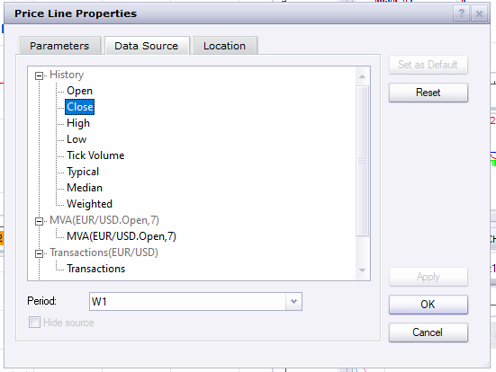

# Price Line

> Source: https://fxcodebase.com/code/viewtopic.php?f=17&t=70914  
> Forum: 17 · Topic 70914 · 5 post(s)

---

## Price Line

**Apprentice** · Fri Feb 12, 2021 11:01 am

Based on the request.
[viewtopic.php?f=27&t=70888](https://fxcodebase.com/code/viewtopic.php?f=27&t=70888)

 

You can select the timeframe on the Data Source tab

 [Price Line.lua](files/140681/Price%20Line.lua)

---

## Re: Price Line

**Ghary4** · Sun Feb 14, 2021 10:46 am

Merci pour cette ligne, est il possible de faire un remplissage entre la ligne de clôture de la semaine N-1 et l'ouverture de la semaine N suivante ?

---

## Re: Price Line

**Apprentice** · Tue Feb 16, 2021 2:33 pm

Can you provide an example?

---

## Re: Ligne de prix

**Ghary4** · Mon Feb 22, 2021 12:46 pm

Bonjour

Voici un exemple, par contre cela ne correspond pas à la clôture de la semaine N-1 ou l'ouverture de la semaine N. C'est un graphique 4 heures.

---

## Re: Price Line

**Apprentice** · Tue Feb 23, 2021 2:50 am

Your request is added to the development list.
Development reference 220.
