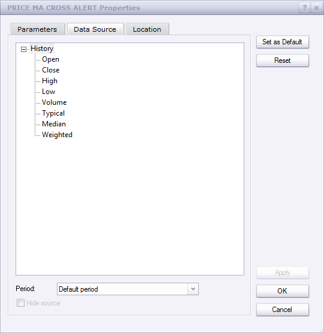
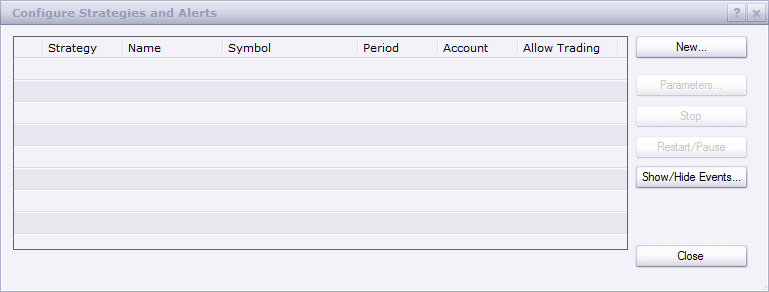
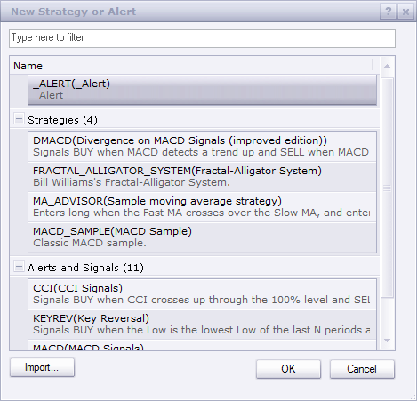
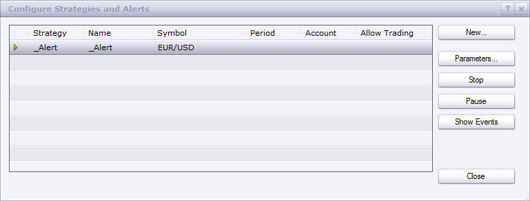

# Price MA Cross Alert

> Source: https://fxcodebase.com/code/viewtopic.php?f=17&t=59311  
> Forum: 17 · Topic 59311 · 71 post(s)

---

## Price MA Cross Alert

**Apprentice** · Tue Aug 27, 2013 4:43 am

This indicator provides Audio / Email Alerts if and when Price cross over/under moving average.
Alert is instantaneous at the time of the cross.

 [Price MA Cross Alert.lua](files/88941/Price%20MA%20Cross%20Alert.lua)

 [Price Averages Cross Alert.lua](files/88941/Price%20Averages%20Cross%20Alert.lua)

---

## Re: Price MA Cross Alert

**yogisan18** · Thu Aug 29, 2013 12:25 pm

Thank you so much for your work on this!

Could you make the indicator show dots and trigger alerts EVERY time Price touches MA?

It only shows dots sometimes.

Can you please look into this.

---

## Re: Price MA Cross Alert

**Apprentice** · Thu Aug 29, 2013 12:37 pm

In fact, both claims are correct.
Dot is shown when price crossover selected MA
if later, during this period, price cross back, dot will be revoked.
Because of this, on historical data, Dot sometimes will not be shown.
However all alert, are sent instantaneously, at the time of the cross.

---

## Re: Price MA Cross Alert

**yogisan18** · Thu Aug 29, 2013 11:24 pm

Could you please add pop-up window alert functionality. So far it's only triggering a sound alert which is not helpful when one watches several pairs.

Thank you!

---

## Re: Price MA Cross Alert

**Coondawg71** · Fri Oct 11, 2013 6:49 am

Can we please request this indicator updated to support the following indicators:

Dema (Double Exponential Moving Average)
Volume Adjusted Moving Average (Vama)
Vwap (Volume Weighted Average Price)
Par MA (Parabolic Moving Average)

Thanks !!!

sjc

---

## Re: Price MA Cross Alert

**Apprentice** · Sat Oct 12, 2013 5:50 am

DEMA, TEMA, VAMA, Parabolic Moving Average Added.

 

If VAMA is Used select complete bar, not component as a source.

---

## Re: Price MA Cross Alert

**Coondawg71** · Sun Feb 02, 2014 10:12 am

I am receiving when an error using using VAMA as the selected moving average.

line 147: VAMA requires Bar Source

thanks,

sjc

---

## Re: Price MA Cross Alert

**Apprentice** · Mon Feb 03, 2014 5:50 am

U need, Bar source for VAMA calculation.
Make sure to have a full bar and Indicator source.

---

## Re: Price MA Cross Alert

**Coondawg71** · Mon Feb 03, 2014 1:02 pm

pardon my ignorance, I still don't understand how to get this indicator to operate with VAMA.

MVA and all other moving average options do work, except for Vama.

Even if I change the source for the Price Ma to Vwap. No worries, I will use the options available.

Regardless, can we please have the maximum MA period input higher than 1000. 3000 would suffice to cover 1440 for one day and 2880 for two days.

thanks!!!

sjc

---

## Re: Price MA Cross Alert

**Apprentice** · Tue Feb 04, 2014 3:21 am

"Period" Limit removed.
As for VAMA, VAMA requests Volume as a data source.
Volume is only available, if a full bar is used / available.

---

## Re: Price MA Cross Alert

**shannondsa** · Mon Feb 10, 2014 7:48 pm

My audio is not working, you mentioned to install and activate the alert. How guide me on how to activate the alert for sound and email. thanks

---

## Re: Price MA Cross Alert

**Apprentice** · Tue Feb 11, 2014 3:36 am

1. Download _Alert.lua Helper
2. Install _Alert.lua Helper

 

3. Open Configure Strategies and Alerts

 

 

4. Add New instance of _Alert for each currency pair used.

---

## Re: Price MA Cross Alert

**Coondawg71** · Sun Feb 16, 2014 11:24 am

Can we please request support the addition of Square Weighted Moving Average to this indicator.

[viewtopic.php?f=17&t=3697&p=36262&hilit=square+weighted#p36262](https://fxcodebase.com/code/viewtopic.php?f=17&t=3697&p=36262&hilit=square+weighted#p36262)

Thanks!

sjc

---

## Re: Price MA Cross Alert

**Apprentice** · Mon Feb 17, 2014 2:42 am

Your request is added to the development list.

---

## Re: Price MA Cross Alert

**panos59** · Mon Feb 17, 2014 7:22 pm

are you sure that the popup window alert is working ? i hear only the sound alert..

---

## Re: Price MA Cross Alert

**Apprentice** · Tue Feb 18, 2014 5:38 am

I use an old template with this one, without a popup window alert.
So in the current version, PopUp is not a option, Audio and Email Alerts are.

---

## Re: Price MA Cross Alert

**MrRiversideDude** · Sun May 11, 2014 7:29 pm

I like this alert, but I don't want to see every occurrence, just the signals that occur after it's been placed on the chart. How do I modify this indicator to do that?

Much thanks in advance!!

---

## Re: Price MA Cross Alert

**Apprentice** · Tue May 13, 2014 3:17 am

Live, Alert Once parameters presented.

---

## Re: Price MA Cross Alert

**Apprentice** · Thu Jun 19, 2014 3:54 am

Price Averages Cross Alert.lua Added.

---

## Re: Price MA Cross Alert

**7510109079** · Tue Oct 07, 2014 4:49 am

The averages version has the same issue as another indicator you recently corrected Apprentice. Namely that if you select the End of Turn option , all the dots disappear. Could you have a look at this please.

I Didnt test the initial indicator for similar problem

---

## Re: Price MA Cross Alert

**Apprentice** · Tue Oct 07, 2014 5:20 am

I believe i have fix both versions then.
Have you re-download Averages version.

---

## Re: Price MA Cross Alert

**7510109079** · Tue Oct 07, 2014 6:04 am

will recheck thx

---

## Re: Price MA Cross Alert

**7510109079** · Tue Oct 07, 2014 6:08 am

re downloaded the averages version. Same error on the end of turn

---

## Re: Price MA Cross Alert

**Apprentice** · Tue Oct 07, 2014 8:34 am

I have tested this, works flawlessly.
You probably have download old version from your browser's cache.
Try this file.

---

## Re: Price MA Cross Alert

**7510109079** · Tue Oct 14, 2014 8:59 am

sry for late reply. been away.

i downloaded the above, renamed so it wouldnt conflict with earlier versions, imported, installed

and NO, it does not work on the end of turn version. Strange!

What happens is when i select End of Turn option and click apply, the whole indicator disappears from the chart, both the MA and the dots.

Any ideas?

---

## Re: Price MA Cross Alert

**7510109079** · Tue Oct 14, 2014 9:04 am

here's the legend

---

## Re: Price MA Cross Alert

**7510109079** · Tue Oct 14, 2014 9:09 am

Actually dont waste time on this.

The Price MA Cross Alert works OK with End of Turn

so i will use this one instead

---

## Re: Price MA Cross Alert

**4x4partners** · Thu May 07, 2015 9:07 am

I get an error on Price MA Cross :

An error occurred during the calculation of the indicator 'PRICE MA CROSS ALERT'. The error details: Price MA Cross Alert.lua:291: attempt to compare nil with number.

---

## Re: Price MA Cross Alert

**4x4partners** · Thu May 07, 2015 9:20 am

I am also getting an error on the MA WITH ALERT indicator when turning sound option off.

I apologize for also posting this here, but tried for hours to find the original post and couldn't find it despite searching everywhere.

Here is the error I get:

An error occurred during the calculation of the indicator 'MA WITH ALERT'. The error details: MA with Alert.lua:235: _Alert.lua:19: The first parameter must be a string.

Thanks

---

## Re: Price MA Cross Alert

**Apprentice** · Fri May 08, 2015 4:58 am

I was not able to reproduce this problem.
Have added additional test that should fix one of the potential problems.

Can u please re-download.

---

## Re: Price MA Cross Alert

**4x4partners** · Fri May 08, 2015 9:16 am

Hi Apprentice,

Thanks for the reply. I just re-installed. Still get same error:

An error occurred during the calculation of the indicator 'PRICE MA CROSS ALERT'. The error details: Price MA Cross Alert.lua:291: attempt to compare nil with number.

I think it might be related to VAMA. How do I set it to use BAR and not CLOSE?

---

## Re: Price MA Cross Alert

**Apprentice** · Mon May 11, 2015 4:57 am

Please re-dowmload Price MA Cross Alert.lua

---

## Re: Price MA Cross Alert

**gregoryyul** · Fri Jun 12, 2015 5:29 am

Thanks for your alert. I've been looking for something like this.

I went through the settings and have some questions.

I am new to TS II and some parameters aren't clear to me.

1. What's the difference between End of Turn and Live?
2. Where can I find explanations of "Price Source" Median, Typical and weighted?
3. Next to "Price Source" it says "If bar is used". What are the non-bar options?
4. How can I set the indicator to send a signal immediately when the MA is touched before a bar is closed (or opened)?
5, Since I'm using several instances of your indicator at once, is there anyway to know which chart the alert is coming from?

Thanks for your time.

GY

---

## Re: Price MA Cross Alert

**Apprentice** · Mon Jun 15, 2015 3:48 am

> 1. What's the difference between End of Turn and Live?

Live will be executed as soon condition is met.
End of the turn will be executed at the end of the current candle

> 2. Where can I find explanations of "Price Source" Median, Typical and weighted?

"median" is (high+low)/2
"typical" is (high+low+close)/3
"weighted" is (high+low+2*close)/4

> 3. Next to "Price Source" it says "If bar is used". What are the non-bar options?

If we have Bar as a source.
Selected component will be used.
Otherwise, the entire bar will be used.
For example, U can select "median" or "typical" for MVA (SMA)
"VAMA" will use the entire bar.

> 4. How can I set the indicator to send a signal immediately when the MA is touched before a bar is closed (or opened)?

Use Live Mode.

> 5. Since I'm using several instances of your indicator at once, is there anyway to know which chart the alert is coming from?

U can use Label parameter option to add your own text.

---

## Re: Price MA Cross Alert

**gregoryyul** · Mon Jun 29, 2015 10:47 am

Hello

Is there any way to add auto-trading to this indicator?

Thanks

---

## Re: Price MA Cross Alert

**Apprentice** · Tue Jun 30, 2015 3:51 am

No. Native support for trading from within indcator should be available in one of following TS update.
Until then u can use one of the available Price / MA cross strategys
Price MA Cross Strategy
[viewtopic.php?f=31&t=59386&hilit=Price+%2F+MA+cross](https://fxcodebase.com/code/viewtopic.php?f=31&t=59386&hilit=Price+%2F+MA+cross)

---

## Re: Price MA Cross Alert

**gregoryyul** · Wed Jul 01, 2015 8:26 pm

> **Apprentice wrote:**
> No. Native support for trading from within indcator should be available in one of following TS update.
> Until then u can use one of the available Price / MA cross strategys
> Price MA Cross Strategy
> [viewtopic.php?f=31&t=59386&hilit=Price+%2F+MA+cross](https://fxcodebase.com/code/viewtopic.php?f=31&t=59386&hilit=Price+%2F+MA+cross)

I don't think this will do what I'm looking for.

I'd like to sell when price touches an MA from beneath and buy when it touches from above but only one trade per bar. the signal should be immediate without waiting for the bar to close.

Any ideas?

Thx for your input

---

## Re: Price MA Cross Alert

**gregoryyul** · Wed Jul 01, 2015 8:41 pm

I noticed that the Price MA CROSS indicator is sending alerts without the using the Alert Signal.

How can this be possible?

thx

---

## Re: Price MA Cross Alert

**DAVIDR** · Fri Sep 18, 2015 7:37 am

Hi, is it possible to have an arrow above/below the price instead of the dot?
All the best.

---

## Re: Price MA Cross Alert

**Apprentice** · Mon Sep 21, 2015 2:26 am

[Price MA Cross Alert.lua](files/102433/Price%20MA%20Cross%20Alert.lua)

Try this version.

---

## Re: Price MA Cross Alert

**DAVIDR** · Tue Sep 22, 2015 10:35 am

Thank You, thats great.

---

## Re: Price MA Cross Alert

**dstoltz** · Thu Nov 26, 2015 11:13 pm

[http://screencast.com/t/2zM5nfTAN](http://screencast.com/t/2zM5nfTAN)

[http://screencast.com/t/JSkKUPQEip](http://screencast.com/t/JSkKUPQEip) (My Attempt)

With my limited programming abilities, I am trying to duplicate the chart covered by the first link.
TMA(12) highs
TMA(12) lows
Close crosses above TMA_highs =buy
Close crosses below TMA_lows = sell
I would like visual popup alerts and arrow alerts (down arrow above high of candle and up arrows at low of candles.

I'm close with my attempt, but I'm sure it could be relatively easy to make it shine.

Doug

---

## Re: Price MA Cross Alert

**Apprentice** · Fri Nov 27, 2015 5:02 am

Requested can be found here.
[viewtopic.php?f=17&t=62917&p=103532#p103532](https://fxcodebase.com/code/viewtopic.php?f=17&t=62917&p=103532#p103532)

---

## Re: Price MA Cross Alert

**HappyFox8** · Mon Nov 30, 2015 11:18 pm

The price cross alert (original version) does not work for detecting a touch of the MA. It only works after closure of the candle. I am finding that when I set it to "touch" it still waits for the candle to close before sending an alert. I need it to send an alert as soon as the MA is touched on a one minute timeframe.

---

## Re: Price MA Cross Alert

**Apprentice** · Tue Dec 01, 2015 5:55 am

Can you specify exact indicator name, version.

---

## Re: Price MA Cross Alert

**HappyFox8** · Tue Dec 01, 2015 7:54 am

I have tried both MA Price Cross Signal and MTF Price MA Signal. The original versions of each. I cannot find any later versions of either strategy. These strategies are essentially the same & neither provide an alert response in a one minute time frame when the MA is touched. Both do not respond until the bar closes.

---

## Re: Price MA Cross Alert

**Apprentice** · Wed Dec 02, 2015 6:07 am

Compatibility issue Fix.
_Alert helper is not longer needed.

---

## Re: Price MA Cross Alert

**HappyFox8** · Wed Dec 02, 2015 10:29 am

Many thanks. It seems to be working perfectly.

I notice that there is no longer an option for us to set the alert to sound after a bar closes. There are also times when I would like to able set the alert to sound only after the candle closes. Is it possible to put this option back so that we can choose between touch (instantaneous) & close?

I also notice that there is no longer an option to specify the timeframe in which the moving average is applied. I would like to be able to set the alert up in a specific timeframe, then be able to move between other timeframes without this changing the alert. For example the alert might be set in an hourly timeframe, but I am mainly viewing the chart in 1 & 5 minutes.

---

## Re: Price MA Cross Alert

**HappyFox8** · Thu Dec 03, 2015 12:58 am

I am finding that sometimes the alert sounds & sometimes it doesn't. I am thinking that it is to do with the options "live" & "end of turn". I have played around with both of them but cannot figure out what each does. I currently have the alert set to "live" & it seems random when it decides to sound. Many times the MA is crossed without a response. Could you please explain. Thanks.

---

## Re: Price MA Cross Alert

**Paul W** · Tue Dec 15, 2015 1:50 pm

Price Averages Cross Alert.lua appears not to support tick chart use

could you please enhance

Thanks

---

## Re: Price MA Cross Alert

**Apprentice** · Wed Dec 16, 2015 4:36 am

Compatibility issue Fixed. _Alert helper is not longer needed.

If you want to use updated version of this indicator,
please make sure to use TS Version 01.14.101415. or higher.

---

## Re: Price MA Cross Alert

**yoelyaacov** · Fri Jan 22, 2016 8:46 am

hi,

your "price ma cross alert" is fantastic, but it could be better if you add the option "show alert" in the notification options...to know which money in concerned by the alert, usdcad or eurusd etc...without the "show alert", it 's impossible to trade with a lot of money in the same time. would you add it please ? thanks a lot..

---

## Re: Price MA Cross Alert

**Apprentice** · Wed Jan 27, 2016 8:06 am

"show alert" option added to top most firts topic post.

---

## Re: Price MA Cross Alert

**Avignon** · Fri Sep 23, 2016 4:41 pm

Hi,

I not pop up message and email notification. I have not tested the sound.

Thank you in advance.

---

## Re: Price MA Cross Alert

**Apprentice** · Mon Sep 26, 2016 6:23 am

Can you provide the name of the indicator in subject?

---

## Re: Price MA Cross Alert

**Avignon** · Mon Sep 26, 2016 12:36 pm

It's Price MA Cross Alert.

Thanks.

---

## Re: Price MA Cross Alert

**Apprentice** · Tue Sep 27, 2016 12:50 pm

Everything is as expected on live chart.
In simulation mode problems with e-mail may be the result of TS bug.

---

## Re: Price MA Cross Alert

**Avignon** · Tue Sep 27, 2016 1:09 pm

---

## Re: Price MA Cross Alert

**steveped** · Wed Oct 05, 2016 7:51 am

Hi Apprentice,
I use this indicator to alert me via email when a SMA is crossed by an indicator (i.e. SMA on OBV). Even if I set the email to be sent 'end of turn', it is quite common I receive lots of emails once the condition is met. Can you suggest how to fix the issue? Many thanks!

---

## Re: Price MA Cross Alert

**steveped** · Wed Oct 05, 2016 8:01 am

Hi Apprentice,
I use this indicator to send an email alert when the condition is met (end of turn). It is quite common I receive a lot of emails when the condition is met. Teke into consideration that I use the indicator o other indicators (i.e. OBV, RSI, etc...). Can you suggest how to fix the issue? Many thanks!

---

## Re: Price MA Cross Alert

**Apprentice** · Fri Oct 07, 2016 3:59 am

Do you use live / demo or simulator?

---

## Re: Price MA Cross Alert

**steveped** · Fri Oct 07, 2016 7:19 am

Hi Apprentice,
I use a real account. Thx.

---

## Re: Price MA Cross Alert

**Apprentice** · Tue Oct 11, 2016 3:09 am

Hm, I was not able to reproduce this issue.

---

## Re: Price MA Cross Alert

**Avignon** · Wed Oct 12, 2016 1:17 pm

We can help to do debug ?

---

## Re: Price MA Cross Alert

**Apprentice** · Wed Aug 08, 2018 10:41 am

The Indicator was revised and updated.

---

## Re: Price MA Cross Alert

**Lextee** · Fri Mar 22, 2019 10:28 pm

Hey, thanks for the great indicator
just a simple request, wishing if you are able to add an additional EMA that is able to filter out trades that goes against the trend

for example, to only show alerts when price meets the criteria of touching an MA line with an additional trend filter eg 10MA above 50 (long) or 10MA below 50MA (short)

Eg. long: filters out short trades when price touches 10EMA and is above 50EMA
and likewise short: when 10EMA is below 50EMA and price touches 10EMA only showing short alerts

Thanks in advance, hopefully its not too confusing
Alex

---

## Re: Price MA Cross Alert

**Apprentice** · Mon Mar 25, 2019 8:45 am

Try this version.

 [Price Averages Cross Alert with Filter.lua](files/125303/Price%20Averages%20Cross%20Alert%20with%20Filter.lua)

---

## Re: Price MA Cross Alert

**Lextee** · Tue Mar 26, 2019 8:10 am

Thank you. The new update with the filter is working great

---

## Re: Price MA Cross Alert

**Lextee** · Tue Mar 26, 2019 8:28 am

sorry to bother you again

are you able to add in the additional feature of "Cross type: eg. cross or touch" to the indicator (price MA cross alert with filter indicator) - to allow a candle to be identified with either the choice of a candle touching or crossing a specific MA line.

Thank again
Alex

---

## Re: Price MA Cross Alert

**Apprentice** · Wed Mar 27, 2019 1:26 pm

Your request is added to the development list under Id Number 4569

---

## Re: Price MA Cross Alert

**Apprentice** · Thu Apr 11, 2019 2:41 pm

Try this version.

 [Price Averages Cross Alert with Filter.lua](files/125672/Price%20Averages%20Cross%20Alert%20with%20Filter.lua)
