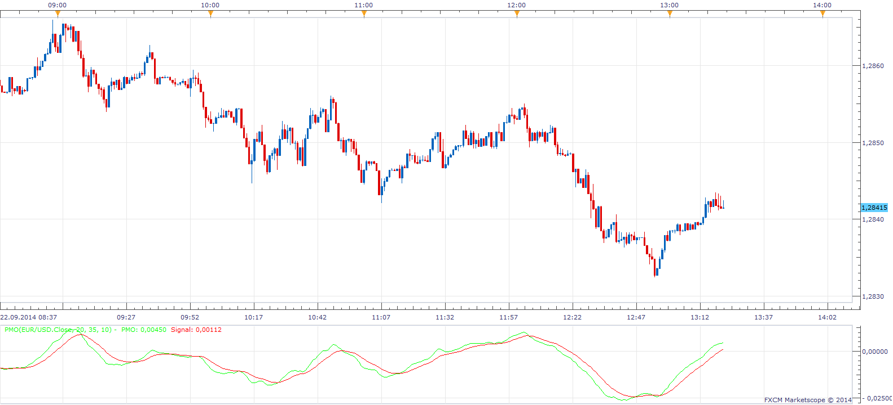

# Price Momentum Oscillator

> Source: https://fxcodebase.com/code/viewtopic.php?f=17&t=61209  
> Forum: 17 · Topic 61209 · 18 post(s)

---

## Price Momentum Oscillator

**Apprentice** · Mon Sep 22, 2014 6:20 am



 Price Momentum Oscillator (PMO) is an oscillator based on a Rate of Change (ROC) calculation that is smoothed twice with exponential moving averages that use a custom smoothing process. Because the PMO is normalized, it can also be used as a relative strength tool.

```
Smoothing Multiplier = (2 / Time period)

Custom Smoothing Function = {Close - Smoothing Function(previous day)} *
 Smoothing Multiplier + Smoothing Function(previous day)

PMO Line = 20-period Custom Smoothing of
(10 * 35-period Custom Smoothing of
 ( ( (Today's Price/Yesterday's Price) * 100) - 100) )

PMO Signal Line = 10-period EMA of the PMO Line
```

 [PMO.lua](files/96063/PMO.lua)

 [Non-standard Timeframe PMO.lua](files/96063/Non-standard%20Timeframe%20PMO.lua)

 


 [PMO Helper.lua](files/96063/PMO%20Helper.lua)

 [Non-standard Timeframe PMO Helper.lua](files/96063/Non-standard%20Timeframe%20PMO%20Helper.lua)

 [Non-standard Timeframe PMO Helper with Alert.lua](files/96063/Non-standard%20Timeframe%20PMO%20Helper%20with%20Alert.lua)

---

## Custom Smoothing Function

**Apprentice** · Mon Sep 22, 2014 11:25 am


I have reproduced Price Momentum Oscillator smoothing method.
As shown has high correlation with Exponential Moving Average.

 [Custom Smoothing Function.lua](files/96094/Custom%20Smoothing%20Function.lua)

---

## Re: Price Momentum Oscillator

**ciclone** · Sat Nov 07, 2015 12:28 pm

you can turn pmo.lua indicator to pmo.ex for MT4. It is possible:tank

---

## Re: Price Momentum Oscillator

**Apprentice** · Mon Nov 09, 2015 5:58 am

Your request is added to the development list.

---

## Re: Price Momentum Oscillator

**Apprentice** · Tue Nov 10, 2015 1:09 pm

Requested can be found here.
[viewtopic.php?f=38&t=62869&p=103294#p103294](https://fxcodebase.com/code/viewtopic.php?f=38&t=62869&p=103294#p103294)

---

## Re: Price Momentum Oscillator

**fxcyberman** · Sat Nov 21, 2015 11:38 pm

Hello, Apprentice.
Would you kindly add a drawing lines into this indicator ?
i.e. when PMO crossover signal line and PMO crossunder signal line , draw a vertical and horizontal line on the main chart as the attached image.

---

## Re: Price Momentum Oscillator

**Apprentice** · Tue Nov 24, 2015 4:37 am

PMO Helper.lua added.

---

## Re: Price Momentum Oscillator

**fxcyberman** · Tue Nov 24, 2015 1:20 pm

Thank you for your prompt action.

---

## Re: Price Momentum Oscillator

**diazr7777** · Sat Mar 05, 2016 1:34 am

Hello,

I just wondering if you've managed to make this indicator with the horizontal drawing lines included?
Also would like to have the horizontal lines available to be called from FX Strategy Wizard if possible.
I would be nice if I could have that code in Lua too please? Happy to pay for the extra effort.

Cheers,
Ruben

---

## Re: Price Momentum Oscillator

**newton** · Sat Mar 05, 2016 4:14 am

hi,

can you create strategy based on this indicator,

buy level:0
sell level:0

**buy : signal>buy level and pmo cross over signal
sell: signal< sell level and pmo cross under signal.**

---

## Re: Price Momentum Oscillator

**diazr7777** · Sat Mar 05, 2016 8:28 am

Hello Apprentice,

Would you kindly add the horizontal price lines at the crossing as well please? It would be nice if these lines can be accessed from FX Strategy Wizard when calling the indicator too.
Cheers,

Ruben

---

## Re: Price Momentum Oscillator

**Apprentice** · Sun Mar 06, 2016 5:48 am

Horizontal Line option added to PMO Helper.lua
As for Strategy Wizard, You would need a function that will find these levels from within strategy.

---

## Re: Price Momentum Oscillator

**diazr7777** · Sun Mar 06, 2016 9:47 am

Hello Apprentice, that's great thank you very much for adding the horizontal lines so quickly.

Cheers,

Ruben

---

## Re: Price Momentum Oscillator

**Apprentice** · Sun Jul 30, 2017 11:04 am

The indicator was revised and updated.

---

## Re: Price Momentum Oscillator

**Apprentice** · Wed Aug 30, 2017 6:40 am

PMO based strategy.
[viewtopic.php?f=31&t=65039&p=114568#p114568](https://fxcodebase.com/code/viewtopic.php?f=31&t=65039&p=114568#p114568)

---

## Re: Price Momentum Oscillator

**Apprentice** · Mon Aug 27, 2018 5:08 am

The indicator was revised and updated.

---

## Re: Price Momentum Oscillator

**jrichardson83** · Thu Sep 27, 2018 9:50 pm

Hey Apprentice, you mind adding an Alert/Email function to the Non-Standard PMO and Non-Standard PMO Helper.

Thanks

---

## Re: Price Momentum Oscillator

**Apprentice** · Fri Sep 28, 2018 7:05 am

Non-standard Timeframe PMO Helper with Alert.lua added.
