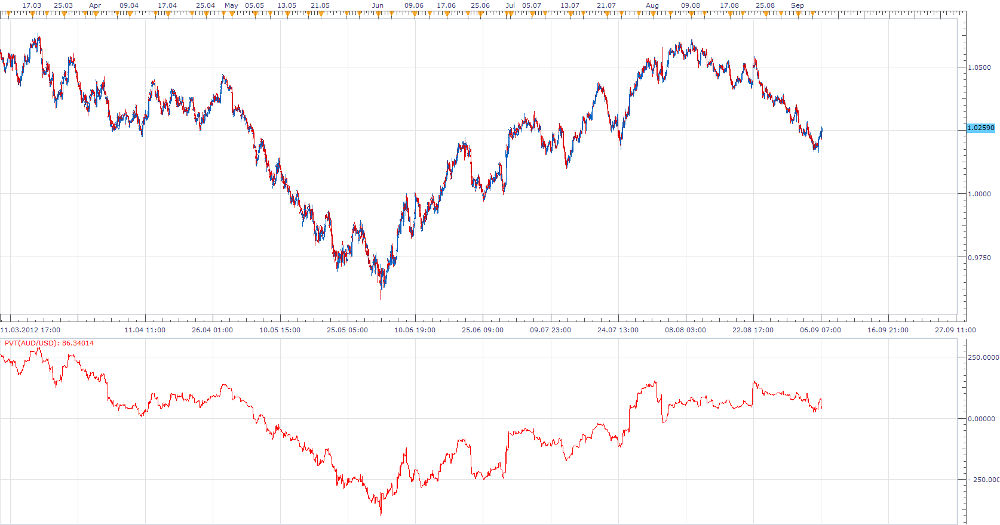
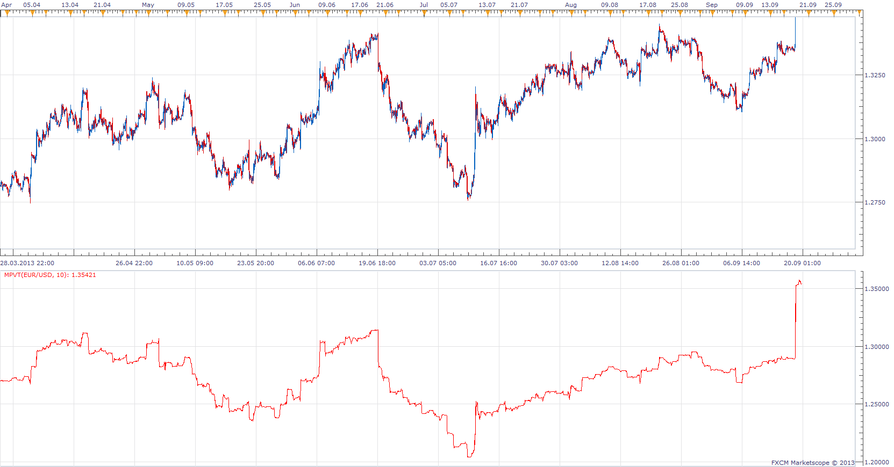
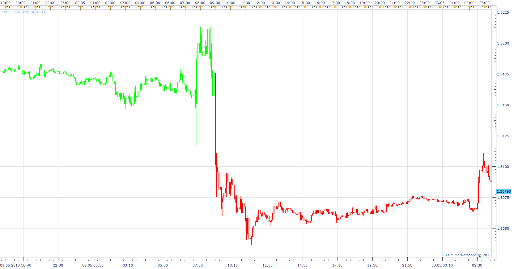

# Price Volume Trend

> Source: https://fxcodebase.com/code/viewtopic.php?f=17&t=23071  
> Forum: 17 · Topic 23071 · 6 post(s)

---

## Price Volume Trend

**Apprentice** · Thu Sep 06, 2012 9:06 am

Price and Volume Trend ("PVT") is similar to On Balance Volume ("OBV")
The amount of volume added to the PVT is determined by the amount that prices rose or fell relative to the previous day's close.

Interpretation
The interpretation of the Price and Volume Trend is similar to the interpretation of On Balance Volume and the Volume Accumulation/Distribution Line.

Calculation
PVT = ((Close-Close(-1))/Close(-1))* Volume + PVT(-1)

 [PVT.lua](files/39764/PVT.lua)

 

As described in the April 2010 issue of S & C Magazine.
Modified, Modified Volume Price Trend added.

 [MPVT.lua](files/39764/MPVT.lua)

The indicator was revised and updated

---

## Re: Price Volume Trend

**Jeffreyvnlk** · Mon May 06, 2013 5:46 pm

Could you make PVT overlaying the chart ? Thank you

---

## Re: Price Volume Trend

**Apprentice** · Tue May 07, 2013 5:36 am

 [PVT Overlay.lua](files/61453/PVT%20Overlay.lua)

---

## Re: Price Volume Trend

**Alexander.Gettinger** · Tue Aug 13, 2013 2:12 pm

MQL4 version of Price Volume Trend oscillator: [viewtopic.php?f=38&t=59086](https://fxcodebase.com/code/viewtopic.php?f=38&t=59086)

---

## Re: Price Volume Trend

**Apprentice** · Thu Sep 19, 2013 4:16 pm

Modified Volume Price Trend added

---

## Re: Price Volume Trend

**Apprentice** · Thu Jul 27, 2017 9:39 am

The indicator was revised and updated.
