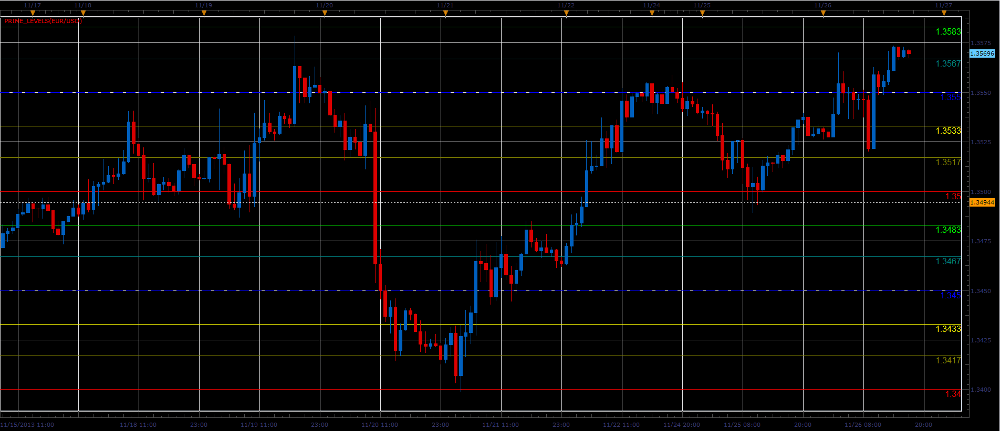
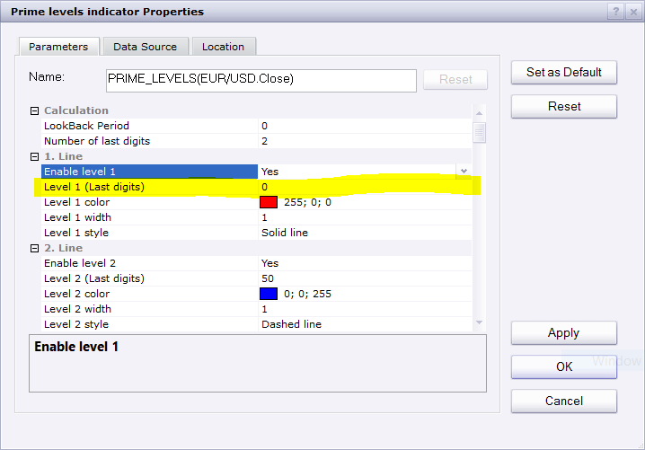
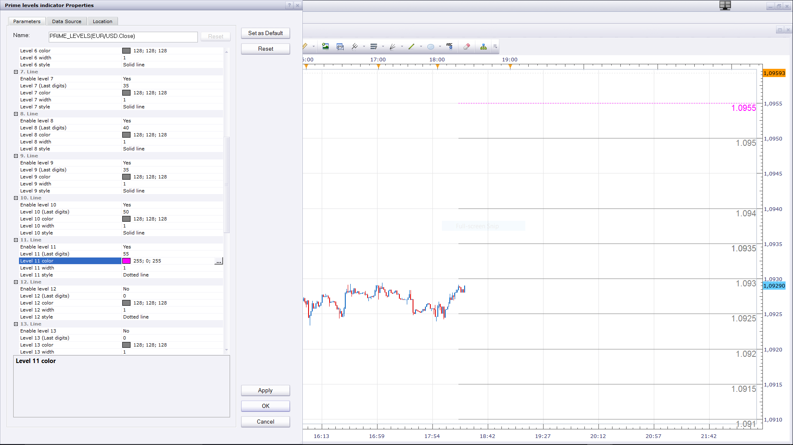
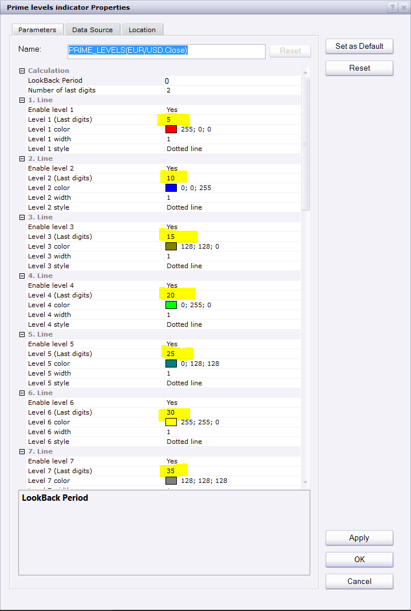

# Prime levels indicator

> Source: https://fxcodebase.com/code/viewtopic.php?f=17&t=60016  
> Forum: 17 · Topic 60016 · 52 post(s)

---

## Prime levels indicator

**Alexander.Gettinger** · Fri Nov 29, 2013 1:03 pm

The indicator is written on request: [viewtopic.php?f=27&t=59511](https://fxcodebase.com/code/viewtopic.php?f=27&t=59511).
The indicator draws levels with the specified prices.

 

Download:

 [Prime_Levels.lua](files/91222/Prime_Levels.lua)

 [Prime levels indicator with Alert.lua](files/91222/Prime%20levels%20indicator%20with%20Alert.lua)

Dec 14, 2015: Compatibility issue Fixed. _Alert helper is not longer needed.

If you want to use updated version of this indicator,
please make sure to use TS Version 01.14.101415. or higher.

---

## Re: Prime levels indicator

**Panther** · Sat Dec 07, 2013 11:27 am

Alexander, Thank you. Panther

---

## Re: Prime levels indicator

**Panther** · Thu Jan 02, 2014 7:59 am

Could you make this so I could use it on a Tick chart?
Thanks

---

## Re: Prime levels indicator

**Apprentice** · Fri Jan 03, 2014 1:02 pm

Please re-download, i have changed the code accordingly.

---

## Re: Prime levels indicator

**Checkz** · Sat Nov 01, 2014 11:29 pm

CAN A ALERT BE MADE WHEN THE PRIME LEVELS ARE HIT. FOR EXAMPLE LETS SAY I HAVE THE PRIME LEVELS SET AT 20 PIPS APART AND IM WATCHING IT ON A ONE MINIUTE CHART. CAN A ALERT OR ALARM SOUND ONCE THAT 20 PIP PRIME LIVEL IS HIT. SO IF PRICE HITS THE 112.200 PRIME LEVEL ON THE USD/JPY ONE MINUTE CHART I WOULD LOVE TO HEAR AN ALARM OR ALERT. THANKS.

---

## Re: Prime levels indicator

**Apprentice** · Mon Nov 03, 2014 5:21 am

Prime levels indicator with Alert.lua Added.

---

## Re: Prime levels indicator

**eshlomi** · Thu Oct 01, 2015 3:29 am

Hello guys,
how are you?
I've got a request, if i may.

can you please create a "shorter" version of this indicator? lets say starting from the last 30th candle? and also show the closest 3 line above to the current price and the closest 3 lines below current price.

something like the screenshot i added.
this will make it much more clean and make the chart more readable.

thank you so much for your help.

cheers.

---

## Re: Prime levels indicator

**Apprentice** · Thu Oct 08, 2015 4:41 am

Your request is added to the development list.

---

## Re: Prime levels indicator

**eshlomi** · Thu Oct 08, 2015 6:08 am

thank you!

---

## Re: Prime levels indicator

**Apprentice** · Mon Dec 14, 2015 6:58 am

Dec 14, 2015: Compatibility issue Fixed. _Alert helper is not longer needed.

If you want to use updated version of this indicator,
please make sure to use TS Version 01.14.101415. or higher.

---

## Re: Prime levels indicator

**eshlomi** · Sun Jan 24, 2016 8:00 am

hello.

any news regarding my request?

cheers.

---

## Re: Prime levels indicator

**jrichardson83** · Fri Feb 26, 2016 9:53 am

Can we adjust the parameters on this indicator so that there are 20 levels, rather than 10? Levels 11-20 can be defaulted to "No" but I'm finding that I'm needing to add 2 sometimes 3 instances of this indicator in order to get things just right. Adding additional levels would eliminate the need to do this.

---

## Re: Prime levels indicator

**Apprentice** · Mon Feb 29, 2016 4:41 am

Lookback Period / Additional lines added.

---

## Re: Prime levels indicator

**jrichardson83** · Mon Feb 29, 2016 5:05 am

Thank you, Apprentice

---

## Re: Prime levels indicator

**jrichardson83** · Wed Mar 02, 2016 9:13 pm

When this indie is applied to the chart there are gaping holes where the lines are not being painted. I have to pull the chart down in order for the lines to appear. Is there some way to fix this?

---

## Re: Prime levels indicator

**Apprentice** · Thu Mar 03, 2016 4:31 am

I could not reproduce this on any time frame.

---

## Re: Prime levels indicator

**rtsayers** · Thu Mar 03, 2016 1:52 pm

Hi Apprentice

I have the same problem as above missing lines it comes and goes? Sometimes there is no problems and other times the lines are missing??

---

## Re: Prime levels indicator

**rtsayers** · Tue Mar 15, 2016 8:17 pm

It seems to be worse the lines disappear until you scroll the charts?

---

## Re: Prime levels indicator

**rtsayers** · Thu Apr 07, 2016 5:18 pm

Just wondering when someone will fix this???? Nobody wants to take charge and get things fixed right?

---

## Re: Prime levels indicator

**scandisk** · Tue Apr 12, 2016 2:42 pm

I also use this indicator alot and I am also wondering when they will fix this problem?

---

## Re: Prime levels indicator

**jrichardson83** · Tue Apr 12, 2016 6:03 pm

> **rtsayers wrote:**
> Just wondering when someone will fix this???? Nobody wants to take charge and get things fixed right?

Oddly enough, this problem sort of "fixed" itself for me. I don't think its the indicator as much as it is a Marketscope problem. I've revised all my charts, removing and reapplied the indicator and it seems to be functioning fine.

I dunno

---

## Re: Prime levels indicator

**scandisk** · Mon Oct 10, 2016 12:55 pm

Hi

On Line Levels beyond 11 when I try to change the lines to dotted this doesnt work? It stays on line?

---

## Re: Prime levels indicator

**Apprentice** · Tue Oct 11, 2016 3:22 am

AddParam(1, true, 0, core.rgb(255, 0, 0), 3, core.LINE_DOT );

---

## Re: Prime levels indicator

**scandisk** · Tue Oct 11, 2016 12:23 pm

> **Apprentice wrote:**
>
>
> EURUSD m1 (10-11-2016 0934).png
>
>
> AddParam(1, true, 0, core.rgb(255, 0, 0), 3, core.LINE_DOT );

Please fix these levels I am not a coder so this means nothing to me? I don't even know where to put these inputs? I don't want to be inputing numbers to get dots!

Thanks

---

## Re: Prime levels indicator

**Apprentice** · Wed Oct 12, 2016 2:54 am

Can you provide line list, for which you want dots.
You can do it via indicator parameters.

---

## Re: Prime levels indicator

**scandisk** · Wed Oct 12, 2016 4:21 pm

> **Apprentice wrote:**
> Can you provide line list, for which you want dots.
> You can do it via indicator parameters.

I would like a combination of dots lines dashes etc.. 1 to 20 lines

---

## Re: Prime levels indicator

**Apprentice** · Thu Oct 13, 2016 6:09 am

Try this version.

 [Prime_Levels.lua](files/108570/Prime_Levels.lua)

---

## Re: Prime levels indicator

**scandisk** · Thu Oct 13, 2016 5:04 pm

> **Apprentice wrote:**
> Try this version.
>
>
> Prime_Levels.lua

You obviously didn't test it?? Because it's still giving me a solid line even when I switch to dotted on line 11??

---

## Re: Prime levels indicator

**Apprentice** · Tue Oct 18, 2016 6:43 am

Try it now.

---

## Re: Prime levels indicator

**scandisk** · Tue Oct 18, 2016 12:10 pm

> **Apprentice wrote:**
> Try it now.

Its still not creating a dotted line on line level 11 to 20?

 Maybe I should report this as a platform bug?

---

## Re: Prime levels indicator

**Apprentice** · Thu Oct 20, 2016 3:53 am

11 individually

 

Make sure lines have different last digits.
Otherwise they will override each other.

---

## Re: Prime levels indicator

**scandisk** · Thu Oct 20, 2016 1:30 pm

> **Apprentice wrote:**
>
>
> 1 only.png
>
>
> 11 individually
>
>
> Capture.PNG
>
>
> Make sure lines have different last digits.
> Otherwise they will override each other.

I am not sure you understand?? Ok show me from 1 to 11 any numbers all dotted lines???

Still not working??

---

## Re: Prime levels indicator

**Apprentice** · Thu Oct 20, 2016 6:14 pm

11. pink , dotted line, last two decimal places 55

---

## Re: Prime levels indicator

**scandisk** · Fri Oct 21, 2016 12:30 pm

I don't think you understand I asked you to put all dotted lines 1 to 11 or even 1 to 20?

I can put all dotted lines from 1 to 10 but on the 11 line it's solid even if it says dotted and it's not a duplicate number??

Just put I to 20 dotted lines but all dotted and you will see? I don't know if you understand?

---

## Re: Prime levels indicator

**Apprentice** · Sat Oct 22, 2016 3:51 am

All lines are here.

I am not sure you understand.
Please re-download, maybe you have old version.
If NOT.

 

Use different digits.

---

## Re: Prime levels indicator

**scandisk** · Sat Oct 22, 2016 1:29 pm

I have redownloaded and still have the same problem? On the 11 line it wont come out dotted even if there different digits but I can say I am using all black dotted lines not colored? Maybe something wrong with my platform??

---

## Re: Prime levels indicator

**Apprentice** · Mon Oct 24, 2016 3:31 am

1. Try this version if browser cache is problem.

2. Try to deinstall / install yout TS.

Does anyone have this problem?

---

## Re: Prime levels indicator

**scandisk** · Wed Oct 26, 2016 1:26 pm

Thanks Apprentice

It's working great! I just renistalled the marketscope!

Thanks!!

---

## Re: Prime levels indicator

**scandisk** · Mon Oct 31, 2016 11:55 pm

Hi Apprentice

Everything is working good except now I am missing lines when I move around the chart?

---

## Re: Prime levels indicator

**Apprentice** · Tue Nov 01, 2016 7:17 am

I am aware of this problem.
This is because I use the draw functionality.

If this is a big problem,
can write another version, with others draw line functions.

---

## Re: Prime levels indicator

**scandisk** · Tue Nov 01, 2016 10:49 am

Hi Apprentice

That would be great if you could fix this so the lines apprear!

Thanks:)

---

## Re: Prime levels indicator

**Apprentice** · Mon Sep 25, 2017 4:08 pm

The indicator was revised and updated.

---

## Re: Prime levels indicator

**scandisk** · Tue Jan 30, 2018 11:44 pm

Hi Apprentice

Still having this annoying lines missing all the time could right new code and fix please!

Thanks

---

## Re: Prime levels indicator

**Apprentice** · Sun Feb 04, 2018 8:21 am

The Indicator was revised and updated.

---

## Re: Prime levels indicator

**scandisk** · Sun Feb 04, 2018 4:30 pm

Hi Apprentice

Still having missing lines at the top and middle of the screen? I have the lastest marketscope? Its really annoying? When i move the charts around on the screen the disappear and reappear?

Please fix Thanks!

---

## Re: Prime levels indicator

**scandisk** · Fri Mar 23, 2018 12:23 pm

Hi Apprentice

I am still waiting to get this fixed????

Still having missing lines at the top and middle of the screen? I have the lastest marketscope? Its really annoying? When i move the charts around on the screen the disappear and reappear?

---

## Re: Prime levels indicator

**Apprentice** · Mon Mar 26, 2018 9:48 am

The reason is, we use Draw method.
We will have to recode the whole indicator, use a different presentation methods.

---

## Re: Prime levels indicator

**Apprentice** · Tue Apr 03, 2018 4:19 am

[Prime_Levels.lua](files/118426/Prime_Levels.lua)

Few fixes.
Unfortunately, I did not have time to write a new version.

---

## Re: Prime levels indicator

**scandisk** · Tue Apr 03, 2018 12:04 pm

Awesome Thanks works good!!

---

## Re: Prime levels indicator

**ANTONIO** · Thu Dec 19, 2019 7:31 am

Hi apprentice
Can you make a strategy with this indicator?
At the levels 17, 33, 50, 67, 83 and 00 to be the following options: No action/ sell/ buy/ close / alert
Entry and exit: Live/ end of turn
Use breakeven
Use filter: MA
Possibility opening multi positions.

Thank you

---

## Re: Prime levels indicator

**Apprentice** · Thu Dec 19, 2019 11:29 am

Your request is added to the development list.
Development reference 452.

---

## Re: Prime levels indicator

**Apprentice** · Fri Dec 20, 2019 9:18 am

Try this version.
[viewtopic.php?f=17&t=69251](https://fxcodebase.com/code/viewtopic.php?f=17&t=69251)
